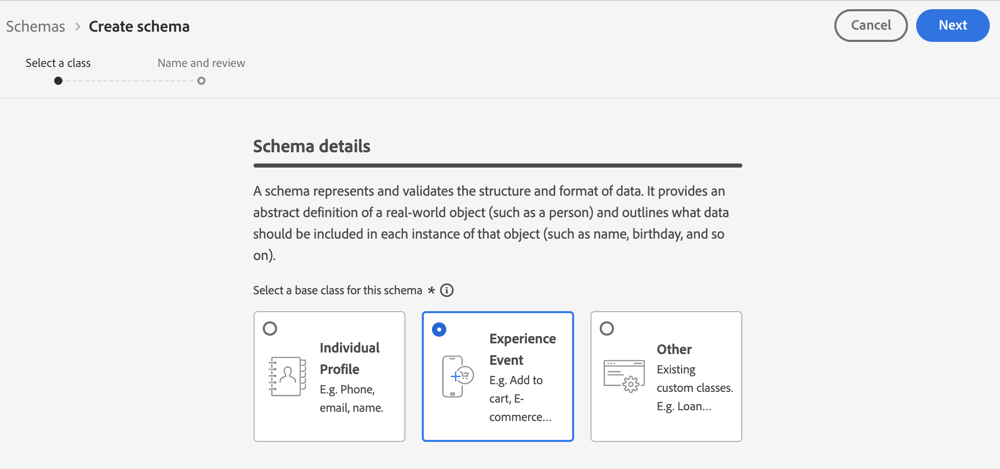
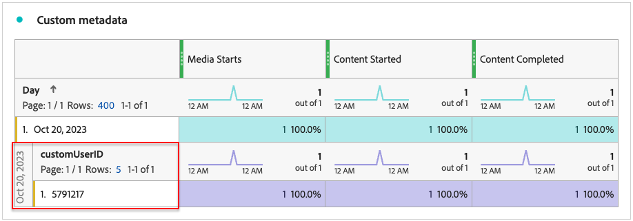

# Implementieren des Add-ons für Streaming-Mediensammlung mit dem Edge Network

Mit Adobe Experience Platform Edge Network können Sie Daten, die für mehrere Produkte bestimmt sind, an einen zentralen Ort senden. Experience Edge leitet die entsprechenden Informationen an die gewünschten Produkte weiter. Mit diesem Konzept können Sie Implementierungsaufgaben zusammenfassen, insbesondere, wenn mehrere Datenlösungen vorhanden sind.

Die folgende Abbildung zeigt, wie das Adobe Streaming-Mediensammlungs-Add-on implementiert werden kann, um Experience Platform Edge zu verwenden und Daten in Analysis Workspace verfügbar zu machen, entweder in Adobe Analytics oder Customer Journey Analytics:

Einen Überblick über alle Implementierungsoptionen, einschließlich Implementierungsmethoden, die Experience Platform Edge nicht verwenden, finden Sie unter [Implementieren des Add-ons für Streaming-Mediensammlung](/help/implementation/overview.md).

Unabhängig davon, ob Sie das Adobe Experience Platform Web SDK, das Adobe Experience Platform Mobile SDK, das Adobe Experience Platform Roku SDK oder die API verwenden, um das Streaming Media Collection Add-on mit Experience Edge zu implementieren, müssen Sie zunächst die folgenden Abschnitte ausführen:

## Einrichten des Schemas in Adobe Experience Platform

Um die Datenerfassung für die Verwendung in allen Anwendungen zu standardisieren, die Adobe Experience Platform nutzen, hat Adobe das offene und öffentlich dokumentierte Standard Experience-Datenmodell (XDM) erstellt.

Erstellen und Einrichten eines Schemas:

1. Beginnen Sie in Adobe Experience Platform mit der Erstellung des Schemas, wie in [Erstellen und Bearbeiten von Schemas in der Benutzeroberfläche](https://experienceleague.adobe.com/docs/experience-platform/xdm/ui/resources/schemas.html?lang=en) beschrieben.

1. Wählen Sie auf der Seite mit den Schemadetails beim Erstellen des Schemas [!UICONTROL **Erlebnisereignis**] aus, wenn Sie die Basisklasse für das Schema auswählen.

   

1. Klicken Sie auf [!UICONTROL **Weiter**].

1. Geben Sie einen Anzeigenamen und eine Beschreibung für das Schema an und wählen Sie dann [!UICONTROL **Beenden**] aus.

1. Wählen Sie im Bereich [!UICONTROL **Komposition**] im Abschnitt [!UICONTROL **Feldergruppen**] die Option [!UICONTROL **Hinzufügen**] aus und suchen Sie dann nach den folgenden neuen Feldergruppen und fügen Sie sie zum Schema hinzu:
   * `Adobe Analytics ExperienceEvent Template`
   * `Implementation Details`
   * `MediaAnalytics Interaction Details`

   Nachdem Sie die Feldergruppen hinzugefügt haben, sollten sie wie folgt im Abschnitt [!UICONTROL **Feldergruppen**] angezeigt werden:

   

1. Wählen Sie [!UICONTROL **Speichern**] aus, um Ihre Änderungen zu speichern.

1. (Optional) Sie können bestimmte Felder ausblenden, die nicht von der Media Edge-API verwendet werden. Das Ausblenden dieser Felder erleichtert das Lesen und Verstehen des Schemas, ist jedoch nicht erforderlich. Diese Felder beziehen sich nur auf die Felder in der Feldgruppe `MediaAnalytics Interaction Details` .

+++ Erweitern Sie hier , um Anweisungen zu Feldern anzuzeigen, die Sie ausblenden können.

   1. Wählen Sie im Bereich [!UICONTROL **Struktur**] das Feld `Media Collection Details` und dann [!UICONTROL **Zugehörige Felder verwalten**] aus.

      

   1. Aktivieren Sie die Option auf [!UICONTROL **Anzeigenamen für Felder anzeigen**] und aktualisieren Sie das Schema dann wie folgt:

      * Blenden Sie im Feld `Media Collection Details` > `Advertising Details` die folgenden Berichtsfelder aus: `Ad Completed`, `Ad Started` und `Ad Time Played`.

      * Blenden Sie im Feld `Media Collection Details` > `Advertising Pod Details` das folgende Berichtsfeld aus: `Ad Break ID`

      * Blenden Sie im Feld `Media Collection Details` > `Chapter Details` die folgenden Berichtsfelder aus: `Chapter Completed`, `Chapter ID`, `Chapter Started` und `Chapter Time Played`.

      * Blendet im Feld `Media Collection Details` das Feld `List Of States` aus.

        

      * Blenden Sie im Feld `Media Collection Details` > `List Of States End` und `Media Collection Details` > `List Of States Start` die folgenden Berichtsfelder aus: `Player State Count`, `Player State Set` und `Player State Time`.

        

      * Verstecken Sie im Feld `Media Collection Details` > `Qoe Data Details` die folgenden Berichtsfelder: `Average Bitrate`, `Average Bitrate Bucket`, `Bitrate Change Impacted Streams`, `Bitrate Changes`, `Buffer Impacted Streams`, `Buffer Events`, `Dropped Frame Impacted Streams`, `Drops Before Starts`, `Errors`, `External Error IDs`, `Error Impacted Streams`, `Media SDK Error IDs`, `Player SDK Error IDs`, `Stalling Impacted Streams`, `Stalling Events`, `Total Buffer Duration` und 8}.`Total Stalling Duration`

      * Verstecken Sie im Feld `Media Collection Details` > `Session Details` die folgenden Berichtsfelder: `10% Progress Marker`, `25% Progress Marker`, `50% Progress Marker`, `75% Progress Marker`, `95% Progress Marker`, `Ad Count`, `Average Minute Audience`, `Content Completes`, `Chapter Count`, `Content Starts`, `Content Time Spent`, `Estimated Streams`, `Federated Data`, `Media Segment Views`, `Media Downloaded Flag`, `Media Starts`, 8, 19, 20, 21, 22, 23, 24, 25, 26 und 27.`Media Session ID``Media Session Server Timeout``Media Time Spent``Pause Events``Pause Impacted Streams``Pev3``Pccr``Total Pause Duration``Unique Time Played``Video Segment`

   1. Wählen Sie [!UICONTROL **Bestätigen**] aus, um Ihre Änderungen zu speichern.

   1. Aktivieren Sie im Bereich [!UICONTROL **Struktur**] die Option &quot;[!UICONTROL **Anzeigenamen für Felder anzeigen**]&quot;und wählen Sie dann das Feld `List Of Media Collection Downloaded Content Events` aus.

   1. Wählen Sie [!UICONTROL **Zugehörige Felder verwalten**] und aktualisieren Sie das Schema dann wie folgt:

      * Blenden Sie im Feld `List Of Media Collection Downloaded Content Events` > `Media Details` > `Advertising Details` die folgenden Berichtsfelder aus: `Ad Completed`, `Ad Started` und `Ad Time Played`.

      * Blenden Sie im Feld `List Of Media Collection Downloaded Content Events` > `Media Details` > `Advertising Pod Details` das folgende Berichtsfeld aus: `Ad Break ID`

      * Blenden Sie im Feld `List Of Media Collection Downloaded Content Events` > `Media Details` > `Chapter Details` die folgenden Berichtsfelder aus: `Chapter Completed`, `Chapter ID`, `Chapter Started` und `Chapter Time Played`.

      * Blenden Sie im Feld `List Of Media Collection Downloaded Content Events` > `Media Details` das Feld `List Of States` aus.

      * Blenden Sie im Feld `List Of Media Collection Downloaded Content Events` > `Media Details` > `List Of States End` und `Media Collection Details` > `List Of States Start` die folgenden Berichtsfelder aus: `Player State Count`, `Player State Set` und `Player State Time`.

      * Verstecken Sie im Feld `List Of Media Collection Downloaded Content Events` > `Media Details` > `Qoe Data Details` die folgenden Berichtsfelder: `Average Bitrate`, `Average Bitrate Bucket`, `Bitrate Change Impacted Streams`, `Bitrate Changes`, `Buffer Events`, `Buffer Impacted Streams`, `Drops Before Starts`, `Dropped Frame Impacted Streams`, `Error Impacted Streams`, `Errors`, `External Error IDs`, `Media SDK Error IDs`, `Player SDK Error IDs`, `Stalling Events`, `Stalling Impacted Streams`, 8 und 19.`Total Buffer Duration``Total Stalling Duration`

      * Verstecken Sie im Feld `List Of Media Collection Downloaded Content Events` > `Media Details` > `Session Details` die folgenden Berichtsfelder: `10% Progress Marker`, `25% Progress Marker`, `50% Progress Marker`, `75% Progress Marker`, `95% Progress Marker`, `Ad Count`, `Average Minute Audience`, `Chapter Count`, `Content Completes`, `Content Starts`, `Content Time Spent`, `Estimated Streams`, `Federated Data`, `Media Downloaded Flag`, `Media Segment Views`, 8, 19, 20, 21, 22, 23, 24, 25, 26, 27 und 28.`Media Session ID``Media Session Server Timeout``Media Starts``Media Time Spent``Pause Events``Pause Impacted Streams``Pccr``Pev3``Total Pause Duration``Unique Time Played``Video Segment`

      * Blenden Sie im Feld `List Of Media Collection Downloaded Content Events` > `Media Details` das Feld `Media Session ID` aus.

   1. Wählen Sie [!UICONTROL **Bestätigen**] aus, um Ihre Änderungen zu speichern.

   1. Wählen Sie im Bereich [!UICONTROL **Struktur**] das Feld `Media Reporting Details` aus und wählen Sie [!UICONTROL **Zugehörige Felder verwalten**] aus.

   1. Aktivieren Sie die Option auf [!UICONTROL **Anzeigenamen für Felder anzeigen**] und aktualisieren Sie das Schema dann wie folgt:

      * Verstecken Sie im Feld `Media Reporting Details` die folgenden Felder: `Error Details`, `List Of States End`, `List of States Start` und `Media Session ID`.

   1. Wählen Sie [!UICONTROL **Bestätigen**] > [!UICONTROL **Speichern**] aus, um Ihre Änderungen zu speichern.

+++

1. (Optional) Sie können Ihrem Schema benutzerdefinierte Metadaten hinzufügen. Auf diese Weise können Sie zusätzliche, benutzerdefinierte Metadaten einschließen, die für bestimmte Anforderungen oder Kontexte angepasst werden können. Diese Flexibilität ist nützlich in Szenarien, in denen vorhandene Schemas keine gewünschten Datenpunkte abdecken. (Sie können auch mit benutzerdefinierten Metadaten mit Media Edge-APIs arbeiten. Weitere Informationen finden Sie unter [Erstellen benutzerdefinierter Metadaten mit Media Edge-APIs](https://developer.adobe.com/cja-apis/docs/endpoints/media-edge/custom-metadata/).)

+++ Erweitern Sie hier , um Anweisungen zum Hinzufügen benutzerdefinierter Metadaten zu Ihrem Schema anzuzeigen.

   1. Suchen Sie den Namen des Mandanten der Organisation, indem Sie [!UICONTROL **Kontoinformationen**] > [!UICONTROL **Zugewiesene Organisationen**] > [!UICONTROL _**Organisationsname**_] > [!UICONTROL **Mandant**] auswählen.

      Diese benutzerdefinierten Felder werden über diesen Pfad empfangen. (Beispiel: Name des Mandanten: _dcbl → myCustomField path: _dcbl.myCustomField.)

   1. Fügen Sie Ihrem definierten Medienschema eine benutzerdefinierte Feldergruppe hinzu.

      

   1. Fügen Sie der Feldergruppe benutzerdefinierte Felder hinzu, die Sie verfolgen möchten.

      

   1. [Verwenden Sie den generierten Pfad](https://experienceleague.adobe.com/en/docs/experience-platform/xdm/ui/fields/overview#type-specific-properties) für das benutzerdefinierte Feld in Ihrer Anfrage-Payload.

      

+++

1. Fahren Sie mit [Erstellen Sie einen Datensatz in Adobe Experience Platform](#create-a-dataset-in-adobe-experience-platform) fort.

## Datensatz in Adobe Experience Platform erstellen

1. Stellen Sie sicher, dass Sie ein Schema wie in [Einrichten des Schemas in Adobe Experience Platform](#set-up-the-schema-in-adobe-experience-platform) beschrieben einrichten.

1. Beginnen Sie in Adobe Experience Platform mit der Erstellung des Datensatzes, wie im [Benutzerhandbuch zur Datensatzbenutzeroberfläche](https://experienceleague.adobe.com/docs/experience-platform/catalog/datasets/user-guide.html?lang=de#create) beschrieben.

   Wählen Sie bei der Auswahl eines Schemas für Ihren Datensatz das zuvor von Ihnen erstellte Schema aus, wie unter [Einrichten des Schemas in Adobe Experience Platform](#set-up-the-schema-in-adobe-experience-platform) beschrieben.

1. Fahren Sie mit [Konfigurieren eines Datastreams in Customer Journey Analytics](#configure-a-datastream-in-adobe-experience-platform) fort.

## Konfigurieren eines Datenspeichers in Adobe Experience Platform

1. Stellen Sie sicher, dass Sie einen Datensatz wie in [Datensatz in Adobe Experience Platform erstellen](#create-a-dataset-in-adobe-experience-platform) beschrieben erstellt haben.

1. Erstellen Sie einen neuen Datastream wie in [Konfigurieren eines Datastreams](https://experienceleague.adobe.com/docs/experience-platform/edge/datastreams/configure.html?lang=de) beschrieben.

   Stellen Sie beim Erstellen des Datastreams sicher, dass Sie die folgenden Konfigurationsoptionen vornehmen:

   * Wählen Sie im Feld [!UICONTROL **Ereignisschema**] beim Erstellen des Datenspeichers das Schema aus, das Sie anhand der Anweisungen unter [Schema in Adobe Experience Platform einrichten](#set-up-the-schema-in-adobe-experience-platform) erstellt haben. Wählen Sie [!UICONTROL **Speichern**] aus.

     >[!IMPORTANT]
     >
     >Wählen Sie nicht [!UICONTROL **Speichern und Zuordnung hinzufügen**] aus, da dies zu Zuordnungsfehlern für das Feld &quot;Zeitstempel&quot;führt.

     

   * Fügen Sie je nachdem, ob Sie Adobe Analytics oder Customer Journey Analytics verwenden, einen der folgenden Dienste zum Datastream hinzu:

      * [!UICONTROL **Adobe Analytics**] (bei Verwendung von Adobe Analytics)

        Wenn Sie Adobe Analytics verwenden, stellen Sie sicher, dass Sie eine Report Suite definieren, wie unter [Report Suite erstellen](https://experienceleague.adobe.com/en/docs/analytics/admin/admin-tools/manage-report-suites/c-new-report-suite/t-create-a-report-suite) beschrieben.

      * [!UICONTROL **Adobe Experience Platform**] (bei Verwendung von Customer Journey Analytics)

     Informationen zum Hinzufügen eines Dienstes zu einem Datastream finden Sie im Abschnitt &quot;Dienste zu einem Datastream hinzufügen&quot;in [Konfigurieren eines Datastreams](https://experienceleague.adobe.com/docs/experience-platform/edge/datastreams/configure.html?lang=en#view-details).

     

      * Erweitern Sie [!UICONTROL **Erweiterte Optionen**] und aktivieren Sie dann die Option [!UICONTROL **Media Analytics**] .

     

1. Sie können jetzt die [Media Edge API](/help/implementation/edge/implementation-edge-api.md) oder das [Media Edge SDK](/help/implementation/edge/edge-mobile-sdk.md) implementieren, um mit der Erfassung von Medienanalysedaten zu beginnen.

   Nachdem Sie einige Daten erfasst haben, können Sie [eine Verbindung in Customer Journey Analytics](#create-a-connection-in-customer-journey-analytics) erstellen.

## Erstellen einer Verbindung in Customer Journey Analytics

>[!NOTE]
>
>Das folgende Verfahren ist nur erforderlich, wenn Sie Customer Journey Analytics verwenden.

1. Stellen Sie sicher, dass Sie einen Datastream erstellt haben, wie in [Konfigurieren eines Datastreams in Customer Journey Analytics](#configure-a-datastream-in-adobe-experience-platform) beschrieben.

1. Erstellen Sie unter Customer Journey Analytics eine Verbindung wie in [Verbindung erstellen](https://experienceleague.adobe.com/docs/analytics-platform/using/cja-connections/create-connection.html?lang=de) beschrieben.

   Beim Erstellen der Verbindung sind für die Implementierung des Add-ons für die Streaming-Mediensammlung die folgenden Konfigurationsoptionen erforderlich:

   1. Wählen Sie den zuvor erstellten Datensatz aus, wie unter [Datensatz in Adobe Experience Platform erstellen](#create-a-dataset-in-adobe-experience-platform) beschrieben.

   1. Stellen Sie sicher, dass die Einstellung [!UICONTROL **Alle neuen Daten importieren**] aktiviert ist.

1. Fahren Sie mit [Erstellen Sie eine Datenansicht in Customer Journey Analytics](#create-a-new-data-view-in-customer-journey-analytics) fort.

## Erstellen einer Datenansicht unter Customer Journey Analytics

>[!NOTE]
>
>Das folgende Verfahren ist nur erforderlich, wenn Sie Customer Journey Analytics verwenden.

1. Stellen Sie sicher, dass Sie eine Verbindung auf dem Customer Journey Analytics erstellt haben, wie in [Erstellen einer Verbindung auf Customer Journey Analytics](#create-a-connection-in-customer-journey-analytics) beschrieben.

1. Erstellen Sie in Customer Journey Analytics eine Datenansicht, wie in [Erstellen oder Bearbeiten einer Datenansicht](https://experienceleague.adobe.com/docs/analytics-platform/using/cja-dataviews/create-dataview.html?lang=de) beschrieben.

   Beim Erstellen der Datenansicht sind für die Implementierung des Streaming-Mediensammlungs-Add-ons die folgenden Konfigurationsoptionen erforderlich:

   1. Wählen Sie im Feld [!UICONTROL **Verbindung**] die zuvor erstellte Verbindung aus, wie unter [Verbindung in Customer Journey Analytics erstellen](#create-a-connection-in-customer-journey-analytics) beschrieben.

      Es kann bis zu 15 Minuten dauern, bis die von Ihnen erstellte Verbindung ausgewählt werden kann.

   1. Suchen Sie auf der Registerkarte [!UICONTROL **Komponenten**] im Abschnitt [!UICONTROL **Schemafelder**] nach den einzelnen Komponenten, die in den Tabellen unten aufgeführt sind, und ziehen Sie sie in den Bereich [!UICONTROL **Metriken**] . Wenn mehrere Felder mit demselben Namen vorhanden sind, verwenden Sie den XDM-Pfad, um sicherzustellen, dass es sich um das richtige Feld handelt.

      **Hauptinhalt - Inhaltsmetriken**

      | Name der Komponente | XDM-Pfad |
      |----------|---------|
      | Medienstarts | mediaReporting.sessionDetails.isViewed |
      | Mediensegmentansichten | mediaReporting.sessionDetails.hasSegmentView |
      | Inhaltsstarts | mediaReporting.sessionDetails.isPlayed |
      | Inhaltsbeendigungen | mediaReporting.sessionDetails.isCompleted |
      | Inhaltsbesuchszeit | mediaReporting.sessionDetails.timePlayed |
      | Besuchszeit für Medien | mediaReporting.sessionDetails.totalTimePlayed |
      | Eindeutige Spielzeit | mediaReporting.sessionDetails.uniqueTimePlayed |
      | 10% Fortschrittsmarkierung | mediaReporting.sessionDetails.hasProgress10 |
      | Zielgruppendurchschnitt pro Minute | mediaReporting.sessionDetails.averageMinuteAudience |

      **Kapitel und Anzeigen - Metriken für Kapitel und Anzeigen**

      | Name der Komponente | XDM-Pfad |
      |----------|---------|
      | Kapitel gestartet | mediaReporting.chapterDetails.isStarted |
      | Kapitel abgeschlossen | mediaReporting.chapterDetails.isCompleted |
      | Wiedergabe des Kapitels | mediaReporting.chapterDetails.timePlayed |
      | Anzeigenstarts | mediaReporting.advertisingDetails.isStarted |
      | Anzeige abgeschlossen | mediaReporting.advertisingDetails.isCompleted |
      | Wiedergabezeit der Anzeige | mediaReporting.advertisingDetails.timePlayed |

      **QoE - QoE-Metriken**

      | Name der Komponente | XDM-Pfad |
      |----------|---------|
      | Zeit bis Start | mediaReporting.qoeDataDetails.timeToStart |
      | Drops vor Start | mediaReporting.qoeDataDetails.isDroppedBeforeStart |
      | Von Puffer betroffene Streams | mediaReporting.qoeDataDetails.hasBufferImpactedStreams |
      | Von Bitratenänderung betroffene Streams | mediaReporting.qoeDataDetails.hasBitrateChangeImpactedStreams |
      | Bitratenänderungen | mediaReporting.qoeDataDetails.bitrateChangeCount |
      | Durchschnittliche Bitrate | mediaReporting.qoeDataDetails.bitrateAverage |
      | Gelöschte Frames | mediaReporting.qoeDataDetails.droppedFrames |
      | Fehler | mediaReporting.qoeDataDetails.errorCount |
      | Von Fehlern betroffene Streams | mediaReporting.qoeDataDetails.hasErrorImpactedStreams |
      | Von Dropped Frames betroffene Streams | mediaReporting.qoeDataDetails.hasDroppedFrameImpactedStreams |

      **Player-Status - Player-Statusmetriken**

      | Name der Komponente | XDM-Pfad |
      |----------|---------|
      | Player-Statusset | mediaReporting.states.isSet |
      | Player-Statusanzahl | mediaReporting.states.count |
      | Player-Statuszeit | mediaReporting.states.time |

   1. Aktualisieren Sie die Beschriftungen (im Dropdown-Menü [!UICONTROL **Kontextbezeichnungen**] ) für die Komponenten in der folgenden Tabelle. Suchen Sie nach Komponenten, die sich noch nicht im Metrikbereich befinden, und ziehen Sie sie in den Bereich.

      | Name der Komponente | Kontext-Label |
      |---------|----------|
      | Zeitüberschreitung des Mediensitzungs-Servers | Medien: Sekunden seit dem letzten Aufruf |
      | Besuchszeit für Medien | Medien: Besuchszeit für Medien |
      | Gesamtpufferdauer | Medien: Gesamtpufferdauer |
      | Zeit bis Start | Medien: Zeit bis Start |
      | Pausierung – Gesamtdauer | Medien: Pausierung - Gesamtdauer |

   1. Um Ihrem Customer Journey Analytics-Projekt Aufschlüsselungen hinzuzufügen, fügen Sie die folgenden Dimensionen zum Bereich [!UICONTROL **Dimensionen**] hinzu:

      | XDM-Pfad | Name der Komponente |
      |---------|----------|
      | mediaReporting.states.name | Player-Statusname |
      | mediaReporting.sessionDetails.ID | Mediensitzungs-ID |

      Zusätzlich zu den Dimensionen in dieser Tabelle können Sie beliebige weitere Dimensionen hinzufügen, die Sie zum Filtern von Daten in Customer Journey Analytics-Projekten bereitstellen möchten.

1. Wählen Sie [!UICONTROL **Speichern und fortfahren**] > [!UICONTROL **Speichern und beenden**] aus, um Ihre Änderungen zu speichern.

1. Fahren Sie mit [Erstellen und konfigurieren Sie ein Projekt in Customer Journey Analytics](#create-and-configure-a-project-in-customer-journey-analytics).

## Erstellen und Konfigurieren eines Projekts im Customer Journey Analytics

1. Stellen Sie sicher, dass Sie eine Datenansicht auf Customer Journey Analytics erstellt haben, wie in [Erstellen einer Datenansicht auf Customer Journey Analytics](#create-a-new-data-view-in-customer-journey-analytics) beschrieben.

1. Wählen Sie unter Customer Journey Analytics auf der Registerkarte [!UICONTROL **Workspace**] im Bereich [!UICONTROL **Projekte**] die Option [!UICONTROL **Projekt erstellen**] aus.

1. Wählen Sie &quot;[!UICONTROL **Leeres Projekt**]&quot;> &quot;[!UICONTROL **Erstellen**]&quot;.

1. Wählen Sie im neuen Projekt die zuvor erstellte Datenansicht aus.

   Beim Erstellen von Bedienfeldern in Ihrem Projekt können Sie alle Komponenten verwenden, die Sie Ihrer Datenansicht hinzugefügt haben, wie unter [Erstellen einer Datenansicht in Customer Journey Analytics](#create-a-new-data-view-in-customer-journey-analytics) beschrieben.

   Die folgenden vier Bedienfelder sind Beispiele für Bedienfelder, die Sie erstellen können:

   

   

   

   

1. Wählen Sie in der linken Leiste das Symbol **Bedienfelder** aus und ziehen Sie dann in den Bereich [!UICONTROL **Gleichzeitige Medienbetrachter**] und in den Bereich [!UICONTROL **Besuchszeit für Medienwiedergabe**] .

   Die beiden Bedienfelder sollten wie folgt aussehen:

   

   

1. (Bedingt) Wenn Sie Ihrem Schema benutzerdefinierte Metadaten hinzugefügt haben, wie in Schritt 8 von [Einrichten des Schemas in Adobe Experience Platform](#set-up-the-schema-in-adobe-experience-platform) beschrieben, müssen Sie die Persistenz für die benutzerdefinierten Felder festlegen, wie in den Einstellungen der Persistenz-Komponente ](https://experienceleague.adobe.com/en/docs/analytics-platform/using/cja-dataviews/component-settings/persistence) im Customer Journey Analytics-Handbuch beschrieben.[

   Wenn Daten in Customer Journey Analytics eingehen, ist die Dimension Benutzerspezifische Benutzer-ID verfügbar.

   

   >[!NOTE]
   >
   >Wenn Sie Adobe Analytics als Upstream für Ihren Datastream einrichten, sind die benutzerdefinierten Metadaten auch in ContextData mit dem Namen vorhanden, den Sie im Schema festgelegt haben (ohne das Mandantenpräfix, z. B. myCustomField). Dadurch können alle für ContextData verfügbaren Adobe Analytics-Funktionen verwendet werden, z. B. [Erstellen einer Verarbeitungsregel](https://experienceleague.adobe.com/en/docs/analytics/admin/admin-tools/manage-report-suites/edit-report-suite/report-suite-general/c-processing-rules/processing-rules).

1. Geben Sie das Projekt wie in [Projekte freigeben](https://experienceleague.adobe.com/docs/analytics-platform/using/cja-workspace/curate-share/share-projects.html?lang=en) beschrieben frei.

   >[!NOTE]
   >
   >   Wenn die Benutzer, für die Sie freigeben möchten, nicht verfügbar sind, stellen Sie sicher, dass die Benutzer über einen Benutzer- und Administratorzugriff auf Customer Journey Analytics in der Adobe Admin Console verfügen.

1. Fahren Sie mit [Daten an Experience Platform Edge senden](#send-data-to-experience-platform-edge) fort.

## Daten an Experience Platform Edge senden

Je nach Datentyp, den Sie an Experience Platform Edge senden möchten, können Sie eine der folgenden Methoden verwenden:

### Web: Verwenden des Adobe Experience Platform Web SDK

* [Erste Schritte](https://developer.adobe.com/client-sdks/documentation/media-for-edge-network/)

* [Webdaten mit dem Adobe Experience Platform Web SDK an Edge senden](/help/implementation/edge/edge-web-sdk.md)

* [Migrieren zu Adobe Streaming Media für Edge Network-Erweiterung](https://developer.adobe.com/client-sdks/documentation/adobe-media-analytics/migration-guide/)

### Mobile: Verwenden des Adobe Experience Platform Mobile SDK

Verwenden Sie die folgenden Dokumentationsressourcen, um die Implementierung für iOS und Android abzuschließen:

* [Erste Schritte](https://developer.adobe.com/client-sdks/documentation/media-for-edge-network/)

* [API-Referenz](https://developer.adobe.com/client-sdks/documentation/media-for-edge-network/api-reference/)

* [Migrieren zu Adobe Streaming Media für Edge Network-Erweiterung](https://developer.adobe.com/client-sdks/documentation/adobe-media-analytics/migration-guide/)

### Roku: Adobe Experience Platform Roku SDK

* [Erste Schritte](https://developer.adobe.com/client-sdks/documentation/media-for-edge-network/)

* [Adobe Experience Platform Roku-SDK](https://github.com/adobe/aepsdk-roku/tree/main)

* [Migrieren zu Adobe Streaming Media für Edge Network-Erweiterung](https://developer.adobe.com/client-sdks/documentation/adobe-media-analytics/migration-guide/) <!-- is the information here also applicable for Roku? -->

### API: Web und andere

Die API ist derzeit die einzige unterstützte Methode zum Senden von Webdaten an Experience Platform Edge.

Die API ist auch verfügbar, wenn Sie eine benutzerdefinierte Implementierung der Edge-APIs verwenden möchten.

Weitere Informationen zur Media Edge-API finden Sie in den folgenden Ressourcen:

* [Übersicht über die Media Edge-API](https://experienceleague.adobe.com/docs/experience-platform/edge-network-server-api/media-edge-apis/overview.html)

* [Erste Schritte mit der Media Edge-API](https://experienceleague.adobe.com/docs/experience-platform/edge-network-server-api/media-edge-apis/getting-started.html)

* [Handbuch zur Fehlerbehebung bei der Media Edge-API](https://experienceleague.adobe.com/docs/experience-platform/edge-network-server-api/media-edge-apis/troubleshooting.html)

* [Verwenden der Open API Specification-Datei für Media Edge-APIs](https://developer.adobe.com/data-collection-apis/docs/api/media-edge/)
