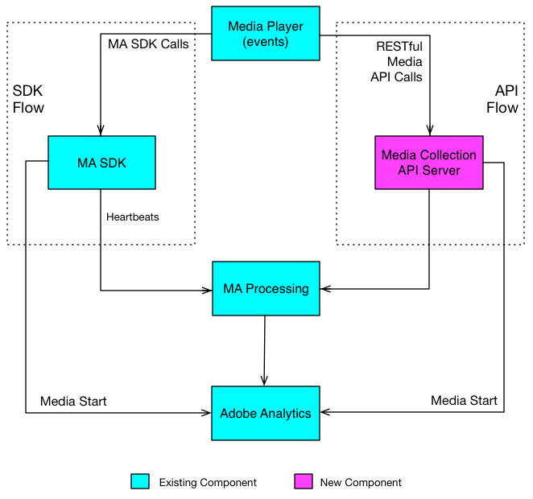

# Übersicht über die Mediensammlungs-API {#overview}

Die Mediensammlungs-API ist die RESTful-Alternative von Adobe zum Client-seitigen Media SDK. Mit der Mediensammlungs-API kann Ihr Player Audio- und Videoereignisse mit RESTful HTTP-Aufrufen tracken.

Die Mediensammlungs-API ist im Wesentlichen ein Adapter, der als Server-seitige Version des Media SDK fungiert. Die erfassten Tracking-Daten von Streaming-Medien führen zu denselben [Reporting und Analyse](/help/reporting/media-reports-enable.md).

## Datenfluss beim Medien-Tracking {#media-tracking-data-flows}

Ein Medienplayer, in den die Mediensammlungs-API implementiert wurde, sendet RESTful-API-Tracking-Aufrufe direkt an den Backend-Server des Medien-Trackings, während ein Player mit dem Medien-SDK innerhalb der Player-Anwendung Tracking-Aufrufe an die SDK-APIs sendet. Da der Player mit der Mediensammlungs-API Aufrufe über das Internet sendet, muss er einen Teil der Verarbeitung übernehmen, den das Medien-SDK automatisch vornimmt. (Details unter [Implementierung der Mediensammlung.](mc-api-impl/mc-api-quick-start.md))

Die über die Mediensammlungs-API erfassten Tracking-Daten werden gesendet und zunächst anders verarbeitet als über einen Medien-SDK-Player erfasste Tracking-Daten. Es wird jedoch für beide Lösungen dieselbe Verarbeitungs-Engine im Backend verwendet.



## API-Übersicht {#api-overview}

**URI:** Besorgen Sie sich dies von Ihrem Adobe-Support-Mitarbeiter.

**HTTP-Methode:** POST, mit JSON-Anforderungstext.

### API-Aufrufe {#mc-api-calls}

* **`sessions`-** Stellt eine Sitzung mit dem Server her und gibt eine Sitzungs-ID zurück, die in nachfolgenden `events`-Aufrufen verwendet wird. Ihre Anwendung führt diesen Aufruf zu Beginn einer Tracking-Sitzung durch.

  `{uri}/api/v1/sessions`

* **`events`-** Sendet Medien-Tracking-Daten.

  `{uri}/api/v1/sessions/{session-id}/events`

### Anfrageinhalt {#mc-api-request-body}

```json
{
    "playerTime": {
        "playhead": "{playhead position in seconds}",
        "ts": "{timestamp in milliseconds}"
    },
    "eventType": "{event-type}",
    "params": {
        "{parameter-name}": "{parameter-value}",
        "{parameter-name}": "{parameter-value}"
    },
    "qoeData" : {
        "{parameter-name}": "{parameter-value}",
        "{parameter-name}": "{parameter-value}"
    },
    "customMetadata": {
        "{parameter-name}": "{parameter-value}",
        "{parameter-name}": "{parameter-value}"
    }
}
```

* `playerTime`: Erforderlich für alle Anforderungen.
* `eventType`: Erforderlich für alle Anforderungen.
* `params`: Erforderlich für bestimmte `eventTypes`. Überprüfen Sie anhand des [JSON-Validierungsschemas](mc-api-ref/mc-api-json-validation.md), welche eventTypes erforderlich und welche optional sind.

* `qoeData`: Optional für alle Anforderungen.
* `customMetadata`: Optional für alle Anforderungen, wird jedoch nur mit den Ereignistypen `sessionStart`, `adStart` und `chapterStart` gesendet.

Für jeden `eventType` gibt es ein öffentlich verfügbares [JSON-Validierungsschema](mc-api-ref/mc-api-json-validation.md), mit dessen Hilfe Sie die Parametertypen überprüfen und herausfinden können, welche Parameter für die einzelnen Ereignisse erforderlich sind.

### Ereignistypen {#mc-api-event-types}

Eine vollständige Liste der Ereignistypen mit Implementierungsbeispielen pro SDK finden Sie unter [Ereignisse - Übersicht](/help/implementation/events/overview.md).
