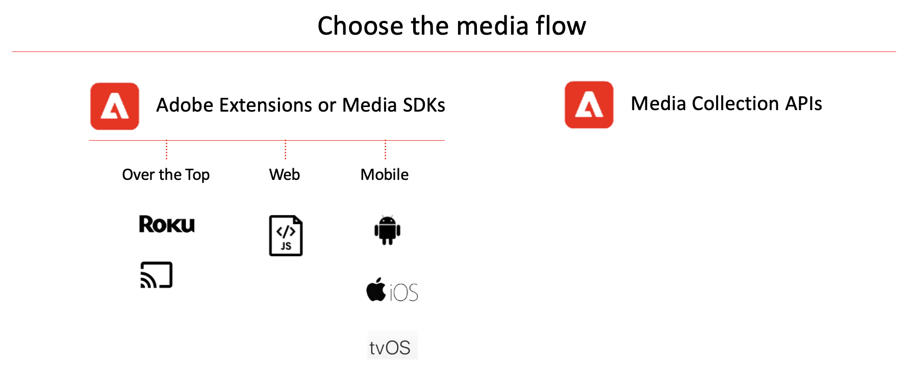

# Implementieren von Streaming-Medien für Adobe Analytics

Der Implementierungspfad, dem Sie folgen, hängt davon ab, ob Sie die integrierte Logik der Media SDKs (die standardmäßige, empfohlene Implementierung) verwenden oder ob Sie sich dafür entscheiden, eine eigene Rolle zu übernehmen und die einfachen, aber leistungsstarken und anpassbaren Mediensammlungs-APIs (RESTful) zu verwenden.

Wählen Sie den Implementierungspfad abhängig von den unterstützten Plattformen aus. Einige Player werden von den Media SDKs oder den Adobe Experience Platform Media Extensions nicht unterstützt. Die Mediensammlungs-APIs bieten eine Möglichkeit, diese Player zu unterstützen. Informationen zu unterstützten Geräten finden Sie unter [Unterstützte Geräte und Plattformen](/help/getting-started/supported-devices.md).

Informationen zum Herunterladen und Installieren von Medien-SDKs und Erweiterungen finden Sie unter [Abrufen von Medien-SDKs, Erweiterungen mithilfe von Tags und OTT-SDKs](/help/getting-started/download-sdks.md).

Informationen zur Verwendung der Mediensammlungs-APIs finden Sie unter [Mediensammlungs-APIs](media-collection-api/mc-api-overview.md).
