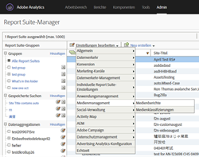
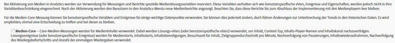
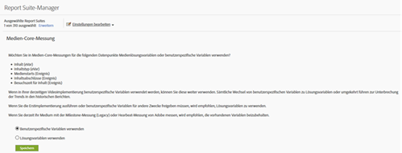
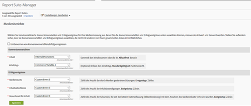

# Übersicht zu Milestone{#milestone-overview}

>[!CAUTION]
>
>Diese Messoption wird nicht mehr empfohlen.

[Alte Milestone-Dokumentation](milestone_analytics_video.pdf)

## Konfiguration {#configuration}

### Milestone-Videokonfiguration

Zum Tracking von Videos reservieren Sie einen Satz von *anwenderspezifischen eVars* und *anwenderspezifischen Ereignissen* für das Tracking und das Reporting. Eine *Custom Insight*-Variable (`s.prop`) wird auch für Pfade verwendet.

Die Variablen, die Sie für jede Metrik auswählen, werden der Video-Konfigurationsseite hinzugefügt. Dadurch kann das System die standardmäßigen Videoberichte automatisch erstellen und formatieren. Die eVar für den *Videonamen* und der Zähler für die *Videoansichten* sind beide erforderlich. Andere Variablen sind optional, werden aber für eine vollständige Messung empfohlen. Nachdem das Video-Tracking aktiviert wurde, können Sie Berichte über Video-Daten einsehen, die Sie mithilfe des Video-Trackings erfasst haben.

Sie können auch eine beliebige Anzahl zusätzlicher Metriken für Videos tracken. Wenn Sie beispielsweise mehrere Videoplayer auf Ihrer Site verwenden, können Sie ein eVar mit dem Player-Namen befüllen. Einige der ausgewählten Variablen können auch in anderen Bereichen Ihrer Site verwendet werden. Bei Verwendung auf Ihrer gesamten Site können Sie mit der *Content-Typ-Variablen* messen, welcher Prozentsatz der Ansichten Ihrer Seite aus Videos stammt, und Konversionsereignisse mit Videos verknüpfen.

### Konfiguration der Berichterstattung mit Meilensteinen

Um das Videoreporting für eine Meilensteinimplementierung einzurichten, gehen Sie zu **[!UICONTROL Admin > Report Suite-Manager].** Wählen Sie die Report Suite und dann **[!UICONTROL Video Management > Video Reporting]:**

<!--
{width="248"}
-->


Auf dem ersten Bildschirm funktioniert nur Video-Core mit Milestone-Daten. Wählen Sie **[!UICONTROL Video-Core]** und klicken Sie auf **[!UICONTROL Speichern].**



Wählen Sie auf dem nächsten Bildschirm **[!UICONTROL Benutzerdefinierte Variablen verwenden].**

<!--
{width="470"}
-->


Wählen Sie auf dem letzten Bildschirm die beiden eVars und drei Ereignisse aus, die für Ihre Videomessung verwendet werden sollen:

<!--

-->


## Videovariablenreferenz {#video-variable-reference}

Die folgende Tabelle enthält zusätzliche Details zu den Commerce-Variablen und anwenderspezifischen Ereignissen für Videos:

| Videometrik | Variablentyp | Beschreibung |
| --- | --- | --- |
| Inhalt | eVar <br/>Standardgültigkeit: Besuch | (Erforderlich) Erfasst den Namen des Videos, wie in der Implementierung angegeben. |
| Content-Typ | eVar<br/> Standardgültigkeit: Seitenansicht | Erfasst Daten zum Typ des Inhalts, der von einem Besucher angesehen wird. Treffer, die durch Videomessung gesendet werden, erhalten einen Content-Typ `video.` <br/>Diese Variable muss nicht ausschließlich für das Video-Tracking reserviert werden. Wenn andere Content-Typen der Inhaltsberichte dieselbe Variable verwenden, können Sie die Verteilung der Besucher auf die verschiedenen Inhaltstypen analysieren. Sie könnten diese Variable z. B. verwenden, um andere Content-Typen mithilfe von Werten wie `article` oder `product page` zu taggen. <br/>Im Hinblick auf die Videomessung können Sie über den *Content-Typ* Videobesucher identifizieren und somit Videokonversionsraten berechnen. |
| Inhaltsbesuchszeit | Ereignistyp<br/>: Zähler | Gibt in Sekunden an, wie lange ein Video seit dem letzten Datenerfassungsprozess (Bildanforderung) angesehen wurde. |
| Videoaufrufe | Ereignistyp<br/>: Zähler | Gibt an, dass ein Besucher einen Teil eines Videos betrachtet hat. Es werden jedoch keine Informationen zu der Länge oder dem Ausschnitt des vom Besucher angesehenen Videos bereitgestellt. |
| Videobeendigungen | Ereignistyp<br/>: Zähler | Gibt an, dass ein Besucher ein Video vollständig angesehen hat. Standardmäßig wird das complete-Ereignis 1 Sekunde vor dem Ende des Videos gemessen.  <br/>Bei der Implementierung können Sie festlegen, wie viele Sekunden vor dem Ende des Videos eine Ansicht als vollständig betrachtet werden soll. Bei Live-Videos und anderen Streams ohne definiertes Ende können Sie einen eigenen Punkt angeben, an dem Beendigungen gemessen werden sollen Beispielsweise nach einer bestimmten Zeit, in der das Video betrachtet wurde. |

## Medienmodulvariablen {#media-module-variables}

Mit den folgenden Variablen können Sie die Videomessung konfigurieren. Definieren Sie die Werte für die Variablen in der Tabelle „Erforderliche Variablen“. Um Ereignisse im Videoplayer zu tracken, müssen Sie außerdem autoTrack (für unterstützte Player) aktivieren oder das Tracking benutzerdefinierter Player-Ereignisse mit den Methoden „open“, „play“, „stop“ und „close“ implementieren.

| Variable    | Beschreibung |
| --- | --- |
| `Media.trackUsingContextData` | **Syntax:** <br/><br/> `s.Media.trackUsingContextData = true;` <br/>Diese Option aktiviert die integrierte Videoverfolgung. Wenn der Wert auf „true“ (wahr) gesetzt ist, generiert das Medienmodul Kontextdaten für das Medien-Tracking anstelle der veralteten Funktion `pev3`. <br/>Verwenden Sie `Media.contextDataMapping`, um die Kontextdaten den gewählten eVars und Ereignissen zuzuordnen.<br/>Standardwert: `false` |
| `Media.contextDataMapping` | **Syntax:** <br/><br/> `s.Media.contextDataMapping = {`<br/>      `"a.media.name":"eVar2, prop2",` <br/>     `"a.media.segment":"eVar3",` <br/>     `"a.contentType":"eVar1",` <br/>     `"a.media.timePlayed":"event3",` <br/>     `"a.media.view":"event1",` <br/>     `"a.media.segmentView":"event2",` <br/>     `"a.media.complete":"event7",` <br/>     `"a.media.milestones":{` <br/>         `25:"event4",` <br/>         `50:"event5",` <br/>         `75:"event6"` <br/>     ` }` <br/> `};` <br/><br/>Ein Objekt, das die Variablenzuordnung zu eVars und Ereignissen definiert, die Sie für die Videomessung verwenden möchten. Das Objekt muss die folgenden Felder zuordnen: <br/><br/> **a.media.name** (erforderlich): Füllt Variablen mit dem Videonamen. Geben Sie das eVar, das Sie zum Speichern des Videonamens ausgewählt haben, und die Variable Custom Insight Vide (`s.prop`) an, die Sie für die Videoverwaltung verwenden möchten. Geben Sie die Werte in einer durch Kommata getrennten Liste an. <br/><br/> **a.media.segment** (optional): Die eVar, mit der Sie den Mediensegmentnamen speichern möchten a.contentType (optional): Die eVar, mit der Sie den Videowert speichern möchten, bei dem Besuchs- und Besucherverfolgung aktiviert sind, damit Sie Berichte zu Videobesuchen und -besuchern erstellen können. Die gewählte Variable wird wahrscheinlich bereits dazu verwendet, Daten wie Artikel-Slideshows oder Produktseiten zu speichern.<br/><br/> **a.media.view** (erforderlich): Das Ereignis, mit dem Medienansichten gezählt werden sollen. <br/><br/> **a.media.segmentView** (optional): Das Ereignis, mit dem Segmentansichten gezählt werden sollen. <br/><br/> **a.media.complete** (optional): Das Ereignis, mit dem vollständige Ansichten gezählt werden sollen. <br/><br/> **a.media.timePlayed** (optional, aber dringend empfohlen): Das numerische Ereignis, mit dem Sie die Anzahl der wiedergegebenen Sekunden des Videos speichern möchten. <br/><br/> **a.media.milestones** (optional): Ein Objekt, das s.Media.trackMilestones-Meilensteine Zählerereignissen zuordnet. Media.segmentByMilestones sollte auf „true“ gesetzt werden, wenn Sie Meilensteine definieren. <br/><br/> **Anzeigen-Tracking** Zum Tracking von Anzeigen stehen die folgenden Kontextdatenvariablen zur Verfügung: <br/> **a.media.ad.name:** (erforderlich) Füllt Variablen mit dem Anzeigennamen. Geben Sie die gewählte eVar für die Speicherung des Anzeigennamens sowie die Custom Insight Video-Variable (`s.prop`) für die Pfadsetzung an. Geben Sie die Werte in einer durch Kommata getrennten Liste an. <br/><br/> **a.media.ad.pod:** Die Position im Hauptinhalt, an der die Anzeige wiedergegeben wurde. <br/><br/> **a.media.ad.podPosition:** Die Position in der Werbeunterbrechung, an der die Anzeige wiedergegeben wurde. <br/><br/> **a.media.ad.CPM:** CPM oder verschlüsselter CPM (mit „~“ als Präfix) für diese Wiedergabe. <br/><br/> **a.media.ad.view:** Funktioniert genauso wie `a.media.view` <br/><br/> **a.media.ad.clicked:** Zählt die Anzahl an Klicks für die Anzeige (`Media.click`-Aufrufe) <br/><br/> **a.media.ad.timePlayed:** Funktioniert genauso wie `a.media.timePlayed` <br/><br/> **a.media.ad.complete:** Funktioniert genauso wie `a.media.complete` a.media.ad.segment: Funktioniert genauso wie `a.media.segment` <br/><br/> **a.media.ad.segmentView:** Funktioniert genauso wie `a.media.segmentView` <br/><br/> **a.media.ad.milestones:** Funktioniert genauso wie `a.media.milestones` <br/><br/> **a.media.ad.offsetMilestones:** Funktioniert genauso wie `a.media.offsetMilestones` |
| `Media.trackVars` | **Syntax:** <br/><br/> `s.Media.trackVars =` <br/>    `"events,` `prop2,` `eVar1,` `eVar2,` `eVar3";` <br/><br/>Eine durch Kommata getrennte Liste aller Variablen, die im Video-Trackingcode festgelegt sind. |
| `Media.trackEvents` | **Syntax:** <br/><br/> `s.Media.trackEvents =` <br/>    `"event1,` `event2,` `event3,` `event4,` `event5,` `event6,` `event7"` <br/><br/>Eine durch Kommata getrennte Liste aller Ereignisse, die im Video-Trackingcode festgelegt sind. |

## Optionale Variablen {#optional-variables}

|  Variable    | Beschreibung |
| --- | --- |
| `Media.autoTrack` | **Syntax:** <br/><br/> `s.Media.autoTrack = true`<br/><br/>Aktiviert das automatische Tracking für unterstützte Player. Folgende Player werden unterstützt: <ul> <li> Open Source Media Framework (OSMF) </li> <li> FLVPlayback (Videoplayer, die vom Video-Importassistenten in Flash Professional erstellt wurden) </li> <li> Silverlight </li> <li> MediaDisplay </li> <li> MediaPlayback </li> <li> Brightcove API-Versionen 2 und 3 (siehe [Brightcove](https://experienceleague.adobe.com/docs/media-analytics/using/media-overview.html?lang=de)) </li> <li> Windows Media Player, Quicktime oder Real Player mit JavaScript </li> </ul> <br/><br/>Wenn Sie einen anderen Player als die oben genannten verwenden, können Sie Player-Ereignisse anhand von `Media.open` `Media.play` `Media.stop` `Media.close` verfolgen. |
| `Media.autoTrackNetStreams` | **Syntax:** <br/><br/> `s.Media.autoTrackNetStreams = true` <br/><br/>In Flash 10.3 wurde neue Funktionalität für die NetStream-Komponente eingeführt, mit der das erweiterte Video-Tracking ermöglicht wird. Wenn Sie einen anwenderspezifischen Flash-NetStream-Player verwenden, können Sie diese Variable aktivieren, um eine ähnliche Funktion wie autoTrack zu ermöglichen. Für diese Methode ist es erforderlich, dass Videos in Flash 10.3 oder höher angezeigt werden. |
| `Media.completeByCloseOffset` | **Syntax:** <br/><br/> <br/><br/>`s.Media.completeByCloseOffset = true` <br/><br/>Mit dieser Einstellung können Sie eine vollständige Videoansicht zählen, auch wenn diese einige Sekunden vor dem eigentlichen Ende beendet wurde.  <br/><br/>Das Ereignis wird basierend auf der in `completeCloseOffsetThreshold` angegebenen Anzahl an Sekunden gesendet. Damit können Sie „completes“ in Videoplayern messen, die nie einen Offset melden, der mit der Länge des Videos identisch ist.<br/><br/>Standardmäßig ist dieser Wert auf „true“ gesetzt und der Schwellenwert auf 1 Sekunde. Mit diesen Standardwerten wird das complete-Ereignis 1 Sekunde vor dem Ende des Videos gesendet. |
| `Media.completeCloseOffsetThreshold` | **Syntax:** <br/><br/> `s.Media.completeCloseOffsetThreshold = 1` <br/><br/>Mit diesem Schwellenwert können Sie eine vollständige Videoansicht einige Sekunden vor dem eigentlichen Ende des Videos aufzeichnen.  `Media.completeByCloseOffset` muss auf „true“ gesetzt werden, um diesen Schwellenwert zu nutzen.<br/><br/>Der angegebene ganzzahlige Wert bestimmt, wie viele Sekunden der Offset von der Länge des Videos beim Schließen entfernt sein darf, um noch als vollständige Ansicht zu zählen. Damit können Sie „completes“ in Videoplayern messen, die nie einen Offset melden, der mit der Länge des Videos identisch ist.  <br/><br/>Der Standardschwellenwert beträgt 1 Sekunde. |
| `Media.playerName` | **Syntax:** <br/><br/> `s.Media.playerName = "Custom Player Name"` <br/><br/>Gibt einen benutzerspezifischen Videoplayernamen an. |
| `Media.trackSeconds` | **Syntax:** <br/><br/> `s.Media.trackSeconds = 15` <br/><br/>Definiert das Intervall (in Sekunden) zum Senden von Video-Tracking-Daten an Adobe-Datenerfassungsserver während der Videowiedergabe. Der Wert muss in Schritten von 5 Sekunden festgelegt werden. <br/><br/>Durch die Aktivierung von `Media.trackSeconds` werden nur die in `Media.contextDataMapping` definierten Ereignisse ausgelöst. Wenn Sie zusätzliche Variablen zu den für die Videomessung angegebenen senden möchten, müssen Sie Media.Monitor verwenden. |
| `Media.trackMilestones` | Verfolgt Meilensteine als Prozentsatz der Videolänge.  <br/><br/> **Syntax:** <br/><br/> `s.Media.trackMilestones = "25, 50, 75";` <br/><br/>Definiert das Intervall zum Senden von Video-Tracking-Daten an Adobe-Datenerfassungsserver als Prozentsatz der Videolänge. Geben Sie die Meilensteine als durch Kommata getrennte Liste mit Ganzzahlen an. Beispiel: 10 = 10 %, 23 = 23 %.  <br/><br/>Da diese Meilensteine feste Punkte im Video sind, sendet das Medienmodul die Tracking-Daten mehrmals, wenn ein Besucher ein Video über den 10-%-Meilenstein anschaut und dann zurückspult und den 10-%-Meilenstein erneut überschreitet. Gleichermaßen sendet das Medienmodul keine Tracking-Daten für einen Meilenstein, wenn ein Besucher diesen beim Vorspulen überspringt.  <br/><br/>Durch die Aktivierung von `Media.trackMilestones` werden nur die in `Media.contextDataMapping` definierten Ereignisse ausgelöst. Wenn Sie zusätzliche Variablen zu den für die Videomessung angegebenen senden möchten, müssen Sie Media.Monitor verwenden. |
| `Media.trackOffsetMilestones` | Zeichnet Meilensteine als Anzahl von Sekunden ab Anfang des Videos auf.  <br/><br/> **Syntax:** <br/><br/> `s.Media.trackOffsetMilestones = "20, 40, 60";` <br/><br/>Definiert das Intervall zum Senden von Video-Tracking-Daten an Adobe-Datenerfassungsserver als Anzahl von Sekunden ab Anfang des Videos. Geben Sie die Meilensteine als durch Kommata getrennte Liste mit Ganzzahlen an. (z. B. 20 = 20 Sekunden, 40 = 40 Sekunden).  <br/><br/>Da diese Meilensteine feste Punkte im Video sind, sendet das Medienmodul die Tracking-Daten mehrmals, wenn ein Besucher ein Video über den 20-Sekunden-Meilenstein anschaut und dann zurückspult und den 20-Sekunden-Meilenstein erneut überschreitet. Gleichermaßen sendet das Medienmodul keine Tracking-Daten für einen Meilenstein, wenn ein Besucher diesen beim Vorspulen überspringt.  <br/><br/>Durch die Aktivierung von `Media.trackOffsetMilestones` werden nur die in `Media.contextDataMapping` definierten Ereignisse ausgelöst. Wenn Sie zusätzliche Variablen zu den für die Videomessung angegebenen senden möchten, müssen Sie Media.Monitor verwenden. |
| `Media.segmentByMilestones` | **Syntax:** <br/><br/> `s.Media.segmentByMilestones = true;` <br/><br/>Generiert automatisch Daten zu Segmentname, Segmentnummer und Segmentlänge anhand der Länge des Mediums und den in `Media.trackMilestones` angegebenen Meilensteinen <br/><br/>Segmentierung nach Meilensteinen ist die einzige Möglichkeit, Segmente bei Verwendung von `autoTrack` zu definieren. <br/><br/>Standardwert: `false` |
| `Media.segmentByOffsetMilestones` | **Syntax:** <br/><br/> `s.Media.segmentByOffsetMilestones = true;` <br/><br/>Generiert automatisch Daten zu Segmentname, Segmentnummer und Segmentlänge anhand der Länge des Mediums und den in `Media.trackOffsetMilestones` angegebenen Meilensteinen <br/><br/>Segmentierung nach Meilensteinen ist die einzige Möglichkeit, Segmente bei Verwendung von `autoTrack` zu definieren.  <br/><br/>Standardwert: `false` |

## Anzeigenverfolgungsvariablen {#ad-tracking-variables}

Mit diesen Variablen können Sie Anzeigeninformationen zusammen mit der openAd-Methode senden. Siehe [VAST-Videoanzeigenverfolgung.](https://experienceleague.adobe.com/docs/media-analytics/using/media-overview.html)

| Variable    | Beschreibung |
| --- | --- |
| `Media.adTrackSeconds` | **Syntax:** <br/><br/> `s.Media.adTrackSeconds = 15;` <br/><br/>Definiert das Intervall (in Sekunden) zum Senden von Videoanzeigen-Tracking-Daten an Adobe-Datenerfassungsserver während der Videowiedergabe. Der Wert muss in Schritten von 5 Sekunden festgelegt werden.  <br/><br/>Durch die Aktivierung von `Media.adTrackSeconds` werden nur die in `Media.contextDataMapping` definierten Ereignisse ausgelöst. Wenn Sie zusätzliche Variablen zu den für die Videomessung angegebenen senden möchten, müssen Sie `Media.monitor` verwenden. |
| `Media.adTrackMilestones` | Verfolgt Anzeigenmeilensteine als Prozentsatz der Anzeigenlänge.  <br/><br/> **Syntax:** <br/><br/> `s.Media.adTrackMilestones = "25, 50, 75";` <br/><br/>Definiert das Intervall zum Senden von Anzeigen-Tracking-Daten an Adobe-Datenerfassungsserver als Prozentsatz der Anzeigenlänge. Geben Sie die Meilensteine als durch Kommata getrennte Liste mit Ganzzahlen an. Beispiel: 10 = 10 %, 23 = 23 %).  <br/><br/>Da diese Meilensteine feste Punkte in der Anzeige sind, sendet das Medienmodul die Tracking-Daten mehrmals, wenn ein Besucher eine Anzeige über den 10-%-Meilenstein anschaut und dann zurückspult und den 10-%-Meilenstein erneut überschreitet. Gleichermaßen sendet das Medienmodul keine Tracking-Daten für einen Meilenstein, wenn ein Besucher diesen beim Vorspulen überspringt.  <br/><br/>Durch die Aktivierung von `Media.adTrackMilestones` werden nur die in `Media.contextDataMapping` definierten Ereignisse ausgelöst. Wenn Sie zusätzliche Variablen zu den für die Videomessung angegebenen senden möchten, müssen Sie `Media.monitor` verwenden. |
| `Media.adTrackOffsetMilestones` | Zeichnet Anzeigenmeilensteine als Anzahl von Sekunden ab Anfang der Anzeige auf.  <br/><br/> **Syntax:** <br/><br/> `s.Media.adTrackOffsetMilestones = "20, 40, 60";` <br/><br/>Definiert das Intervall zum Senden von Anzeigen-Tracking-Daten an Adobe-Datenerfassungsserver als Anzahl von Sekunden ab Anfang der Anzeige. Geben Sie die Meilensteine als durch Kommata getrennte Liste mit Ganzzahlen an. (z. B. 20 = 20 Sekunden, 40 = 40 Sekunden).  <br/><br/>Da diese Meilensteine feste Punkte in der Anzeige sind, sendet das Medienmodul die Tracking-Daten mehrmals, wenn ein Besucher eine Anzeige über den 20-Sekunden-Meilenstein anschaut und dann zurückspult und den 20-Sekunden-Meilenstein erneut überschreitet. Gleichermaßen sendet das Medienmodul keine Tracking-Daten für einen Meilenstein, wenn ein Besucher diesen beim Vorspulen überspringt.  <br/><br/>Durch die Aktivierung von `Media.adTrackOffsetMilestones` werden nur die in `Media.contextDataMapping` definierten Ereignisse ausgelöst. Wenn Sie zusätzliche Variablen zu den für die Videomessung angegebenen senden möchten, müssen Sie `Media.monitor` verwenden. |
| `Media.adSegmentByMilestones` | **Syntax:** <br/><br/> `s.Media.adSegmentByMilestones = true;` <br/><br/>Generiert automatisch Daten zu Segmentname, Segmentnummer und Segmentlänge anhand der Länge des Mediums und den in `Media.adTrackMilestones` angegebenen Meilensteinen <br/><br/>Segmentierung nach Meilensteinen ist die einzige Möglichkeit, Segmente bei Verwendung von `autoTrack` zu definieren.  <br/><br/>Standardwert: `false` |
| `Media.adSegmentByOffsetMilestones` | **Syntax:** <br/><br/> `s.Media.adSegmentByOffsetMilestones = true;` <br/><br/>Generiert automatisch Daten zu Segmentname, Segmentnummer und Segmentlänge anhand der Länge des Mediums und den in `Media.adTrackOffsetMilestones` angegebenen Meilensteinen <br/><br/>Segmentierung nach Meilensteinen ist die einzige Möglichkeit, Segmente bei Verwendung von `autoTrack` zu definieren. <br/><br/>Standardwert: `false` |

## Medienmodulmethoden {#media-module-methods}

Mit den Medienmodulmethoden können Sie Playerereignisse sowie weitere Metriken, die nicht zu den Standardvideoberichten gehören, manuell verfolgen.

Wenn Sie `Media.autoTrack` verwenden und keine zusätzlichen Metriken verfolgen, müssen Sie keine dieser Methoden direkt aufrufen. Alle Argumente, die nicht als optional gekennzeichnet wurden, sind erforderlich.

| Methode    | Beschreibung |
| --- | --- |
| `Media.open` | **Syntax:** <br/><br/> `s.Media.open(mediaName, mediaLength, mediaPlayerName)` <br/><br/>Bereitet das Medienmodul auf die Erfassung von Video-Tracking-Daten vor. Diese Methode akzeptiert die folgenden Parameter: <ul><li> **mediaName** (erforderlich): Der Name des Videos, wie er in Videoberichten angezeigt werden soll. </li><li>  **mediaLength** (erforderlich): Die Länge des Videos in Sekunden.  </li><li> **mediaPlayerName** (erforderlich): Der Name des Medienplayers, mit dem das Video wiedergegeben wird, wie er in Videoberichten angezeigt werden soll. </li></ul> |
| `Media.openAd` | **Syntax:** <br/><br/> `s.Media.openAd(name, length, playerName, parentName,`<br/>   `parentPod, parentPodPosition, CPM)` <br/><br/>Bereitet das Medienmodul auf die Erfassung von Anzeigen-Tracking-Daten vor. Diese Methode akzeptiert die folgenden Parameter: <ul> <li> **name** (erforderlich): Name oder ID der Anzeige.  </li> <li> **length** (erforderlich): Länge der Anzeige.  </li> <li> **playerName** (erforderlich): Name des Medienplayers, mit dem die Anzeige wiedergegeben wird.  </li> <li> **parentName:** Name oder ID des Hauptinhalts, in den die Anzeige eingebettet ist.  </li> <li> **parentPod:** Die Position im Hauptinhalt, an der die Anzeige wiedergegeben wurde.  </li> <li> **parentPodPosition:** Die Position in der Werbeunterbrechung, an der die Anzeige wiedergegeben wurde.  </li> <li> **CPM:** CPM oder verschlüsselter CPM (mit „~“ als Präfix) für diese Wiedergabe.  </li> </ul> |
| `Media.click` | **Syntax:** <br/><br/> `s.Media.click(name, offset)` <br/><br/>Verfolgt, wenn in einem Video auf eine Anzeige geklickt wird. Diese Methode akzeptiert die folgenden Parameter: <ul> <li> **name**: Name der Anzeige. Dieser Name muss mit dem in Media.openAd verwendeten Namen übereinstimmen.  </li> <li> **offset:** Die Verzögerung der Anzeige ab dem Klick.  </li> </ul> |
| `Media.close` | **Syntax:** <br/><br/> `s.Media.close(mediaName)` <br/><br/>Beendet die Videodatenerfassung und sendet Informationen an Adobe-Datenerfassungsserver. Rufen Sie diese Methode am Ende des Videos auf. Diese Methode akzeptiert den folgenden Parameter: <br/><br/> **mediaName**: Name des Videos. Dieser Name muss mit dem in `Media.open` verwendeten Namen übereinstimmen. |
| `Media.complete` | **Syntax:** <br/><br/> `s.Media.complete(name, offset)` <br/><br/>Mit dieser Methode wird ein complete-Ereignis manuell aufgezeichnet. Diese Methode wird verwendet, wenn Sie Ereignisse über spezielle Logik auslösen müssen, die nicht mit `Media.completeByCloseOffset` verarbeitet werden kann. <br/><br/>Wenn Sie z. B. einen Live-Stream ohne ein definiertes Ende messen, können Sie ein „complete“ auslösen, wenn ein Anwender einen Live-Stream x Sekunden lang angesehen hat. Sie können eine Beendigung anhand einer Prozentrechnung auf der Basis der Länge und des Typs des Inhalts messen. Diese Methode akzeptiert die folgenden Parameter: <ul> <li> **mediaName**: Name des Videos. Dieser Name muss mit dem in Media.open verwendeten Namen übereinstimmen.  </li> <li> **mediaOffset**: Gibt an, nach wie vielen Sekunden Videowiedergabe das complete-Ereignis gesendet werden soll. Geben Sie das Offset nach dem Videostart bei Sekunde Null an. <br/><br/>Wenn der Medienplayer das Tracking anhand von Millisekunden vornimmt, achten Sie darauf, den Wert in Sekunden umzuwandeln, bevor Sie Media.complete aufrufen.  </li> </ul> Wenn Sie „complete“ manuell aufrufen möchten, definieren Sie <br/><br/> `s.Media.completeByCloseOffset = false`. |
| `Media.play` | **Syntax:** <br/><br/> `s.Media.play(name, offset, segmentNum, segment, segmentLength)` <br/><br/>Rufen Sie diese Methode jedes Mal auf, wenn die Videowiedergabe gestartet wird. Bei der manuellen Videomessung können Sie die aktuellen Segmentdaten angeben, wenn Sie Videomessdaten senden.  <br/><br/>Wenn Ihr Player aus irgendeinem Grund von einem Segment zu einem anderen wechselt, sollten Sie `Media.stop` `Media.play` aufrufen. <br/><br/>Diese Methode akzeptiert die folgenden Parameter: <br/><br/> **mediaName**: Name des Videos. Dieser Name muss mit dem in Media.open verwendeten Namen übereinstimmen.  <br/><br/> **mediaOffset:** Gibt an, nach wie vielen Sekunden ab Videoanfang die Wiedergabe beginnt. Geben Sie das Offset nach dem Videostart bei Sekunde Null an. Wenn der Medienplayer das Tracking anhand von Millisekunden vornimmt, achten Sie darauf, den Wert in Sekunden umzuwandeln, bevor Sie Media.play aufrufen.  <br/><br/> **segmentNum** (optional): Die aktuelle Segmentnummer, anhand deren Marketingberichte die Anzeigereihenfolge von Segmenten in Berichten festlegen. Der segmentNum-Parameter muss größer als null sein.  <br/><br/> **Segment** (optional): Der aktuelle Segmentname.  <br/><br/> **segmentLength** (optional): <br/><br/>Die aktuelle Segmentlänge in Sekunden.  <br/><br/>Beispiel: <br/><br/> `s.Media.play("My Video", 1800, 2,"Second Quarter", 1800)` <br/><br/> `s.Media.play("My Video", 0, 1,"Preroll", 30)` |
| `Media.stop` | **Syntax:** <br/><br/> `s.Media.stop(mediaName, mediaOffset)`<br/><br/>Zeichnet ein stop-Ereignis (stop, pause usw.) für das angegebene Video auf. Diese Methode akzeptiert die folgenden Parameter: <ul> <li> **mediaName**: Name des Videos. Dieser Name muss mit dem in `Media.open` verwendeten Namen übereinstimmen.  </li> <li> **mediaOffset:** Gibt an, nach wie vielen Sekunden ab Videoanfang das Stopp- oder Pause-Ereignis auftritt. Geben Sie das Offset nach dem Videostart bei Sekunde Null an.  </li> </ul> |
| `Media.monitor` | **Syntax:** <br/><br/> `s.Media.monitor(s, media)` <br/><br/> **Silverlight-Syntax:**<br/><br/> `s.Media.monitor =` <br/>   `new AppMeasurement_Media_Monitor(myMediaMonitor);` <br/><br/>Der Medienmonitor der Silverlight-App implementiert das Objective-C-Delegate-Designmuster. Die Klassenmethode `myMediaMonitor` akzeptiert die Parameter `s` und `media`. <br/><br/>Anhand dieser Methode können Sie zusätzliche Videometriken senden. Sie können zusätzliche Variablen (Props, eVars, Ereignisse) einrichten und diese über `Media.track` je nach dem aktuellen Status des Videos während der Wiedergabe senden. <br/><br/>Siehe [Zusätzliche Metriken mit Media.monitor messen.](https://experienceleague.adobe.com/docs/media-analytics/using/media-overview.html) <br/><br/>Diese Methode akzeptiert die folgenden Parameter: <br/><br/>  **s:** Die `AppMeasurement`-Instanz (oder das JavaScript-`s`-Objekt). <br/><br/> **media:** Ein Objekt mit Elementen, die den Status des Videos angeben. Zu diesen Elementen gehören die Folgenden:  <ul><li> `media.name:` Der Name des Videos. Dieser Name muss mit dem in `Media.open` verwendeten Namen übereinstimmen; </li><li> `media.length:` Die Länge des Videos, die im `Media.open`-Aufruf angegeben wird (in Sekunden); </li><li> `media.playerName:` Der Name des Medienplayers, der im `Media.open`-Aufruf angegeben wird; </li><li> `media.openTime:` Ein NSDate-Objekt mit Daten zum Zeitpunkt, zu dem `Media.open` aufgerufen wurde; </li><li> `media.offset:` Der aktuelle Offset in Sekunden (tatsächlicher Punkt im Video) nach Videoanfang. Der Offset beginnt bei null (die erste Sekunde des Videos ist Sekunde 0); </li><li> `media.percent:` Der aktuelle Prozentsatz der Videowiedergabe basierend auf der Videolänge und dem aktuellen Versatz.;  </li><li> `media.timePlayed:` Die Gesamtanzahl der bisher wiedergegebenen Sekunden;  </li><li> `media.eventFirstTime:` Gibt an, ob dieses Medienereignis für dieses Video zum ersten Mal aufgerufen wurde; </li><li> `media.mediaEvent:` Eine Zeichenfolge mit dem Namen des Ereignisses, das den Monitoraufruf ausgelöst hat. </li></ul> |
|  | `media.mediaEvent` events: <ul><li> `OPEN:` Wenn die Wiedergabe über `Media.autoTrack` oder einen `Media.play`-Aufruf zuerst ermittelt wird; </li><li> `CLOSE:` Wenn die Wiedergabe bei Abschluss des Videos über `Media.autoTrack` oder einem `Media.close`-Aufruf beendet wird;</li><li> `PLAY:` Wenn die Wiedergabe nach Pause oder Scrubbing über `Media.autoTrack` oder einen zweiten `Media.play`-Aufruf wiederaufgenommen wird;</li><li> `STOP:` Wenn die Wiedergabe aufgrund einer Pause am Anfang des Scrubbings über `Media.autoTrack` oder einen `Media.stop`-Aufruf gestoppt wird;</li><li> `MONITOR:` Wenn die automatische Überwachung den Status des Videos während seiner Wiedergabe prüft (jede Sekunde);</li><li> `SECONDS:` In dem von der `Media.trackSeconds`-Variable definierten Sekundenintervall;</li><li> `MILESTONE:` Bei den von der `Media.trackMilestones`-Variable definierten Meilensteinen; </li></ul> |
| `Media.track` | **Syntax:** <br/><br/> `s.Media.track(mediaName)` <br/><br/>Sendet umgehend den aktuellen Videostatus zusammen mit allen definierten `Media.trackVars` und Media.trackEvents. Diese Methode wird innerhalb von `Media.monitor` verwendet. <br/><br/>Siehe [Zusätzliche Metriken mit Media.monitor messen.](https://experienceleague.adobe.com/docs/media-analytics/using/media-overview.html) <br/><br/>Rufen Sie `Media.open` und `Media.play` am Video auf, bevor Sie diese Methode aufrufen. Diese Methode akzeptiert den folgenden Parameter: <ul> <li> **mediaName**: Name des Videos. Dieser Name muss mit dem in `Media.open` verwendeten Namen übereinstimmen.</li> </ul> Diese Methode ist die einzige Möglichkeit, zusätzliche Variablen während der Videowiedergabe zu senden. Setzt das Sekundenintervall und die Meilenstein-Prozentzähler auf null zurück, um mehrere Tracking-Treffer zu verhindern. |


## Videoplayer-Ereignisse verfolgen {#track-video-player-events}

Sie können Medienplayer verfolgen, indem Sie Funktionen erstellen und an die Ereignishandler des Videoplayers anhängen. Damit können Sie `Media.open`, `Media.play`, `Media.stop` und `Media.close` zu den passenden Zeiten aufrufen. Beispiel:

* **Laden:** `Media.open` und `Media.play` wird aufgerufen.
* **Anhalten:** `Media.stop` wird aufgerufen. Beispiel: Wenn ein Anwender ein Video nach 15 Sekunden anhält, wird `s.Media.stop("Video1", 15)` aufgerufen.
* **Puffern:** `Media.stop` wird aufgerufen, während das Video gepuffert wird. `Media.play` wird aufgerufen, wenn die Wiedergabe fortgesetzt wird.
* **Wiederaufnehmen:** `Media.play` wird aufgerufen. Wenn ein Benutzer z. B. das Video nach dem anfänglichen Abspielen von 15 Sekunden und der Pause fortsetzt, wird `s.Media.play("Video1", 15)` aufgerufen.
* **Scrubbing (Regler):** Wenn der Anwender den Videoregler zieht, wird `Media.stop` aufgerufen. Bei Freigabe des Videoreglers wird `Media.play` aufgerufen.
* **Ende:** `Media.stop` wird aufgerufen und anschließend `Media.close`. Beispielsweise werden nach Ende eines 100-Sekunden-Videos `s.Media.stop("Video1", 100)` und dann `s.Media.close("Video1")` aufgerufen.

Um dies zu erreichen, können Sie vier anwenderspezifische Funktionen definieren, die Sie über die Media Player-Ereignishandler aufrufen können. Die verschiedenen Parameter, die an `Media.open`, `Media.play`, `Media.stop` und `Media.close` übergeben werden, stammen aus dem Player. Das folgende Pseudocode-Beispiel zeigt, wie dies erreicht wird:

```javascript
/* Call on video load */ 
function startMovie() { 
    s.Media.open(mediaName, mediaLength, mediaPlayerName); 
    playMovie(); 
} 
 
/* Call on video resume from pause and slider release */ 
function playMovie() { 
    s.Media.play(mediaName, 
                 mediaOffset,  
                 segmentNum,  
                 segment,  
                 segmentLength); 
} 
/* Call on video pause and slider grab */ 
function stopMovie() { 
    s.Media.stop(mediaName, mediaOffset); 
} 
 
/* Call on video end */ 
/* Measuring Video for Developers 43 */ 
function endMovie() { 
    stopMovie(); 
    s.Media.close(mediaName); 
} 
```

## JavaScript-AutoTrack {#javascript-autotrack}

Das JavaScript-Medienmodul identifiziert alle `<embed>`- oder `<object>`-Tags in der Seiten-HTML. Dann werden die Daten in jedem Tag durchsucht, um zu bestimmen, welcher Medienplayer verwendet wird. Wenn der Player Windows Media Player, Quicktime oder Real Player ist, kann `autoTrack` verwendet werden. `autoTrack` für Windows Media Player funktioniert allerdings nur mit Internet Explorer. Um andere Browser zu unterstützen, ist das manuelle Tracking für Windows Media Player erforderlich.

Sie müssen das Attribut `classid` am Objekt festlegen, das Sie verfolgen möchten. Die `classid` ist erforderlich, um die Ereignishandler verfügbar zu machen, mit denen das Medienmodul das Video automatisch verfolgt.

```javascript
s.Media.autoTrack = true
```

## JavaScript-Beispielcode {#javascript-sample-code}

```javascript
// Sample implementation 
s.usePlugins=true 
function s_doPlugins(s) { 
    /* Add manual calls to modules and plugins here */ 
} 
 
s.doPlugins=s_doPlugins 
 
/*********Media Module Calls**************/ 
s.loadModule("Media") 
 
/*Configure Media Module Functions */ 
s.Media.autoTrack= true; 
s.Media.trackVars="events, prop2, eVar1, eVar2, eVar3"; 
s.Media.trackEvents="event1, event2, event3, event4, event5, event6, event7" 
s.Media.trackMilestones="25, 50, 75"; 
s.Media.playerName="My Media Player"; 
s.Media.segmentByMilestones = true; 
s.Media.trackUsingContextData = true; 
s.Media.contextDataMapping = { 
    "a.media.name":"eVar2, prop2", 
    "a.media.segment":"eVar3", 
    "a.contentType":"eVar1", 
    "a.media.timePlayed":"event3", 
    "a.media.view":"event1", 
    "a.media.segmentView":"event2", 
    "a.media.complete":"event7", 
    "a.media.milestones":{ 
        25:"event4", 
        50:"event5", 
        75:"event6" 
    } 
} 
 
s.Media.monitor = function (s, media) { } //If Needed

/* Turn on and configure debugging here */ 
s.debugTracking = true; 
s.trackLocal = true; 
 
/* WARNING: Changing any of the below variables will cause drastic changes to how your visitor 
data is collected. Changes should only be made when instructed to do so by your account 
manager.*/ 
s.visitorNamespace = "yourNamespace"; 
s.trackingServer="metrics.mysite.com" //Use only if using first party cookies 
s.trackingServerSecure="smetrics.mysite.com" // Use only if using first party cookies in  
                                             // conjunction with SSL 
s.dc = '122'; 
 
/************************** PLUGINS SECTION *************************/ 
/* Insert any plugins code you want to use here. */ 
 
/****************************** MODULES *****************************/ 
/* Insert the media module tracking code here. */ 
```
