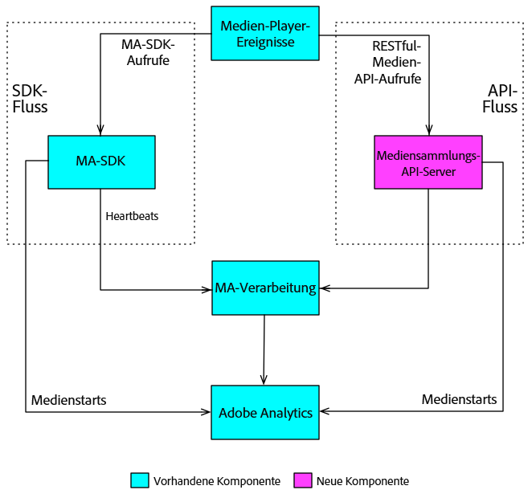

# Überblick {#overview}

Die Mediensammlungs-API wird von Adobe als RESTful-Alternative zum Client-seitigen Medien-SDK angeboten. Mit der Mediensammlungs-API kann Ihr Player Audio- und Videoereignisse mithilfe von RESTful-HTTP-Anfragen verfolgen. Die Mediensammlungs-API bietet das gleiche Echtzeit-Tracking wie das Medien-SDK sowie eine zusätzliche Funktion:

* **Tracking heruntergeladener Inhalte**

   Diese Funktion gibt Ihnen die Möglichkeit, Medien durch lokale Speicherung von Ereignisdaten zu verfolgen, während ein Benutzer offline ist, bis das Gerät des Benutzers wieder online ist. (Weitere Details unter [Tracking heruntergeladener Inhalte](track-downloaded-content.md).)

Die Mediensammlungs-API ist im Grunde ein Adapter, der als serverseitige Version des Medien-SDK fungiert. Das bedeutet, dass einige Aspekte der Medien-SDK-Dokumentation auch für die Mediensammlungs-API relevant sind. Beispielsweise verwenden beide Lösungen dieselben [Audio- und Video-Parameter](/help/metrics-and-metadata/audio-video-parameters.md), und die erfassten Audio- und Video-Tracking-Daten führen zu derselben [Berichterstellung und Analyse](/help/media-reports/media-reports-enable.md).

## Datenfluss beim Medien-Tracking {#media-tracking-data-flows}

Ein Medienplayer, in den die Mediensammlungs-API implementiert wurde, sendet RESTful-API-Tracking-Aufrufe direkt an den Backend-Server des Medien-Trackings, während ein Player mit dem Medien-SDK innerhalb der Player-Anwendung Tracking-Aufrufe an die SDK-APIs sendet. Da der Player mit der Mediensammlungs-API Aufrufe über das Internet sendet, muss er einen Teil der Verarbeitung übernehmen, den das Medien-SDK automatisch vornimmt. (Details unter [Implementierung der Mediensammlung.](mc-api-impl/mc-api-quick-start.md))

Die über die Mediensammlungs-API erfassten Tracking-Daten werden gesendet und zunächst anders verarbeitet als über einen Medien-SDK-Player erfasste Tracking-Daten. Es wird jedoch für beide Lösungen dieselbe Verarbeitungs-Engine im Backend verwendet.



## API-Übersicht {#api-overview}

**URI:** Diese erhalten Sie von Ihrem Adobe-Support-Mitarbeiter.

**HTTP-Methode:** POST mit JSON-Anfrageinhalt.

### API-Aufrufe {#mc-api-calls}

* **`sessions`**: Stellt eine Sitzung mit dem Server her und gibt eine Sitzungs-ID zurück, die in nachfolgenden `events`-Aufrufen verwendet wird. Ihre Anwendung führt diesen Aufruf zu Beginn einer Tracking-Sitzung durch.

   ```
   {uri}/api/v1/sessions
   ```

* **`events`**: Sendet Medien-Tracking-Daten.

   ```
   {uri}/api/v1/sessions/{session-id}/events
   ```

### Anfrageinhalt {#mc-api-request-body}

```
{ 
    "playerTime": { 
        "playhead": {playhead position in seconds}, 
        "ts": {timestamp in milliseconds} 
    }, 
    "eventType": {event-type}, 
    "params": { 
        {parameter-name}: {parameter-value}, 
        ... 
        {parameter-name}: {parameter-value} 
    }, 
    "qoeData" : { 
        {parameter-name}: {parameter-value}, 
        ... 
        {parameter-name}: {parameter-value} 
    }, 
    "customMetadata": { 
        {parameter-name}: {parameter-value}, 
        ... 
        {parameter-name}: {parameter-value} 
    } 
} 
```

* `playerTime`: Erforderlich für alle Anforderungen.
* `eventType`: Erforderlich für alle Anforderungen.
* `params`: Erforderlich für bestimmte `eventTypes`. Überprüfen Sie anhand des [JSON-Validierungsschemas](mc-api-ref/mc-api-json-validation.md), welche eventTypes erforderlich und welche optional sind.

* `qoeData`: Optional für alle Anforderungen.
* `customMetadata`: Optional für alle Anforderungen, wird jedoch nur mit den Ereignistypen `adStart``sessionStart` und `chapterStart` gesendet.

Für jeden `eventType` gibt es ein öffentlich verfügbares [JSON-Validierungsschema](mc-api-ref/mc-api-json-validation.md), mit dessen Hilfe Sie die Parametertypen überprüfen und herausfinden können, welche Parameter für die einzelnen Ereignisse erforderlich sind.

### Ereignistypen {#mc-api-event-types}

* `sessionStart`
* `play`
* `ping`
* `pauseStart`
* `bufferStart`
* `adStart`
* `adComplete`
* `adSkip`
* `adBreakStart`
* `adBreakComplete`
* `chapterStart`
* `chapterSkip`
* `chapterComplete`
* `sessionEnd`
* `sessionComplete`

