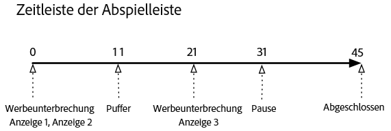
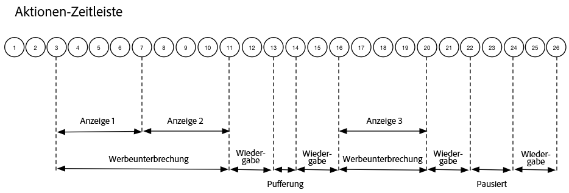

# Zeitlicher Ablauf 1: Wiedergabe bis zum Ende des Inhalts {#timeline-view-to-end-of-content}

## VOD, Pre-Roll-Anzeigen, Pausen, Puffern, Wiedergabe des Inhalts bis zum Ende

Die folgenden Diagramme illustrieren die Zeitleiste der Abspielleiste und die zugehörige Zeitleiste der Aktionen eines Benutzers. Die Details für jede Aktion und die zugehörigen Anforderungen sind unten aufgeführt.








## Aktionsdetails

### Aktion 1: Sitzung starten {#Action-1}

| Aktion | Aktions-Timeline (Sekunden) | Abspielleistenposition (Sekunden) | Client-Anfrage |
| --- | :---: | :---: | --- |
| Button zur automatischen Wiedergabe oder zur Wiedergabe gedrückt, Video wird geladen. | 0 | 0 | `/api/v1/sessions` |

**Implementierungsdetails**

Dieser Aufruf signalisiert _die Anwenderintention, ein Video abzuspielen_. <br/><br/>Er gibt eine Sitzungs-ID (`{sid}`) an den Client zurück, die zur Identifikation aller nachfolgenden Tracking-Aufrufe innerhalb der Sitzung verwendet wird. Der Player-Status lautet noch nicht „Playing“ (Wiedergabe), sondern „Starting“ (Start). <br/><br/>[Erforderliche Sitzungsparameter](/help/media-collection-api/mc-api-ref/mc-api-sessions-req.md) müssen in der `params`-Map des Anfrageinhalts angegeben werden. <br/><br/>Am Backend generiert dieser Aufruf einen Adobe Analytics-Initiationsaufruf.

**Beispiel-Anfrageinhalt**

```
{
    playerTime: {
        playhead: 0, ts: <timestamp>
    },
    eventType:sessionStart, params: {
        "media.playerName": "sample-html5-api-player",
        "analytics.trackingServer": "[ _YOUR_TS_ ]",
        "analytics.reportSuite": "[ _YOUR_RSID_ ]",
        "analytics.visitorId": "[ _YOUR_VISITOR_ID_ ]",
        "media.contentType": "VOD",
        "media.length": 60.3333333333333,
        "media.id": "VA API Sample Player",
        "visitor.marketingCloudOrgId": "[YOUR_MCID]",
        "media.name": "ClickMe",
        "media.channel": "sample-channel",
        "media.sdkVersion": "va-api-0.0.0",
        "analytics.enableSSL": false
    }
}
```

### Aktion 2: Start des Ping-Timers {#Action-2}

| Aktion | Aktions-Timeline (Sekunden) | Abspielleistenposition (Sekunden) | Client-Anfrage |
| --- | :---: | :---: | --- |
| App startet Ping-Ereignis-Timer | 0 | 0 | `/api/v1/sessions/{sid}/events` |  |

**Implementierungsdetails**

Starten Sie den Ping-Timer Ihrer App. Das erste Ping-Ereignis sollte dann nach 1 Sekunde ausgelöst werden, wenn Pre-Roll-Anzeigen vorhanden sind, andernfalls nach 10 Sekunden.

### Aktion 3: Start der Werbeunterbrechung {#Action-3}

| Aktion | Aktions-Timeline (Sekunden) | Abspielleistenposition (Sekunden) | Client-Anfrage |
| --- | :---: | :---: | --- |
| Verfolgen des Starts der Pre-Roll-Anzeigenunterbrechung | 0 | 0 | `/api/v1/sessions/{sid}/events` |

**Implementierungsdetails**

Anzeigen können nur innerhalb einer Werbeunterbrechung verfolgt werden.

**Beispiel-Anfrageinhalt**

```
{
    playerTime: {
        playhead: 0,
        ts: <timestamp>
    },
    eventType:adBreakStart, params: {
        "media.ad.podFriendlyName": "ad_pod1",
        "media.ad.podIndex": 0,
        "media.ad.podSecond": 0
    }
}
```

### Aktion 4: Anzeigenstart {#Action-4}

| Aktion | Aktions-Timeline (Sekunden) | Abspielleistenposition (Sekunden) | Client-Anfrage |
| --- | :---: | :---: | --- |
| Verfolgen des Starts der Pre-Roll-Anzeige Nr. 1 | 0 | 0 | `/api/v1/sessions/{sid}/events` |

**Implementierungsdetails**

Beginnen Sie mit dem Tracking der ersten Pre-Roll-Anzeige, die 15 Sekunden dauert, einschließlich anwenderspezifischer Metadaten mit diesem `adStart` .

**Beispiel-Anfrageinhalt**

```
{
    playerTime: {
        playhead: 0,
        ts: &lt;timestamp&gt;
    },
    eventType:adStart,
    params: {
        "media.ad.podFriendlyName": "ad_pod1",
        "media.ad.name": "Ad 1",
        "media.ad.id": "001",
        "media.ad.length": 15,
        "media.ad.podPosition": 1,
        "media.ad.playerName": "Sample Player",
        "media.ad.advertiser": "Ad Guys",
        "media.ad.campaignId": "1",
        "media.ad.creativeId": "42",
        "media.ad.siteId": "XYZ",
        "media.ad.creativeURL": "https://xyz_creative.com",
        "media.ad.placementId": "sample_placement"
    },
    customMetadata: {
        "myCustomData1": "CustomData1",
        "myCustomData2": "CustomData2"
    }
}
```

### Aktion 5: Anzeigen-Pings {#Action-5}

#### Aktion 5.1 - Anzeigen-Ping 1 {#Action-5-1}

| Aktion | Aktions-Timeline (Sekunden) | Abspielleistenposition (Sekunden) | Client-Anfrage |
| --- | :---: | :---: | --- |
| Anwendung sendet Ping-Ereignis. | 1 | 0 | `/api/v1/sessions/{sid}/events` |

**Implementierungsdetails**

Senden Sie innerhalb einer Anzeige jede Sekunde ein Ping-Ereignis an das Backend.

**Beispiel-Anfrageinhalt**

```
{
    playerTime: {
        playhead: 0,
        ts: <timestamp>
    },
    eventType:ping
}
```

#### Aktion 5.2 - Anzeigen-Ping 2 {#Action-5-2}

| Aktion | Aktions-Timeline (Sekunden) | Abspielleistenposition (Sekunden) | Client-Anfrage |
| --- | :---: | :---: | --- |
| Anwendung sendet Ping-Ereignis. | 2 | 0 | `/api/v1/sessions/{sid}/events` |

**Implementierungsdetails**

Senden Sie innerhalb einer Anzeige jede Sekunde ein Ping-Ereignis an das Backend.

**Beispiel-Anfrageinhalt**

```
{
    playerTime: {
        playhead: 0,
        ts: <timestamp>
    },
    eventType:ping
}
```

#### Aktion 5.3 - Anzeigen-Ping 3 {#Action-5-3}


| Aktion | Aktions-Timeline (Sekunden) | Abspielleistenposition (Sekunden) | Client-Anfrage |
| --- | :---: | :---: | --- |
| Anwendung sendet Ping-Ereignis. | 3 | 0 | `/api/v1/sessions/{sid}/events` |

**Implementierungsdetails**

Senden Sie innerhalb einer Anzeige jede Sekunde ein Ping-Ereignis an das Backend.

>[!NOTE]
>
>Nachfolgende Anzeigen in der Zeitleiste überspringen die Anzeige der Reihe von 1-Sekunden-Ping-Ereignissen.
>im Interesse der Kürze …

**Beispiel-Anfrageinhalt**

```
{
    playerTime: {
        playhead: 0,
        ts: <timestamp>
    },
    eventType:ping
}
```

### Aktion 6: Abschluss der Anzeige {#Action-6}

| Aktion | Aktions-Timeline (Sekunden) | Abspielleistenposition (Sekunden) | Client-Anfrage |
| --- | :---: | :---: | --- |
| Verfolgen des Abschlusses der Pre-Roll-Anzeige Nr. 1 | 15 | 0 | `/api/v1/sessions/{sid}/events` |

**Implementierungsdetails**

Verfolgen Sie das Ende der ersten Pre-Roll-Anzeige.

**Beispiel-Anfrageinhalt**

```
{
    playerTime: {
        playhead: 0,
        ts: <timestamp>
    },
    eventType:adComplete
}
```

### Aktion 7: Anzeigenstart {#Action-7}

| Aktion | Aktions-Timeline (Sekunden) | Abspielleistenposition (Sekunden) | Client-Anfrage |
| --- | :---: | :---: | --- |
| Verfolgen des Starts der Pre-Roll-Anzeige Nr. 2 | 15 | 0 | `/api/v1/sessions/{sid}/events` |

**Implementierungsdetails**

Verfolgen Sie den Start der zweiten Pre-Roll-Anzeige, die 7 Sekunden lang ist.

**Beispiel-Anfrageinhalt**

```
{
    playerTime: {
        playhead: 0,
        ts: <timestamp>
    },
    eventType:adStart, params: {
        "media.ad.podFriendlyName": "ad_pod1",
        "media.ad.name": "Ad 2",
        "media.ad.id": "002",
        "media.ad.length": 7,
        "media.ad.podPosition": 1,
        "media.ad.playerName": "Sample Player",
        "media.ad.advertiser": "Ad Guys",
        "media.ad.campaignId": "2",
        "media.ad.creativeId": "44",
        "media.ad.siteId": "XYZ",
        "media.ad.creativeURL": "https://xyz_creative.com",
        "media.ad.placementId": "sample_placement2"
    },
}
```

### Aktion 8: Anzeigen-Pings {#Action-8}

| Aktion | Aktions-Timeline (Sekunden) | Abspielleistenposition (Sekunden) | Client-Anfrage |
| --- | :---: | :---: | --- |
| Anwendung sendet Ping-Ereignis. | 20 | 0 | `/api/v1/sessions/{sid}/events` |

**Implementierungsdetails**

Senden Sie jede Sekunde ein Ping-Ereignis an das Backend.

**Beispiel-Anfrageinhalt**

```
{
    playerTime: {
        playhead: 0,
        ts: <timestamp>
    },
    eventType:ping
}
```

### Aktion 9: Abschluss der Anzeige {#Action-9}

| Aktion | Aktions-Timeline (Sekunden) | Abspielleistenposition (Sekunden) | Client-Anfrage |
| --- | :---: | :---: | --- |
| Verfolgen des Abschlusses der Pre-Roll-Anzeige Nr. 2 | 22 | 0 | `/api/v1/sessions/{sid}/events` |

**Implementierungsdetails**

Verfolgen Sie das Ende der zweiten Pre-Roll-Anzeige.

**Beispiel-Anfrageinhalt**

```
{
    playerTime: {
        playhead: 0,
        ts: <timestamp>
    },
    eventType:adComplete
}
```

### Aktion 10: Abschluss der Werbeunterbrechung {#Action-10}

| Aktion | Aktions-Timeline (Sekunden) | Abspielleistenposition (Sekunden) | Client-Anfrage |
| --- | :---: | :---: | --- |
| Verfolgen des Abschlusses der Pre-Roll-Anzeigenunterbrechung | 22 | 0 | `/api/v1/sessions/{sid}/events` |

**Implementierungsdetails**

Die Werbeunterbrechung ist vorüber. Während der Anzeigenunterbrechung blieb der Wiedergabestatus auf „Abspielen“.

**Beispiel-Anfrageinhalt**

```
{
    playerTime: {
        playhead: 0,
        ts: <timestamp>
    },
    eventType:adBreakComplete
}
```

### Aktion 11: Inhalt abspielen {#Action-11}

| Aktion | Aktions-Timeline (Sekunden) | Abspielleistenposition (Sekunden) | Client-Anfrage |
| --- | :---: | :---: | --- |
| Verfolgen des Wiedergabe-Ereignisses | 22 | 0 | `/api/v1/sessions/{sid}/events` |

**Implementierungsdetails**

Versetzen Sie den Player nach dem Ereignis `adBreakComplete` mit dem Ereignis `play`-Ereignis in den Status „Playing“ (Wiedergabe).

**Beispiel-Anfrageinhalt**

```
{
    playerTime: {
        playhead: 0,
        ts: <timestamp>
    },
    eventType:play
}
```

### Aktion 12: Ping {#Action-12}

| Aktion | Aktions-Timeline (Sekunden) | Abspielleistenposition (Sekunden) | Client-Anfrage |
| --- | :---: | :---: | --- |
| Anwendung sendet Ping-Ereignis. | 30 | 8 | `/api/v1/sessions/{sid}/events` |

**Implementierungsdetails**

Senden Sie alle 10 Sekunden Ping-Ereignisse an das Backend.

**Beispiel-Anfrageinhalt**

```
{
    playerTime: {
        playhead: 8,
        ts: <timestamp>
    },
    eventType:ping
}
```

### Aktion 13: Start der Pufferung {#Action-13}

| Aktion | Aktions-Timeline (Sekunden) | Abspielleistenposition (Sekunden) | Client-Anfrage |
| --- | :---: | :---: | --- |
| Pufferstart-Ereignis aufgetreten | 33 | 11 | `/api/v1/sessions/{sid}/events` |

**Implementierungsdetails**

Verfolgen Sie den Wechsel des Players zum Status „Buffering“ (Puffern).

**Beispiel-Anfrageinhalt**

```
{
    playerTime: {
        playhead: 11,
        ts: <timestamp>
    }, eventType:bufferStart
}
```

### Aktion 14: Ende der Pufferung {#Action-14}

| Aktion | Aktions-Timeline (Sekunden) | Abspielleistenposition (Sekunden) | Client-Anfrage |
| --- | :---: | :---: | --- |
| Pufferung abgeschlossen, die App verfolgt die Wiederaufnahme des Inhalts | 36 | 11 | `/api/v1/sessions/{sid}/events` |

**Implementierungsdetails**

Puffern endet nach 3 Sekunden, sodass der Player wieder zum Status „Playing“ (Wiedergabe) wechselt. Sie müssen am Ende des Puffervorgangs ein weiteres Ereignis zum Verfolgen der Wiedergabe senden.  **Der `play`-Aufruf nach einem `bufferStart` stellt für das Backend einen „bufferEnd“-Aufruf dar**. Ein `bufferEnd`-Ereignis ist also nicht erforderlich.

**Beispiel-Anfrageinhalt**

```
{
    playerTime: {
        playhead: 11,
        ts: <timestamp>
    },
    eventType:play
}
```

### Aktion 15: Ping {#Action-15}

| Aktion | Aktions-Timeline (Sekunden) | Abspielleistenposition (Sekunden) | Client-Anfrage |
| --- | :---: | :---: | --- |
| Anwendung sendet Ping-Ereignis. | 40 | 15 | `/api/v1/sessions/{sid}/events` |

**Implementierungsdetails**

Senden Sie alle 10 Sekunden Ping-Ereignisse an das Backend.

**Beispiel-Anfrageinhalt**

```
{
    playerTime: {
        playhead: 15,
        ts: <timestamp>
    }, eventType:ping
}
```

### Aktion 16: Start der Werbeunterbrechung {#Action-16}

| Aktion | Aktions-Timeline (Sekunden) | Abspielleistenposition (Sekunden) | Client-Anfrage |
| --- | :---: | :---: | --- |
| Verfolgen des Starts der Mid-Roll-Anzeigenunterbrechung | 46 | 21 | `/api/v1/sessions/{sid}/events` |

**Implementierungsdetails**

Mid-Roll-Anzeige mit einer Dauer von 8 Sekunden: Senden Sie `adBreakStart` .

**Beispiel-Anfrageinhalt**

```
{
    playerTime: {
        playhead: 21,
        ts: <timestamp>
    },
    eventType:adBreakStart,
    params: {
        "media.ad.podFriendlyName": "ad_pod2",
        "media.ad.podIndex": 1,
        "media.ad.podSecond": 21
    }
}
```

### Aktion 17: Anzeigenstart {#Action-17}

| Aktion | Aktions-Timeline (Sekunden) | Abspielleistenposition (Sekunden) | Client-Anfrage |
| --- | :---: | :---: | --- |
| Verfolgen des Starts der Mid-Roll-Anzeige Nr. 3 | 46 | 21 | `/api/v1/sessions/{sid}/events` |

**Implementierungsdetails**

Verfolgen Sie die Mid-Roll-Anzeige.

**Beispiel-Anfrageinhalt**

```
{
    playerTime: {
        playhead: 21,
        ts: <timestamp>
    },
    eventType:adStart, params: {
        "media.ad.podFriendlyName": "ad_pod2",
        "media.ad.name": "Ad 3",
        "media.ad.id": "003",
        "media.ad.length": 8,
        "media.ad.podPosition": 2,
        "media.ad.playerName": "Sample Player",
        "media.ad.advertiser": "Ad Guys",
        "media.ad.campaignId": "7",
        "media.ad.creativeId": "40",
        "media.ad.siteId": "XYZ",
        "media.ad.creativeURL": "https://xyz_creative.com",
        "media.ad.placementId": "sample_placement2"
    },
}
```

### Aktion 18: Anzeigen-Ping {#Action-18}

| Aktion | Aktions-Timeline (Sekunden) | Abspielleistenposition (Sekunden) | Client-Anfrage |
| --- | :---: | :---: | --- |
| Anwendung sendet Ping-Ereignis. | 50 | 21 | `/api/v1/sessions/{sid}/events` |

**Implementierungsdetails**

Senden Sie alle 10 Sekunden Ping-Ereignisse an das Backend.

**Beispiel-Anfrageinhalt**

```
{
    playerTime: {
        playhead: 21,
        ts: <timestamp>
    }, eventType:ping
}
```

### Aktion 19: Abschluss der Anzeige {#Action-19}

| Aktion | Aktions-Timeline (Sekunden) | Abspielleistenposition (Sekunden) | Client-Anfrage |
| --- | :---: | :---: | --- |
| Verfolgen des Abschlusses der Mid-Roll-Anzeige Nr. 1 | 54 | 21 | `/api/v1/sessions/{sid}/events` |

**Implementierungsdetails**

Die Mid-Roll-Anzeige ist abgeschlossen.

**Beispiel-Anfrageinhalt**

```
{
    playerTime: {
        playhead: 21,
        ts: <timestamp>
    },
    eventType:adComplete
}
```

### Aktion 20: Abschluss der Werbeunterbrechung {#Action-20}

| Aktion | Aktions-Timeline (Sekunden) | Abspielleistenposition (Sekunden) | Client-Anfrage |
| --- | :---: | :---: | --- |
| Verfolgen des Abschlusses der Mid-Roll-Anzeigenunterbrechung. | 54 | 21 | `/api/v1/sessions/{sid}/events` |

**Implementierungsdetails**

Die Werbeunterbrechung ist abgeschlossen.

**Beispiel-Anfrageinhalt**

```
{
    playerTime: {
        playhead: 21,
        ts: <timestamp>
    },
    eventType:adBreakComplete
}
```

### Aktion 21: Ping {#Action-21}

| Aktion | Aktions-Timeline (Sekunden) | Abspielleistenposition (Sekunden) | Client-Anfrage |
| --- | :---: | :---: | --- |
| Anwendung sendet Ping-Ereignis. | 60 | 27 | `/api/v1/sessions/{sid}/events` |

**Implementierungsdetails**

Senden Sie alle 10 Sekunden Ping-Ereignisse an das Backend.

**Beispiel-Anfrageinhalt**

```
{
    playerTime: {
        playhead: 27,
        ts: <timestamp>
    },
    eventType:ping
}
```

### Aktion 22: Anhalten {#Action-22}

| Aktion | Aktions-Timeline (Sekunden) | Abspielleistenposition (Sekunden) | Client-Anfrage |
| --- | :---: | :---: | --- |
| Benutzer hat Pause gedrückt | 64 | 31 | `/api/v1/sessions/{sid}/events` |

**Implementierungsdetails**

Durch die Anwenderaktion wechselt der Wiedergabestatus zu „Paused“ (Pause).

**Beispiel-Anfrageinhalt**

```
{
    playerTime: {
        playhead: 31,
        ts: <timestamp>
    },
    eventType:pauseStart
}
```

### Aktion 23: Ping {#Action-23}

| Aktion | Aktions-Timeline (Sekunden) | Abspielleistenposition (Sekunden) | Client-Anfrage |
| --- | :---: | :---: | --- |
| Anwendung sendet Ping-Ereignis. | 70 | 31 | `/api/v1/sessions/{sid}/events` |

**Implementierungsdetails**

Senden Sie alle 10 Sekunden Ping-Ereignisse an das Backend. Der Player befindet sich weiterhin im Status „buffering“ (Puffern); der Nutzer hängt bei 20 Sekunden des Inhalts fest und ist würtend.

**Beispiel-Anfrageinhalt**

```
{
    playerTime: {
        playhead: 31,
        ts: <timestamp>
    }, eventType:ping
}
```

### Aktion 24: Abspielen {#Action-24}

| Aktion | Aktions-Timeline (Sekunden) | Abspielleistenposition (Sekunden) | Client-Anfrage |
| --- | :---: | :---: | --- |
| Der Benutzer drückte „Play“, um mit dem Hauptinhalt fortzufahren | 74 | 31 | `/api/v1/sessions/{sid}/events` |

**Implementierungsdetails**

Ändern Sie den Wiedergabestatus zu „playing“ (Wiedergabe).  **Der `play`-Aufruf nach einem `pauseStart` stellt für das Backend einen „resume“-Aufruf dar**. Ein `resume`-Ereignis ist also nicht erforderlich.

**Beispiel-Anfrageinhalt**

```
{
    playerTime: {
        playhead: 31,
        ts: <timestamp>
    }, eventType:play
}
```

### Aktion 25: Ping {#Action-25}

| Aktion | Aktions-Timeline (Sekunden) | Abspielleistenposition (Sekunden) | Client-Anfrage |
| --- | :---: | :---: | --- |
| Anwendung sendet Ping-Ereignis. | 80 | 37 | `/api/v1/sessions/{sid}/events` |

**Implementierungsdetails**

Senden Sie alle 10 Sekunden Ping-Ereignisse an das Backend.

**Beispiel-Anfrageinhalt**

```
{
    playerTime: {
        playhead: 37,
        ts: <timestamp>
    }, eventType:ping
}
```

### Aktion 26: Abschluss der Sitzung {#Action-26}

| Aktion | Aktions-Timeline (Sekunden) | Abspielleistenposition (Sekunden) | Client-Anfrage |
| --- | :---: | :---: | --- |
| Der Benutzer sieht sich den Inhalt bis zum Ende an. | 88 | 45 | `/api/v1/sessions/{sid}/events` |

**Implementierungsdetails**

Senden Sie `sessionComplete` an das Backend, um anzugeben, dass der Anwender den gesamten Inhalt abgespielt hat.

**Beispiel-Anfrageinhalt**

```
{
    playerTime: {
        playhead: 45,
        ts: <timestamp>
    }, eventType:sessionComplete
}
```

>[!NOTE]
>
>**Keine Suchereignisse? -** Die Mediensammlungs-API unterstützt die Ereignisse `seekStart` und `seekComplete` nicht explizit. Das liegt daran, dass bestimmte Player eine große Anzahl solcher Ereignisse generieren, wenn der Anwender durch das Video springt. So können einige Hunderte von Anwendern schnell die Netzwerkbandbreite des Backend-Service überlasten. Adobe unterstützt explizite Suchvorgänge für Ereignisse, indem die Heartbeat-Dauer basierend auf dem Geräte-Zeitstempel und nicht auf der Abspielposition berechnet wird.
