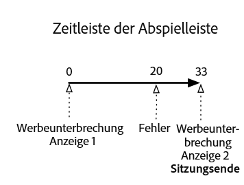
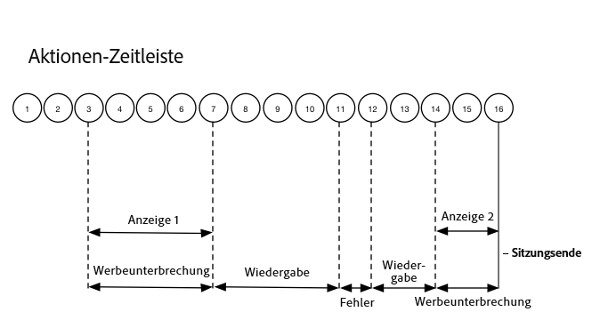

# Zeitlicher Ablauf 2: Verlassen der Sitzung durch Anwender {#timeline--2-user-abandons-session}

## VOD, Pre-Roll-Anzeige, Mid-Roll-Anzeigen, Anwender verlässt Inhalt schnell

Die folgenden Diagramme illustrieren die Zeitleiste der Abspielleiste und die entsprechende Zeitschiene der Aktionen eines Benutzers. Die Einzelheiten zu den einzelnen Maßnahmen und den zugehörigen Anträgen werden nachstehend dargestellt.








## Aktionsdetails

### Aktion 1: Sitzung starten {#Action-1}

| Aktion | Aktionsablauf (Sekunden) | Abspielposition (Sekunden) | Clientanfrage |
| --- | :---: | :---: | --- |
| Automatische Wiedergabe oder Drücken auf „Abspielen“ | 0 | 0 | `/api/v1/sessions` |

**Implementierungsdetails**

Dieser Aufruf signalisiert _die Anwenderintention, ein Video abzuspielen_. It returns a Session ID ( `{sid}` ) to the client that is used to identify all subsequent tracking calls within the session. Der Player-Status lautet noch nicht „Playing“ (Wiedergabe), sondern „Starting“ (Start). [Erforderliche Sitzungsparameter](/help/media-collection-api/mc-api-ref/mc-api-sessions-req.md) müssen in der `params`-Map des Anfrageinhalts angegeben werden.  Am Backend generiert dieser Aufruf einen Adobe Analytics-Initiationsaufruf.

**Beispiel-Anfrageinhalt**

```
{
    playerTime: {
        playhead: 0,
        ts: <timestamp>
    },
    eventType:sessionStart, params: {
        "media.playerName": "sample-html5-api-player",
        "analytics.trackingServer": "[ _YOUR-TS_ ]",
        "analytics.reportSuite": "[ _YOUR-RSID_ ]",
        "analytics.visitorId": "[ _YOUR-VISITOR-ID_ ]",
        "media.contentType": "VOD",
        "media.length": 60.3333333333333,
        "media.id": "VA API Sample Player",
        "visitor.marketingCloudOrgId": "[YOUR-MCID]",
        "media.name": "ClickMe",
        "media.channel": "sample-channel",
        "media.sdkVersion": "va-api-0.0.0",
        "analytics.enableSSL": false
    }
}
```

### Aktion 2: Start des Ping-Timers {#Action-2}

| Aktion | Aktionsablauf (Sekunden) | Abspielposition (Sekunden) | Clientanfrage |
| --- | :---: | :---: | --- |
| Anwendung startet Ping-Ereignis-Timer. | 0 | 0 |  |

**Implementierungsdetails**

Starten Sie den Ping-Timer Ihrer App. Das erste Ping-Ereignis sollte dann 1 Sekunde in ausgelöst werden, wenn Pre-Roll-Anzeigen vorhanden sind, andernfalls 10 Sekunden.

### Aktion 3: Anzeigenunterbrechungsstart {#Action-3}

| Aktion | Aktionsablauf (Sekunden) | Abspielposition (Sekunden) | Clientanfrage |
| --- | :---: | :---: | --- |
| Start der Pre-Roll-Werbeunterbrechung wird verfolgt. | 0 | 0 | `/api/v1/sessions/{sid}/events` |

**Implementierungsdetails**

Pre-Roll-Anzeigen müssen verfolgt werden. Anzeigen können nur innerhalb einer Werbeunterbrechung verfolgt werden.

**Beispiel-Anfrageinhalt**

```
{
    playerTime: {
        playhead: 0,
        ts: <timestamp>
    },
    eventType:adBreakStart, params: {
        "media.ad.podFriendlyName": "ad_pod1",
        "media.ad.podIndex": 0,
        "media.ad.podSecond": 0
    }
}
```

### Aktion 4 - Anzeigenstart {#Action-4}

| Aktion | Aktionsablauf (Sekunden) | Abspielposition (Sekunden) | Clientanfrage |
| --- | :---: | :---: | --- |
| Start der ersten Pre-Roll-Anzeige wird verfolgt. | 0 | 0 | `/api/v1/sessions/{sid}/events` |

**Implementierungsdetails**

Es startet eine 12-sekündige Anzeige.

**Beispiel-Anfrageinhalt**

```
{
    playerTime: {
        playhead: 0,
        ts: <timestamp>
    },
    eventType:adStart, params: {
        "media.ad.podFriendlyName": "ad_pod1",
        "media.ad.name": "Ad 1",
        "media.ad.id": "002",
        "media.ad.length": 7,
        "media.ad.podPosition": 1,
        "media.ad.playerName": "Sample Player",
        "media.ad.advertiser": "Ad Guys",
        "media.ad.campaignId": "1",
        "media.ad.creativeId": "42",
        "media.ad.siteId": "XYZ",
        "media.ad.creativeURL": "https://xyz-creative.com",
        "media.ad.placementId": "sample-placement2"
    },
}
```

### Aktion 5: Werbeanzeigen {#Action-5}

| Aktion | Aktionsablauf (Sekunden) | Abspielposition (Sekunden) | Clientanfrage |
| --- | :---: | :---: | --- |
| Anwendung sendet Ping-Ereignis. | 1 | 0 | `/api/v1/sessions/{sid}/events` |

**Implementierungsdetails**

Ping des Backends alle 1 Sekunde (Nachfolgende Werbeanzeigen werden im Interesse der Kürze nicht angezeigt.)

**Beispiel-Anfrageinhalt**

```
{
    playerTime: {
        playhead: 0,
        ts: <timestamp>
    },
    eventType:ping
}
```

### Aktion 6: Anzeigenbeendigung {#Action-6}

| Aktion | Aktionsablauf (Sekunden) | Abspielposition (Sekunden) | Clientanfrage |
| --- | :---: | :---: | --- |
| Abschluss der ersten Pre-Roll-Anzeige wird verfolgt. | 12 | 0 | `/api/v1/sessions/{sid}/events` |

**Implementierungsdetails**

Die erste Pre-Roll-Anzeige ist vorüber.

**Beispiel-Anfrageinhalt**

```
{
    playerTime: {
        playhead: 0,
        ts: <timestamp>
    },
    eventType:adComplete
}
```

### Aktion 7: Anzeigenumbruch abgeschlossen {#Action-7}

| Aktion | Aktionsablauf (Sekunden) | Abspielposition (Sekunden) | Clientanfrage |
| --- | :---: | :---: | --- |
| Abschluss der Pre-Roll-Werbeunterbrechung wird verfolgt. | 12 | 0 | `/api/v1/sessions/{sid}/events` |

**Implementierungsdetails**

Die Werbeunterbrechung ist vorüber. Während der Werbeunterbrechung wurde der Player-Status „Playing“ (Wiedergabe) beibehalten.

**Beispiel-Anfrageinhalt**

```
{
    playerTime: {
        playhead: 0,
        ts: <timestamp>
    },
    eventType:adBreakComplete
}
```

### Aktion 8: Inhalt abspielen {#Action-8}

| Aktion | Aktionsablauf (Sekunden) | Abspielposition (Sekunden) | Clientanfrage |
| --- | :---: | :---: | --- |
| Wiedergabeereignis wird verfolgt. | 12 | 0 | `/api/v1/sessions/{sid}/events` |

**Implementierungsdetails**

Ändern Sie den Status des Players zu „Playing“ (Wiedergabe); beginnen Sie mit dem Tracking des Starts der Inhaltswiedergabe.

**Beispiel-Anfrageinhalt**

```
{
    playerTime: {
        playhead: 0,
        ts: <timestamp>
    },
    eventType:play,
    qoeData: { bitrate: 10000 }
}
```

### Aktion 9 - Ping {#Action-9}

| Aktion | Aktionsablauf (Sekunden) | Abspielposition (Sekunden) | Clientanfrage |
| --- | :---: | :---: | --- |
| Anwendung sendet Ping-Ereignis. | 20 | 8 | `/api/v1/sessions/{sid}/events` |

**Implementierungsdetails**

Senden Sie alle 10 Sekunden Ping-Ereignisse an das Backend.

**Beispiel-Anfrageinhalt**

```
{
    playerTime: {
        playhead: 8ß,
        ts: <timestamp>
    },
    eventType:ping
}
```

### Aktion 10 - Ping {#Action-10}

| Aktion | Aktionsablauf (Sekunden) | Abspielposition (Sekunden) | Clientanfrage |
| --- | :---: | :---: | --- |
| Anwendung sendet Ping-Ereignis. | 30 | 18 | `/api/v1/sessions/{sid}/events` |

**Implementierungsdetails**

Senden Sie alle 10 Sekunden Ping-Ereignisse an das Backend.

**Beispiel-Anfrageinhalt**

```
{
    playerTime: {
        playhead: 18,
        ts: <timestamp>
    },
    eventType:ping
}
```

### Aktion 11 - Fehler {#Action-11}

| Aktion | Aktionsablauf (Sekunden) | Abspielposition (Sekunden) | Clientanfrage |
| --- | :---: | :---: | --- |
| Fehler tritt auf; Anwendung sendet Fehlerinformationen. | 32 | 20 | `/api/v1/sessions/{sid}/events` |

**Implementierungsdetails**


**Beispiel-Anfrageinhalt**

```
{
    playerTime: {
        playhead: 20,
        ts: <timestamp>
    },
    eventType:error
}
```

### Aktion 12 - Inhalt abspielen {#Action-12}

| Aktion | Aktionsablauf (Sekunden) | Abspielposition (Sekunden) | Clientanfrage |
| --- | :---: | :---: | --- |
| Fehler behoben; Anwender betätigt Play-Schaltfläche. | 37 | 20 | `/api/v1/sessions/{sid}/events` |

**Implementierungsdetails**


**Beispiel-Anfrageinhalt**

```
{
    playerTime: {
        playhead: 18,
        ts: <timestamp>
    },
    eventType:play, qoeData: { bitrate: 10000 }
}
```

### Aktion 13 - Ping {#Action-13}

| Aktion | Aktionsablauf (Sekunden) | Abspielposition (Sekunden) | Clientanfrage |
| --- | :---: | :---: | --- |
| Anwendung sendet Ping-Ereignis. | 40 | 28 | `/api/v1/sessions/{sid}/events` |

**Implementierungsdetails**

Senden Sie alle 10 Sekunden Ping-Ereignisse an das Backend.

**Beispiel-Anfrageinhalt**

```
{
    playerTime: {
        playhead: 28,
        ts: <timestamp>
    },
    eventType:ping
}
```

### Aktion 14 - Anzeigenunterbrechungsstart {#Action-14}

| Aktion | Aktionsablauf (Sekunden) | Abspielposition (Sekunden) | Clientanfrage |
| --- | :---: | :---: | --- |
| Start der Mid-Roll-Werbeunterbrechung wird verfolgt. | 45 | 33 | `/api/v1/sessions/{sid}/events` |

**Implementierungsdetails**

Mid-Roll-Anzeige mit einer Dauer von 8 Sekunden: Senden Sie `adBreakStart` .

**Beispiel-Anfrageinhalt**

```
{
    playerTime: {
        playhead: 33,
        ts: <timestamp>
    },
    eventType:adBreakStart, params: {
        "media.ad.podFriendlyName": "ad_pod2",
        "media.ad.podIndex": 1,
        "media.ad.podSecond": 33
    }
}
```

### Aktion 15 - Anzeigenstart {#Action-15}

| Aktion | Aktionsablauf (Sekunden) | Abspielposition (Sekunden) | Clientanfrage |
| --- | :---: | :---: | --- |
| Start der ersten Mid-Roll-Anzeige wird verfolgt. | 45 | 33 | `/api/v1/sessions/{sid}/events` |

**Implementierungsdetails**

Verfolgen Sie die Mid-Roll-Anzeige.

**Beispiel-Anfrageinhalt**

```
{
    playerTime: { playhead: 33, ts: <timestamp>
    },
    eventType:adStart, params: {
        "media.ad.podFriendlyName": "ad_pod1",
        "media.ad.name": "Ad 1",
        "media.ad.id": "002",
        "media.ad.length": 8,
        "media.ad.podPosition": 1,
        "media.ad.playerName": "Sample Player",
        "media.ad.advertiser": "Ad Guys",
        "media.ad.campaignId": "7",
        "media.ad.creativeId": "40",
        "media.ad.siteId": "XYZ",
        "media.ad.creativeURL": "https://xyz_creative.com",
        "media.ad.placementId": "sample_placement2"
    },
}
```

### Aktion 16 - App schließen {#Action-16}

| Aktion | Aktionsablauf (Sekunden) | Abspielposition (Sekunden) | Clientanfrage |
| --- | :---: | :---: | --- |
| Anwender schließt Anwendung; die Anwendung stellt fest, dass der Anwender die Wiedergabe verlassen hat und nicht zur Sitzung zurückkehrt. | 48 | 33 | `/api/v1/sessions/{sid}/events` |

**Implementierungsdetails**

Senden Sie `sessionEnd` an das VA-Backend, um anzugeben, dass die Sitzung umgehend und ohne weitere Verarbeitung geschlossen werden soll.

**Beispiel-Anfrageinhalt**

```
{
    playerTime: {
        playhead: 33,
        ts: <timestamp>
    },
    eventType:sessionEnd
}
```


