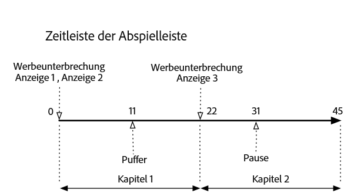
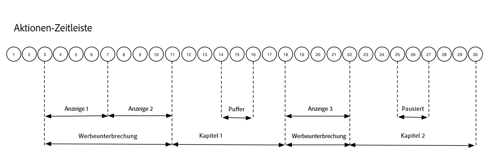

# Zeitlicher Ablauf 3: Kapitel {#timeline-3-chapters}

## VOD, Pre-Roll-Anzeigen, Pausen, Puffern, Wiedergabe des Inhalts bis zum Ende


Die folgenden Diagramme illustrieren die Zeitleiste der Abspielleiste und die zugehörige Zeitleiste der Aktionen eines Benutzers. Die Details für jede Aktion und die zugehörigen Anforderungen sind unten aufgeführt.








## Aktionsdetails


### Aktion 1: Sitzung starten {#Action-1}

| Aktion | Aktionsablauf (Sekunden) | Abspielposition (Sekunden) | Clientanfrage |
| --- | :---: | :---: | --- |
| Automatische Wiedergabe oder Betätigung der Play-Schaltfläche; Video wird geladen. | 0 | 0 | `/api/v1/sessions` |

**Implementierungsdetails**

Dieser Aufruf signalisiert _die Absicht des Benutzers, ein Video abzuspielen_. Er gibt eine Sitzungs-ID (`{sid}`) an den Client zurück, die zur Identifikation aller nachfolgenden Tracking-Aufrufe innerhalb der Sitzung verwendet wird. Der Player-Status lautet noch nicht „Playing“ (Wiedergabe), sondern „Starting“ (Start).  [Erforderliche Sitzungsparameter](/help/media-collection-api/mc-api-ref/mc-api-sessions-req.md) müssen in der `params`-Map des Anfrageinhalts angegeben werden.  Am Backend generiert dieser Aufruf einen Adobe Analytics-Initiationsaufruf.

**Beispiel-Anfrageinhalt**

```
{
    playerTime: {
        playhead: 0,
        ts: <timestamp>
    },
    eventType:sessionStart, params: {
        "media.playerName": "sample-html5-api-player",
        "analytics.trackingServer": "[ _YOUR-TS_ ]",
        "analytics.reportSuite": "[ _YOUR_RSID_ ]",
        "analytics.visitorId": "[ _YOUR_VISITOR_ID_ ]",
        "media.contentType": "VOD",
        "media.length": 60.3333333333333,
        "media.id": "VA API Sample Player",
        "visitor.marketingCloudOrgId": "[YOUR_MCID]",
        "media.name": "ClickMe",
        "media.channel": "sample-channel",
        "media.sdkVersion": "va-api-0.0.0",
        "analytics.enableSSL": false
    }
}
```

### Aktion 2: Start des Ping-Timers {#Action-2}

| Aktion | Aktionsablauf (Sekunden) | Abspielposition (Sekunden) | Clientanfrage |
| --- | :---: | :---: | --- |
| Anwendung startet Ping-Ereignis-Timer. | 0 | 0 |  |

**Implementierungsdetails**

Starten Sie Ihren Ping-Timer. Das erste Ping-Ereignis sollte dann nach 1 Sekunde ausgelöst werden, wenn Pre-roll-Anzeigen vorhanden sind, andernfalls nach 10 Sekunden.

### Aktion 3: Start der Werbeunterbrechung {#Action-3}

| Aktion | Aktionsablauf (Sekunden) | Abspielposition (Sekunden) | Clientanfrage |
| --- | :---: | :---: | --- |
| Start der Pre-Roll-Werbeunterbrechung wird verfolgt. | 0 | 0 | `/api/v1/sessions/{sid}/events` |

**Implementierungsdetails**

Anzeigen können nur innerhalb einer Werbeunterbrechung verfolgt werden.

**Beispiel-Anfrageinhalt**

```
{
    playerTime: {
        playhead: 0,
        ts: <timestamp>
    },
    eventType:adBreakStart, params: {
        "media.ad.podFriendlyName": "ad_pod1",
        "media.ad.podIndex": 0, "media.ad.podSecond": 0
    }
}
```

### Aktion 4: Anzeigenstart {#Action-4}

| Aktion | Aktionsablauf (Sekunden) | Abspielposition (Sekunden) | Clientanfrage |
| --- | :---: | :---: | --- |
| Start der ersten Pre-Roll-Anzeige wird verfolgt. | 0 | 0 | `/api/v1/sessions/{sid}/events` |

**Implementierungsdetails**

Beginnen Sie mit dem Tracking der ersten Pre-Roll-Anzeige, die 15 Sekunden dauert, einschließlich anwenderspezifischer Metadaten mit diesem `adStart` .

**Beispiel-Anfrageinhalt**

```
{
    playerTime: {
        playhead: 0,
        ts: <timestamp>
    },
    eventType:adStart, params: {
        "media.ad.podFriendlyName": "ad_pod1",
        "media.ad.name": "Ad 1",
        "media.ad.id": "001",
        "media.ad.length": 15,
        "media.ad.podPosition": 1,
        "media.ad.playerName": "Sample Player",
        "media.ad.advertiser": "Ad Guys",
        "media.ad.campaignId": "1",
        "media.ad.creativeId": "42",
        "media.ad.siteId": "XYZ",
        "media.ad.creativeURL": "https://xyz_creative.com",
        "media.ad.placementId": "sample_placement"
    },
    customMetadata: {
        "myCustomData1": "CustomData1",
        "myCustomData2": "CustomData2"
    }
}
```

### Aktion 5: Anzeigen-Pings {#Action-5}

| Aktion | Aktionsablauf (Sekunden) | Abspielposition (Sekunden) | Clientanfrage |
| --- | :---: | :---: | --- |
| Anwendung sendet Ping-Ereignis. | 10 | 0 | `/api/v1/sessions/{sid}/events` |

**Implementierungsdetails**

Senden Sie jede Sekunde ein Ping-Ereignis an das Backend. (Nachfolgende Anzeigen-Pings werden im Interesse der Kürze nicht angezeigt.)

**Beispiel-Anfrageinhalt**

```
{
    playerTime: {
        playhead: 0,
        ts: <timestamp>
    },
    eventType:ping
}
```

### Aktion 6: Abschluss der Anzeige {#Action-6}

| Aktion | Aktionsablauf (Sekunden) | Abspielposition (Sekunden) | Clientanfrage |
| --- | :---: | :---: | --- |
| Abschluss der ersten Pre-Roll-Anzeige wird verfolgt. | 15 | 0 | `/api/v1/sessions/{sid}/events` |

**Implementierungsdetails**

Verfolgen Sie das Ende der ersten Pre-Roll-Anzeige.

**Beispiel-Anfrageinhalt**

```
{
    playerTime: {
        playhead: 0,
        ts: <timestamp>
    },
    eventType:adComplete
}
```

### Aktion 7: Anzeigenstart {#Action-7}

| Aktion | Aktionsablauf (Sekunden) | Abspielposition (Sekunden) | Clientanfrage |
| --- | :---: | :---: | --- |
| Start der zweiten Pre-Roll-Anzeige wird verfolgt. | 15 | 0 | `/api/v1/sessions/{sid}/events` |

**Implementierungsdetails**

Verfolgen Sie den Start der zweiten Pre-Roll-Anzeige, die 7 Sekunden lang ist.

**Beispiel-Anfrageinhalt**

```
{
    playerTime: {
        playhead: 0,
        ts: <timestamp>
    },
    eventType:adStart, params: {
        "media.ad.podFriendlyName": "ad_pod1",
        "media.ad.name": "Ad 2",
        "media.ad.id": "002",
        "media.ad.length": 7,
        "media.ad.podPosition": 1,
        "media.ad.playerName": "Sample Player",
        "media.ad.advertiser": "Ad Guys",
        "media.ad.campaignId": "2",
        "media.ad.creativeId": "44",
        "media.ad.siteId": "XYZ",
        "media.ad.creativeURL": "https://xyz_creative.com",
        "media.ad.placementId": "sample_placement2"
    },
}
```

### Aktion 8: Anzeigen-Pings {#Action-8}

| Aktion | Aktionsablauf (Sekunden) | Abspielposition (Sekunden) | Clientanfrage |
| --- | :---: | :---: | --- |
| Anwendung sendet Ping-Ereignis. | 16 | 0 | `/api/v1/sessions/{sid}/events` |

**Implementierungsdetails**

Senden Sie jede Sekunde ein Ping-Ereignis an das Backend. (Nachfolgende Anzeigen-Pings werden im Interesse der Kürze nicht angezeigt.)

**Beispiel-Anfrageinhalt**

```
{
    playerTime: {
        playhead: 0,
        ts: <timestamp>
    },
    eventType:ping
}
```

### Aktion 9: Abschluss der Anzeige {#Action-9}

| Aktion | Aktionsablauf (Sekunden) | Abspielposition (Sekunden) | Clientanfrage |
| --- | :---: | :---: | --- |
| Abschluss der zweiten Pre-Roll-Anzeige wird verfolgt. | 22 | 0 | `/api/v1/sessions/{sid}/events` |

**Implementierungsdetails**

Verfolgen Sie das Ende der zweiten Pre-Roll-Anzeige.

**Beispiel-Anfrageinhalt**

```
{
    playerTime: {
        playhead: 0,
        ts: <timestamp>
    },
    eventType:adComplete
}
```

### Aktion 10: Abschluss der Werbeunterbrechung {#Action-10}

| Aktion | Aktionsablauf (Sekunden) | Abspielposition (Sekunden) | Clientanfrage |
| --- | :---: | :---: | --- |
| Abschluss der Pre-Roll-Werbeunterbrechung wird verfolgt. | 22 | 0 | `/api/v1/sessions/{sid}/events` |

**Implementierungsdetails**

Die Werbeunterbrechung ist vorüber. Während der Werbeunterbrechung wurde der Status „Playing“ (Wiedergabe) beibehalten.

**Beispiel-Anfrageinhalt**

```
{
    playerTime: {
        playhead: 0,
        ts: <timestamp>
    },
    eventType:adBreakComplete
}
```

### Aktion 11: Inhalt abspielen {#Action-11}

| Aktion | Aktionsablauf (Sekunden) | Abspielposition (Sekunden) | Clientanfrage |
| --- | :---: | :---: | --- |
| Wiedergabeereignis wird verfolgt. | 22 | 0 | `/api/v1/sessions/{sid}/events` |

**Implementierungsdetails**

Versetzen Sie den Player nach dem Ereignis `adBreakComplete` mit dem Ereignis `play`-Ereignis in den Status „Playing“ (Wiedergabe).

**Beispiel-Anfrageinhalt**

```
{
    playerTime: {
        playhead: 0,
        ts: <timestamp>
    },
    eventType:play
}
```

### Aktion 12: Kapitelstart {#Action-12}

| Aktion | Aktionsablauf (Sekunden) | Abspielposition (Sekunden) | Clientanfrage |
| --- | :---: | :---: | --- |
| Kapitelstart-Ereignis wird verfolgt. | 23 | 1 | `/api/v1/sessions/{sid}/events` |

**Implementierungsdetails**

Verfolgen Sie nach dem Wiedergabeereignis den Start des ersten Kapitels.

**Beispiel-Anfrageinhalt**

```
{
    playerTime: {
        playhead: 0,
        ts: <timestamp>
    },
    eventType:chapterStart, params: {
        "media.chapter.index": 1,
        "media.chapter.offset": 0, "media.chapter.length": 20, "media.chapter.friendlyName": "Chapter Uno"
    },
}
```

### Aktion 13: Ping {#Action-13}

| Aktion | Aktionsablauf (Sekunden) | Abspielposition (Sekunden) | Clientanfrage |
| --- | :---: | :---: | --- |
| Anwendung sendet Ping-Ereignis. | 30 | 8 | `/api/v1/sessions/{sid}/events` |

**Implementierungsdetails**

Senden Sie alle 10 Sekunden Ping-Ereignisse an das Backend.

**Beispiel-Anfrageinhalt**

```
{
    playerTime: {
        playhead: 8,
        ts: <timestamp>
    },
    eventType:ping
}
```

### Aktion 14: Start der Pufferung {#Action-14}

| Aktion | Aktionsablauf (Sekunden) | Abspielposition (Sekunden) | Clientanfrage |
| --- | :---: | :---: | --- |
| Pufferstartereignis aufgetreten. | 33 | 11 | `/api/v1/sessions/{sid}/events` |

**Implementierungsdetails**

Verfolgen Sie den Wechsel des zum Status „Buffering“ (Puffern).

**Beispiel-Anfrageinhalt**

```
{
    playerTime: {
        playhead: 11,
        ts: <timestamp>
    },
    eventType:bufferStart
}
```

### Aktion 15: Ende der Pufferung (Abspielen) {#Action-15}

| Aktion | Aktionsablauf (Sekunden) | Abspielposition (Sekunden) | Clientanfrage |
| --- | :---: | :---: | --- |
| Puffern abgeschlossen; die Anwendung setzt den Inhalt fort. | 36 | 11 | `/api/v1/sessions/{sid}/events` |

**Implementierungsdetails**

Puffern endet nach 3 Sekunden, sodass der Player wieder zum Status „Playing“ (Wiedergabe) wechselt. Sie müssen am Ende des Puffervorgangs ein weiteres Ereignis zum Verfolgen der Wiedergabe senden.  **Der`play`-Aufruf nach einem`bufferStart`stellt für das Backend einen „bufferEnd“-Aufruf dar**. Ein `bufferEnd`-Ereignis ist also nicht erforderlich.

**Beispiel-Anfrageinhalt**

```
{
    playerTime: {
        playhead: 11,
        ts: <timestamp>
    },
    eventType:play
}
```

### Aktion 16: Ping {#Action-16}

| Aktion | Aktionsablauf (Sekunden) | Abspielposition (Sekunden) | Clientanfrage |
| --- | :---: | :---: | --- |
| Anwendung sendet Ping-Ereignis. | 40 | 15 | `/api/v1/sessions/{sid}/events` |

**Implementierungsdetails**

Senden Sie alle 10 Sekunden Ping-Ereignisse an das Backend.

**Beispiel-Anfrageinhalt**

```
{
    playerTime: {
        playhead: 15,
        ts: <timestamp>
    },
    eventType:ping
}
```

### Aktion 17: Kapitelende {#Action-17}

| Aktion | Aktionsablauf (Sekunden) | Abspielposition (Sekunden) | Clientanfrage |
| --- | :---: | :---: | --- |
| Anwendung verfolgt Kapitelende. | 45 | 20 | `/api/v1/sessions/{sid}/events` |

**Implementierungsdetails**

Das erste Kapitel endet direkt vor der zweiten Werbeunterbrechung.

**Beispiel-Anfrageinhalt**

```
{
    playerTime: {
        playhead: 20,
        ts: <timestamp>
    },
    eventType:chapterEnd
}
```

### Aktion 18: Start der Werbeunterbrechung {#Action-18}

| Aktion | Aktionsablauf (Sekunden) | Abspielposition (Sekunden) | Clientanfrage |
| --- | :---: | :---: | --- |
| Start der Mid-Roll-Werbeunterbrechung wird verfolgt. | 46 | 21 | `/api/v1/sessions/{sid}/events` |

**Implementierungsdetails**

Mid-Roll-Anzeige mit einer Dauer von 8 Sekunden: Senden Sie `adBreakStart` .

**Beispiel-Anfrageinhalt**

```
{
    playerTime: {
        playhead: 21,
        ts: <timestamp>
    },
    eventType:adBreakStart, params: {
        "media.ad.podFriendlyName": "ad_pod2",
        "media.ad.podIndex": 1, "media.ad.podSecond": 21
    }
}
```

### Aktion 19: Anzeigenstart {#Action-19}

| Aktion | Aktionsablauf (Sekunden) | Abspielposition (Sekunden) | Clientanfrage |
| --- | :---: | :---: | --- |
| Start der dritten Mid-Roll-Anzeige wird verfolgt. | 46 | 21 | `/api/v1/sessions/{sid}/events` |

**Implementierungsdetails**

Verfolgen Sie die Mid-Roll-Anzeige.

**Beispiel-Anfrageinhalt**

```
{
    playerTime: {
        playhead: 21,
        ts: <timestamp>
    },
    eventType:adStart, params: {
        "media.ad.podFriendlyName": "ad_pod2",
        "media.ad.name": "Ad 3",
        "media.ad.id": "003",
        "media.ad.length": 8,
        "media.ad.podPosition": 2,
        "media.ad.playerName": "Sample Player",
        "media.ad.advertiser": "Ad Guys",
        "media.ad.campaignId": "7",
        "media.ad.creativeId": "40",
        "media.ad.siteId": "XYZ",
        "media.ad.creativeURL": "https://xyz_creative.com",
        "media.ad.placementId": "sample_placement2"
    },
}
```

### Aktion 20: Anzeigen-Pings {#Action-20}

| Aktion | Aktionsablauf (Sekunden) | Abspielposition (Sekunden) | Clientanfrage |
| --- | :---: | :---: | --- |
| Anwendung sendet Ping-Ereignis. | 47 | 21 | `/api/v1/sessions/{sid}/events` |

**Implementierungsdetails**

Senden Sie jede Sekunde ein Ping-Ereignis an das Backend. (Nachfolgende Anzeigen-Pings werden im Interesse der Kürze nicht angezeigt.)

**Beispiel-Anfrageinhalt**

```
{
    playerTime: {
        playhead: 21,
        ts: <timestamp>
    },
    eventType:ping
}
```

### Aktion 21: Abschluss der Anzeige {#Action-21}

| Aktion | Aktionsablauf (Sekunden) | Abspielposition (Sekunden) | Clientanfrage |
| --- | :---: | :---: | --- |
| Abschluss der ersten Mid-Roll-Anzeige wird verfolgt. | 54 | 21 | `/api/v1/sessions/{sid}/events` |

**Implementierungsdetails**

Die Mid-Roll-Anzeige ist abgeschlossen.

**Beispiel-Anfrageinhalt**

```
{
    playerTime: {
        playhead: 21,
        ts: <timestamp>
    },
    eventType:adComplete
}
```

### Aktion 22: Abschluss der Werbeunterbrechung {#Action-22}

| Aktion | Aktionsablauf (Sekunden) | Abspielposition (Sekunden) | Clientanfrage |
| --- | :---: | :---: | --- |
| Abschluss der Mid-Roll-Werbeunterbrechung wird verfolgt. | 54 | 21 | `/api/v1/sessions/{sid}/events` |

**Implementierungsdetails**

Die Werbeunterbrechung ist abgeschlossen.

**Beispiel-Anfrageinhalt**

```
{
    playerTime: {
        playhead: 21,
        ts: <timestamp>
    },
    eventType:adBreakComplete
}
```

### Aktion 23: Kapitelstart {#Action-23}

| Aktion | Aktionsablauf (Sekunden) | Abspielposition (Sekunden) | Clientanfrage |
| --- | :---: | :---: | --- |
| Start des zweiten Kapitels wird verfolgt. | 55 | 22 | `/api/v1/sessions/{sid}/events` |

**Implementierungsdetails**


**Beispiel-Anfrageinhalt**

```
{
    playerTime: {
        playhead: 22,
        ts: <timestamp>
    },
    eventType:chapterStart, params: {
        "media.chapter.index": 2,
        "media.chapter.offset": 22, "media.chapter.length": 22, "media.chapter.friendlyName": "Chapter Dos"
    },
}
```

### Aktion 24: Ping {#Action-24}

| Aktion | Aktionsablauf (Sekunden) | Abspielposition (Sekunden) | Clientanfrage |
| --- | :---: | :---: | --- |
| Anwendung sendet Ping-Ereignis. | 60 | 27 | `/api/v1/sessions/{sid}/events` |

**Implementierungsdetails**

Senden Sie alle 10 Sekunden Ping-Ereignisse an das Backend.

**Beispiel-Anfrageinhalt**

```
{
    playerTime: {
        playhead: 27,
        ts: <timestamp>
    },
    eventType:ping
}
```

### Aktion 25: Anhalten {#Action-25}

| Aktion | Aktionsablauf (Sekunden) | Abspielposition (Sekunden) | Clientanfrage |
| --- | :---: | :---: | --- |
| Anwender betätigt Pause-Schaltfläche. | 64 | 31 | `/api/v1/sessions/{sid}/events` |

**Implementierungsdetails**

Durch die Benutzeraktion wechselt der Wiedergabestatus zu „paused“ (angehalten).

**Beispiel-Anfrageinhalt**

```
{
    playerTime: {
        playhead: 31,
        ts: <timestamp>
    },
    eventType:pauseStart
}
```

### Aktion 26: Ping {#Action-26}

| Aktion | Aktionsablauf (Sekunden) | Abspielposition (Sekunden) | Clientanfrage |
| --- | :---: | :---: | --- |
| Anwendung sendet Ping-Ereignis. | 70 | 31 | `/api/v1/sessions/{sid}/events` |

**Implementierungsdetails**

Senden Sie alle 10 Sekunden Ping-Ereignisse an das Backend. Der Player befindet sich weiterhin im Status „buffering“ (Puffern); der Nutzer hängt bei 20 Sekunden des Inhalts fest und ist frustriert.

**Beispiel-Anfrageinhalt**

```
{
    playerTime: {
        playhead: 31,
        ts: <timestamp>
    },
    eventType:ping
}
```

### Aktion 27: Inhalt abspielen {#Action-27}

| Aktion | Aktionsablauf (Sekunden) | Abspielposition (Sekunden) | Clientanfrage |
| --- | :---: | :---: | --- |
| Anwender betätigt Play-Schaltfläche, um Hauptinhalt fortzusetzen. | 74 | 31 | `/api/v1/sessions/{sid}/events` |

**Implementierungsdetails**

Ändern Sie den Wiedergabestatus zu „playing“ (Wiedergabe).  **Der`play`-Aufruf nach einem`pauseStart`stellt für das Backend einen „“-Aufruf dar**. Ein `resume`resume-Ereignis ist also nicht erforderlich.

**Beispiel-Anfrageinhalt**

```
{
    playerTime: {
        playhead: 31,
        ts: <timestamp>
    },
    eventType:play
}
```

### Aktion 28: Ping {#Action-28}

| Aktion | Aktionsablauf (Sekunden) | Abspielposition (Sekunden) | Clientanfrage |
| --- | :---: | :---: | --- |
| Anwendung sendet Ping-Ereignis. | 80 | 37 | `/api/v1/sessions/{sid}/events` |

**Implementierungsdetails**

Senden Sie alle 10 Sekunden Ping-Ereignisse an das Backend.

**Beispiel-Anfrageinhalt**

```
{
    playerTime: {
        playhead: 37,
        ts: <timestamp>
    },
    eventType:ping
}
```

### Aktion 29: Kapitelende {#Action-29}

| Aktion | Aktionsablauf (Sekunden) | Abspielposition (Sekunden) | Clientanfrage |
| --- | :---: | :---: | --- |
| Kapitel 2 endet. | 87 | 44 | `/api/v1/sessions/{sid}/events` |

**Implementierungsdetails**

Verfolgen Sie das Ende des zweiten und letzten Kapitels.

**Beispiel-Anfrageinhalt**

```
{
    playerTime: {
        playhead: 0,
        ts: <timestamp>
    },
    eventType:chapterEnd
}
```

### Aktion 30: Abschluss der Sitzung {#Action-30}

| Aktion | Aktionsablauf (Sekunden) | Abspielposition (Sekunden) | Clientanfrage |
| --- | :---: | :---: | --- |
| Anwender sieht sich Inhalt bis zum Ende an. | 88 | 45 | `/api/v1/sessions/{sid}/events` |

**Implementierungsdetails**

Senden Sie `sessionComplete` an das Backend, um anzugeben, dass der Anwender den gesamten Inhalt abgespielt hat.

**Beispiel-Anfrageinhalt**

```
{
    playerTime: {
        playhead: 45,
        ts: <timestamp>
    },
    eventType:sessionComplete
}
```


>[!NOTE]
>
>**Keine Suchereignisse? -** Die Mediensammlungs-API unterstützt die Ereignisse `seekStart` und `seekComplete` nicht explizit. Das liegt daran, dass bestimmte Player eine große Anzahl solcher Ereignisse generieren, wenn der Anwender durch das Video springt. So können einige Hunderte von Anwendern schnell die Netzwerkbandbreite des Backend-Service überlasten. Adobe umgeht die explizite Unterstützung von Suchereignissen durch die Berechnung einer Heartbeat-Dauer basierend auf dem Gerätezeitstempel statt auf der Abspielposition.

