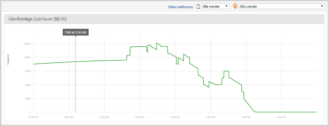

# Gleichzeitige Medienbesucher {#media-concurrent-viewers}

Im Dashboard „Gleichzeitige Medienbetrachter“ werden gleichzeitige Viewer an einem Tag angezeigt. Die Daten können nach Inhalt, Gerätetyp und Land gefiltert werden.

>[!TIP]
>
> Grundlage für diesen Bericht bilden gleichzeitig aktive Mediensitzungen.  Wenn Sie gleichzeitige Betrachtungen für einen Unique Visitor anzeigen und dabei weitere Funktionen, Aufschlüsselung mit Vergleich, auf ein Segment anwenden möchten, nutzen Sie dafür das [Bedienfeld für gleichzeitige Medienbetrachter in Analysis Workspace](https://docs.adobe.com/content/help/de-DE/analytics/analyze/analysis-workspace/panels/media-concurrent-viewers.html).

## Berichtsfunktionen {#report-features}

Hier sind einige Funktionen des Berichts:

* Die Daten werden nicht in Echtzeit angezeigt. Der Bericht weist eine normale Adobe Analytics-Latenz auf.
* Der Bericht deckt einen Zeitraum von 24 Stunden ab. Die X-Achse ist die Tageszeit, die auf der Zeitzone der Report Suite basiert.
* Dadurch werden gleichzeitige Betrachter mit extrem hoher Granularität angezeigt.
* Es gibt einen *Bericht über gleichzeitige Medienbetrachter*, der zeigt, wie viele Betrachter den gesamten Inhalt ansehen oder ihm zuhören.
* Es gibt einen Bericht über gleichzeitige Medienbetrachter innerhalb des *Berichts über Mediendetails*, der angibt, wie viele Betrachter ein bestimmtes Medienelement ansehen oder ihm zuhören.
* Der Bericht betrachtet jeweils nur einen einzigen Tag.
* Der Kunde kann sich Verlaufsberichte zu gleichzeitigen Zuschauern anzeigen (beschränkt auf einzelne Tage).

## Einschränkungen {#limitations}

Für diesen Bericht gelten folgende Einschränkungen:

* Es werden keine Daten angezeigt, wenn das ausgewählte Intervall keinen gesamten Tag darstellt.
* Sie können die Daten nicht exportieren, z. B. ReportBuilder.
* Sie können die Daten nicht in einem Tabellenformat darstellen.
* Sie können keinen Bericht per E-Mail senden.
* Auch wenn Sie keine Anzeigen verfolgen, müssen Sie die Medienverfolgung erneut aktivieren und das Medienanzeigemodul auswählen.
* Diese Funktion bietet genaue Daten, wenn eine Heartbeats-Bibliothek verwendet wird, in die eine Funktion für Pausenverfolgung integriert ist.
