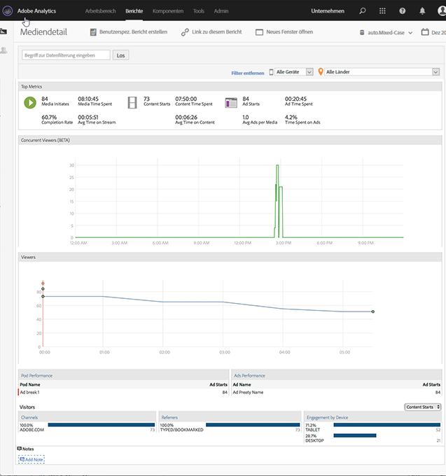

# Mediendetails{#media-detail}

Im Dashboard „Mediendetails“ werden detaillierte Metriken für alle Inhalte angezeigt, einschließlich gleichzeitiger Besucher, Inhaltsstarts, Abschlussraten, Besuchszeiten und Anzeigenstarts.

