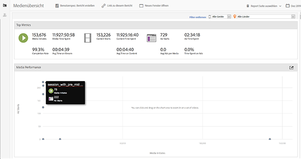
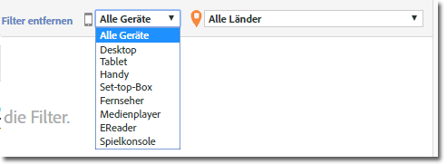
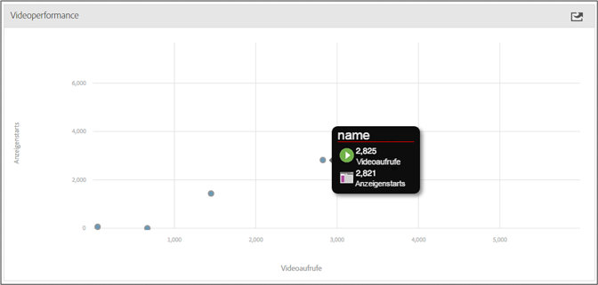

# Medienübersicht {#media-overview}

Im Dashboard „Medienübersicht“ können Sie die Medien auf Ihrer Site überwachen. Die Anzeige „Medienübersicht“ zeigt mehrere aggregierte Messungen an, so dass Sie schnell erkennen können, ob die Medien wie erwartet funktionieren. In einem Diagramm werden die Inhaltsstarts neben Anzeigenstarts angezeigt, damit Sie diese Metriken schnell für jedes Medium anzeigen können.

<!--
{width="672px"} 
-->

## Schnellfilter {#quick-filters}

Zeigen Sie Medienmetriken schnell nach Gerät oder Land an:

<!--
{width="400px"}
-->

## Medienperformance {#media-performance}

Zoomen Sie durch Klicken und Ziehen und zeigen Sie dann mit dem Mauszeiger auf Elemente, um granulare Metriken für bestimmte Medien anzuzeigen. Klicken Sie auf  

, um die Ansicht nach dem Zoomen zurückzusetzen.

<!--
{width="400px"}
-->
