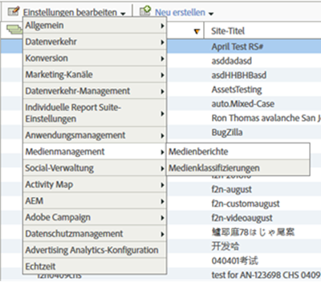

# Aktivierung von Medienberichten{#media-reports-enablement}

Jede Report Suite, die Medienmetriken erfasst, muss konfiguriert werden, bevor Mediendaten gesendet werden.

>[!TIP]
>
>Um die neuen Funktionen nutzen zu können, sollten bestehende Media Analytics-Kunden die Medienverfolgung für ihre RSIDs erneut aktivieren.

1. In [Reports &amp; Analytics](https://my.omniture.com/login/) click [!UICONTROL Admin] &gt; [!UICONTROL Report Suites].
1. Select the report suite(s) where you are collecting media data and click [!UICONTROL Edit Settings] &gt; [!UICONTROL Media Management] &gt; [!UICONTROL Media Reporting].

   {width="400px"}

1. On the **[!UICONTROL Media Reporting]** page, enable **[!UICONTROL Media Core]**, and optionally enable **[!UICONTROL Media Ads]**, **[!UICONTROL Media Chapters]**, and **[!UICONTROL Media Quality]**.

   Die Medienmessung enthält folgende Module:

   * **Medien-Core**

      Die Hauptmedienmessung wird für Medieninhalte verwendet. Dabei werden Lösungs- (oder benutzerdefinierte) eVars verwendet, um Inhalt, Content-Typ, Content Player-Name und Inhaltskanal nachzuverfolgen. Lösungsereignisse (oder benutzerdefinierte Ereignisse) werden für Medienstarts, Inhaltsstarts, Inhaltsbeendigungen und Besuchszeit für Inhalte verwendet.

   * **Medienanzeigen**

      Die Medienanzeigenmessung wird zur Messung von Anzeigen im Medieninhalt verwendet. Dabei werden Lösungs-eVars verwendet, um Anzeige, Name des Anzeigenplayers, Anzeigen-Pod und Anzeigenposition innerhalb der Werbeunterbrechung zu messen. Lösungsereignisse werden für Anzeigenstarts, Anzeigenbeendigungen, Besuchszeit für Anzeige und Besuchszeit für Video verwendet.

   * **Medienkapitel**

      Die Videokapitelmessung wird zur Kapitelmessung verwendet. Ein Kapitel ist eine Unterteilung von Inhalten in einem einzelnen Medium. Dabei wird die Kapitel-ID über eine Lösungs-eVar gespeichert. Lösungsereignisse werden für Kapitelstarts, Kapitelbeendigungen und Besuchszeit für Kapitel verwendet. Zusätzliche Kapitelmetadaten für Kapitelname und Kapitelposition werden als Classifications der Kapitel-ID bereitgestellt.

   * **Medienqualität**

      Die Messung der Videoqualität dient zur Messung der Qualität der Inhaltswiedergabe. Dabei werden die Zeit bis zum Start, die Pufferereignisse, die Gesamtpufferdauer, Bitratenwechsel, die durchschnittliche Bitrate, Fehler und Dropped Frames über Lösungs-eVars gespeichert. Lösungsereignisse werden für die Zeit bis zum Start, die Drops vor dem Start, von Puffer betroffene Streams, Pufferereignisse, die Gesamtpufferdauer, von Bitratenänderungen betroffene Streams, Bitratenänderungen, die durchschnittliche Bitrate, von Fehlern betroffene Streams, Fehlerereignisse, von Dropped Frames betroffene Streams und Dropped Frames verwendet.

   * **Video und Videoanzeigenmetadaten**

      Metadaten können an ein Medium und/oder eine Anzeige angehängt werden, um dieses Medium/diese Anzeige weiter zu beschreiben und zu kategorisieren. Standardisierte Medien- und Anzeigenmetadaten werden über Lösungsvariablen und Classifications erfasst. Mögliche Werte: Show, Season, Episode, Asset ID, Genre, First Air Date, First Digital Date, Content Rating, Originator, Network, Show Type, Ad Loads, MVPD, Authorized, Day Part, Media Session ID, Advertiser, Campaign ID und Creative ID.

   * **Audio und Audio-Anzeigemetadaten**

      Sie können einer Audiodatei und/oder einer Anzeige Metadaten hinzufügen, um die Audiodatei/die Anzeige näher zu beschreiben und zu kategorisieren. Standardisierte Audio- und Anzeigenmetadaten werden über Lösungsvariablen und Klassifizierungen gesammelt. Einzuschließende Werte: Künstler, Album, Bezeichnung, Autor, Herausgeber, Station, Sendung, Staffel, Episode, Asset-ID, Genre, Erstes Sendedatum, Erstes digitales Veröffentlichungsdatum, Inhaltsbewertung, Urheber, Sendungstyp, Anzeige-Ladevorgänge, Tagesteil, Mediensitzungs-ID, Advertiser, Kampagnen-ID und Creative-ID.
   Wenn Sie ein Modul aktivieren, wird jeweils eine Reihe von Variablen reserviert und ein neuer Satz an Berichten erstellt. Mit Ausnahme der Qualität enthalten Berichte nur dann Daten, wenn die zugehörige Implementierung abgeschlossen wurde. Bei Implementierung des Core-Moduls wird auch das Qualitätsmodul implementiert, wenn Sie es aktivieren.

   Wenn Sie die Qualität von Anzeigen, Kapiteln oder Wiedergabe noch nicht verfolgen, können Sie später jederzeit weitere Optionen aktivieren.

1. Klicken Sie auf **[!UICONTROL Speichern]**.

   If this report suite is already configured to collect media data, after you click **[!UICONTROL Save]**, an additional configuration page is displayed. Wenn die Seite [!UICONTROL Media-Core-Messung] angezeigt wird, fahren Sie mit dem nächsten Schritt fort.

1. (Conditional) On the [!UICONTROL Media Core measurement] page, choose to continue using custom variables or choose to use solution variables.

   | Option | Hinweise |
   | --- | --- |
   | Weiterhin benutzerspezifische Variablen verwenden | Vorteile und Nachteile:<ul> <li> **Vorteile**: Die Inhaltstrend-Erstellung funktioniert auch nach der Migration. </li> <li> **** Nachteile: Erfordert, dass zwei benutzerspezifische eVars und drei benutzerspezifische Ereignisse Medien zugeordnet werden. Eine anwenderspezifische eVar und ein anwenderspezifisches Ereignis werden freigegeben. </li> </ul> So verwenden Sie weiterhin anwenderspezifische Variablen: <ol> <li>Wählen Sie Benutzerspezifische Variablen verwenden und klicken Sie auf Speichern. </li> <li>Wenn Sie dazu aufgefordert werden, ordnen Sie die aktuellen anwenderspezifischen eVars und Ereignisse zu und klicken Sie auf Speichern: </li> </ol> |
   | Zu Lösungsvariablen migrieren | Vorteile und Nachteile:<ul> <li> **Vorteile**: Drei anwenderspezifische eVars und vier anwenderspezifische Ereignisse werden freigegeben. </li> <li> **Nachteile**: **Alle** Verlaufstrends und -vergleiche für Medienberichte gehen verloren. Das bedeutet, dass Sie keine Trends für Inhaltsansichten oder Inhaltszeiten erstellen können, die vor der Migration in Heartbeat stattgefunden haben. </li> </ul> **Einschränkung:** Migrieren Sie nur dann zu Lösungsvariablen, wenn Sie sicher sind, dass Sie diese Trends nicht beibehalten möchten. Alle Kunden sollten nur dann Lösungsvariablen verwenden und Mediendaten anhand von Verarbeitungsregeln an vorhandene Props und eVars übergeben, wenn sie den Verlauf beibehalten müssen. So migrieren Sie zu Lösungsvariablen: Wählen Sie [!UICONTROL Lösungsvariablen] verwenden und klicken Sie auf [!UICONTROL Speichern].    WICHTIG: Wenn Sie zu Lösungsvariablen migrieren, gehen **alle** historischen Trends und Vergleiche für Medienberichte verloren. |

>[!IMPORTANT]
>
>Ändern Sie nicht die Classification-Namen für Variablen, die in den Tabellen "Metriken"und "Metadaten"aufgeführt sind (z. B. [Audio- und Videoparameter](/help/metrics-and-metadata/audio-video-parameters.md)) und die dort unter "Berichterstellung/Reservierte Variable"als "Classification"beschrieben werden. Die Medienklassifizierungen werden definiert, wenn eine Report Suite für die Medienverfolgung aktiviert ist. Adobe fügt von Zeit zu Zeit neue Eigenschaften hinzu. In diesem Fall müssen Kunden ihre Report Suites erneut aktivieren, um Zugriff auf die neuen Medieneigenschaften zu erhalten. Während des Aktualisierungsvorgangs ermittelt Adobe, ob die Klassifizierungen aktiviert sind, indem die Namen der Variablen überprüft werden. Wenn eines der Elemente fehlt, fügt Adobe die fehlenden erneut hinzu.
