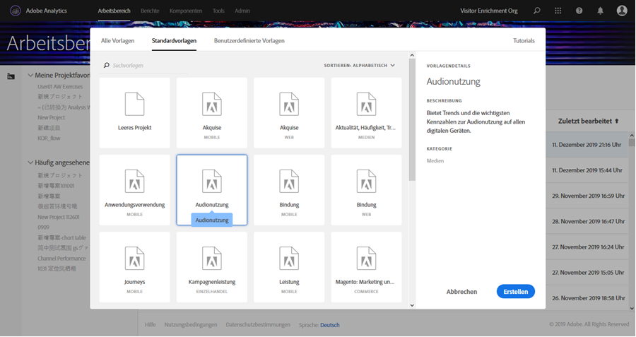
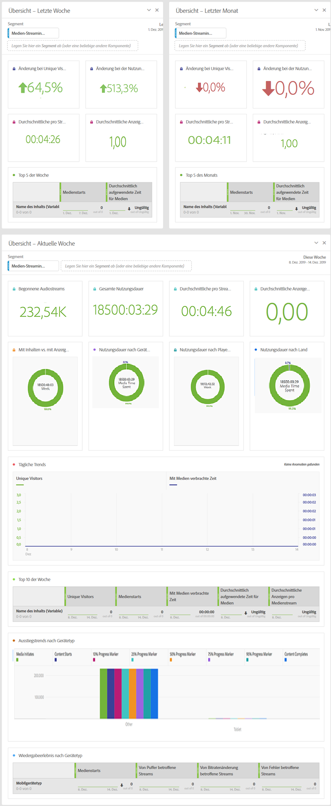

# Vorlagen für Media Workspace{#media-workspace-templates}

Adobe Analytics Workspace bietet Ihnen die Möglichkeit, schnell Dashboards zur Analyse Ihrer Tracking-Daten einzurichten. Wenn Sie ein neues Projekt erstellen oder wenn Sie in Workspace gehen, um ein bestehendes Projekt zu verwalten, können Sie aus Standardvorlagen wählen, die gängige allgemeine Tracking-Szenarios wie Akquise, Nutzung von Streaming-Medien und mehr abdecken. Sie können auch eigene benutzerdefinierte Vorlagen erstellen, ändern und speichern.

Zum Erstellen oder Verwalten von Projekten verwenden Sie Vorlagen von der Workspace-Registerkarte in Adobe Analytics. Wenn Sie Workspace öffnen, werden Ihnen die Optionen zum Erstellen eines neuen Projekts oder zum Öffnen eines vorhandenen Projekts angezeigt:

* **Neues Projekt erstellen:** Wenn Sie in Workspace auf die Schaltfläche **[!UICONTROL Neues Projekt erstellen]** klicken, wird Ihnen ein Dialogfeld angezeigt, in dem Sie aus Ihrer Vorlagensammlung (einschließlich Standard- und benutzerdefinierter Vorlagen) auswählen können:

   

   Wenn Sie beispielsweise die Vorlage **[!UICONTROL Audionutzung]** auswählen, wird ein Projekt mit dem folgenden Audio-Dashboard angezeigt:

   

* **Projekte verwalten:** Sie können in einem bestehenden Projekt die Datendarstellung ändern und speichern, um Ihre eigenen benutzerdefinierten Vorlagen zu erstellen.
