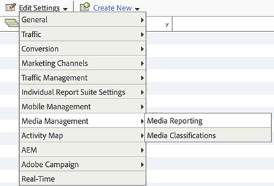

# Aktivierung von Medienberichten {#media-reports-enablement}

Jede Report Suite, die Medienmetriken erfasst, muss konfiguriert werden, bevor Mediendaten gesendet werden.

Fortgeschrittene Kunden können die Medien-Bedienfelder in Analysis Workspace nur verwenden, wenn Media Core und das Tracking für [Erlebnisqualität](/help/use-cases/track-qos/track-qos-overview.md) aktiviert sind.

>[!TIP]
>
>Um neue Funktionen nutzen zu können, sollten Bestandskunden von Media Analytics das Medien-Tracking für ihre RSIDs erneut aktivieren.

1. Klicken Sie in [Reports &amp; Analytics](https://my.omniture.com/login/) auf **[!UICONTROL Admin > Report Suites].**
1. Wählen Sie die Report Suites aus, in denen Sie Mediendaten erfassen, und klicken Sie anschließend auf **[!UICONTROL Einstellungen bearbeiten > Medienmanagement > Medienberichte].**

   

1. Aktivieren Sie auf der Seite **[!UICONTROL Medienberichte]** die Option **[!UICONTROL Media-Core],** und aktivieren Sie optional **[!UICONTROL Medienanzeigen],** **[!UICONTROL Medienkapitel],** und **[!UICONTROL Medienqualität].**

   Die Medienmessung enthält folgende Module:

   * **Medien-Core**

      Die Core-Medienmessung wird für Medieninhalte verwendet. Dabei werden Lösungs- (oder benutzerdefinierte) eVars verwendet, um Inhalt, Content-Typ, Inhalts-Player-Name und Inhaltskanal nachzuverfolgen. Lösungs- (oder benutzerdefinierte) Ereignisse werden für Medienstarts, Inhaltsstarts, Inhaltsbeendigungen und Besuchszeit für Inhalt verwendet.

   * **Medienanzeigen**

      Die Medienanzeigenmessung wird für die Messung von Anzeigen im Medieninhalt verwendet. Dabei werden Lösungs-eVars verwendet, um Anzeige, Name des Anzeigenplayers, Anzeigen-Pod und Anzeigenposition innerhalb der Werbeunterbrechung zu messen. Lösungsereignisse werden für Anzeigenstarts, Anzeigenbeendigungen, Besuchszeit für Anzeigen und Besuchszeit für Videos verwendet.

   * **Medienkapitel**

      Die Medienkapitelmessung wird für die Messung von Kapiteln verwendet. Ein Kapitel ist eine Unterteilung von Inhalt in einem einzelnen Medium. Dabei wird ein Lösungs-eVar zum Speichern der Kapitel-ID verwendet. Lösungsereignisse werden für Kapitelstarts, Kapitelbeendigungen, und Besuchszeit für Kapitel verwendet. Zusätzliche Kapitelmetadaten des Kapitelnamens und der Kapitelposition werden als Klassifizierungen der Kapitel-ID bereitgestellt.

   * **Medienqualität**

      Anhand der Videoqualitätsmessung wird die Qualität der Inhaltswiedergabe gemessen. Dabei werden Lösungs-eVars verwendet, um Zeit bis Start, Pufferereignisse, Gesamtpufferdauer, die Bitratenwechsel, durchschnittliche Bitrate, Fehler und Dropped Frames zu speichern. Die Lösungsereignisse werden für Folgendes verwendet: Zeit bis zum Start, vor dem Start übersprungen, vom Puffer betroffene Streams, Pufferereignisse, gesamte Pufferdauer, von Bitratenänderungen betroffene Streams, Bitratenänderungen, mittlere Bitrate, von Fehlern betroffene Streams, Fehlerereignisse, von übersprungenen Bildern betroffene Streams und übersprungene Bilder.

   * **Video und Videoanzeigenmetadaten**

      An ein Medium oder an eine Anzeige können Metadaten angefügt werden, die eine weitere Beschreibung und Kategorisierung enthalten. Über Lösungsvariablen und Klassifizierungen werden standardisierte Medien- und Anzeigen-Metadaten erfasst. Mögliche Werte: Show, Season, Episode, Asset ID, Genre, First Air Date, First Digital Date, Content Rating, Originator, Network, Show Type, Ad Loads, MVPD, Authorized, Day Part, Media Session ID, Advertiser, Campaign ID und Creative ID.

   * **Audio und Audio-Anzeigemetadaten**

      Sie können einer Audiodatei und/oder einer Anzeige Metadaten hinzufügen, um die Audiodatei/die Anzeige näher zu beschreiben und zu kategorisieren. Standardisierte Audio- und Anzeigenmetadaten werden über Lösungsvariablen und Klassifizierungen gesammelt. Einzuschließende Werte: Künstler, Album, Bezeichnung, Autor, Herausgeber, Station, Sendung, Staffel, Episode, Asset-ID, Genre, Erstes Sendedatum, Erstes digitales Veröffentlichungsdatum, Inhaltsbewertung, Urheber, Sendungstyp, Anzeige-Ladevorgänge, Tagesteil, Mediensitzungs-ID, Advertiser, Kampagnen-ID und Creative-ID.
   Durch die Aktivierung jedes Moduls wird ein Variablensatz reserviert und ein neuer Satz von Berichten erstellt. Mit Ausnahme der Qualitätsberichte enthalten Berichte keine Daten, es sei denn, die entsprechende Implementierung wurde durchgeführt. Bei Implementierung des Kernmoduls wird auch das Qualitätsmodul implementiert, wenn Sie es aktivieren.

   Wenn Sie noch keine Anzeigen-, Kapitel- oder Wiedergabequalität verfolgen, können Sie jederzeit weitere Optionen aktivieren.

1. Klicken Sie auf **[!UICONTROL Speichern].**

   Wenn diese Report Suite bereits zur Erfassung von Mediendaten konfiguriert ist, wird eine zusätzliche Konfigurationsseite angezeigt, nachdem Sie auf **[!UICONTROL Speichern]** klicken. Wenn die Seite **[!UICONTROL Media-Core-Messung]** angezeigt wird, fahren Sie mit dem nächsten Schritt fort.

1. (Situationsabhängig) Legen Sie auf der Seite **[!UICONTROL Media-Core-Messung]** fest, ob Sie weiterhin benutzerdefinierte Variablen oder Lösungsvariablen verwenden möchten.

   | Option | Hinweise |
   | --- | --- |
   | Weiterhin benutzerspezifische Variablen verwenden | Vorteile und Nachteile:<ul> <li> **Vorteile**: Die Inhaltstrend-Erstellung funktioniert auch nach der Migration. </li> <li> **Nachteile:** Erfordert die Beibehaltung von zwei benutzerdefinierten eVars und drei benutzerdefinierten Ereignissen für Medien. Sie können ein einziges benutzerspezifisches eVar und ein einziges benutzerspezifisches Ereignis erneut verwenden. </li> </ul> Wenn Sie weiterhin benutzerspezifische Variablen verwenden möchten: <ol> <li>Wählen Sie **[!UICONTROL Benutzerdefinierte Variablen verwenden]** aus und klicken Sie auf **[!UICONTROL Speichern.]** </li> <li>Wenn Sie dazu aufgefordert werden, ordnen Sie die aktuellen benutzerdefinierten eVars und Ereignisse zu und klicken Sie auf **[!UICONTROL Speichern:]** </li> </ol> |
   | Zu Lösungsvariablen migrieren | Vorteile und Nachteile:<ul> <li> **Vorteile:** Sie können drei benutzerspezifische eVars und vier benutzerspezifische Ereignisse erneut verwenden. </li> <li> **Nachteile:** Sie verlieren **alle** historischen Trends und Vergleiche für Medienberichte. Das bedeutet, dass Sie keine Trendansicht für Inhaltsdaten oder Inhaltszeiten erstellen können, die vor der Migration zu Heartbeats wiedergegeben wurden. </li> </ul> **Einschränkung:** Migrieren Sie nur dann zu Lösungsvariablen, wenn Sie sicher sind, dass Sie diese Trends nicht beibehalten möchten. Alle Kunden sollten nur dann Lösungsvariablen verwenden und Mediendaten anhand von Verarbeitungsregeln an vorhandene Props und eVars übergeben, wenn sie den Verlauf beibehalten müssen. Migrieren der Lösungsvariablen: Wählen Sie **[!UICONTROL Lösungsvariablen verwenden]** aus und klicken Sie auf **[!UICONTROL Speichern].**    WICHTIG: Bei der Migration zu Lösungsvariablen gehen **alle** Verlaufstrends und -vergleiche für Medienberichte verloren. |

>[!IMPORTANT]
>
>Ändern Sie nicht die Klassifizierungsnamen für Variablen, die in den Metriken und Metadatentabellen aufgeführt sind (z. B. [Audio- und Videoparameter](/help/implementation/variables/audio-video-parameters.md)) und dort unter „Berichterstellung/Reservierte Variable“ als „Klassifizierung“ beschrieben sind. Die Medienklassifizierungen werden definiert, wenn eine Report Suite für das Medien-Tracking aktiviert ist. Adobe fügt von Zeit zu Zeit neue Eigenschaften hinzu. In diesem Fall müssen Kunden ihre Report Suites erneut aktivieren, um Zugriff auf die neuen Medieneigenschaften zu erhalten. Während des Aktualisierungsvorgangs ermittelt Adobe anhand der Namen der Variablen, ob die Klassifizierungen aktiviert sind. Wenn eine fehlt, fügt Adobe die fehlenden erneut hinzu.
