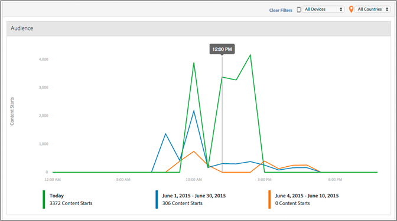

# Medientagesabschnitt{#media-daypart}

Das Dashboard „Medientagesabschnitt[[!UICONTROL &#x200B; zeigt &#x200B;]](/help/reporting/metrics/content-starts.md)Inhaltsstarts“ nach Tageszeit an, damit Sie schnell ermitteln können, wann Ihre Zielgruppe interagiert.  
