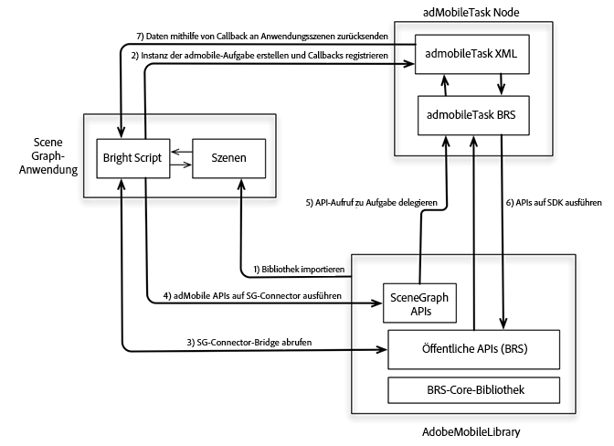

# Tracking in SceneGraph (Roku){#tracking-in-scenegraph-roku}

## Einführung {#introduction}

Roku hat ein neues Programmier-Framework für die Entwicklung von Anwendungen herausgebracht: das SceneGraph XML-Programmier-Framework. Dieses neue Framework umfasst zwei neue Schlüsselkonzepte:

* SceneGraph-Rendering der Anwendungsszenen
* XML-Konfiguration der SceneGraph-Screens

Das Adobe Mobile SDK for Roku wurde in BrightScript geschrieben. Das SDK verwendet viele Komponenten, die nicht für eine App verfügbar sind, die auf SceneGraph ausgeführt wird (z. B. Threads). Daher kann ein Roku-App-Entwickler, der das SceneGraph-Framework verwenden möchte, Adobe Mobile SDK-APIs nicht aufrufen (letztere sind ähnlich wie die in älteren BrightScript-Apps verfügbaren APIs).

## Architektur {#architecture}

Damit das AdobeMobile-SDK SceneGraph unterstützt, hat Adobe eine neue API hinzugefügt, die eine Connector-Verbindung zwischen dem AdobeMobile-SDK und `adbmobileTask` herstellt. Letzterer ist ein SceneGraph-Knoten, der für die API-Ausführung des SDK verwendet wird. (Die Verwendung von `adbmobileTask` wird im Rest dieses Dokuments ausführlich erklärt.)

Die Connector-Verbindung ist wie folgt ausgelegt:

* Die Verbindung gibt eine SceneGraph-kompatible Instanz des AdobeMobile SDK zurück. Das SceneGraph-kompatible SDK verfügt über alle APIs, die vom alten SDK bereitgestellt werden.
* Sie verwenden die AdobeMobile SDK-APIs in SceneGraph ähnlich wie die alten APIs.
* Die Verbindung stellt auch einen Mechanismus zum Abhören von Callbacks für APIs, die Daten zurückgeben, bereit.



## Komponenten {#components}

**SceneGraph-Anwendung:**

* Nutzt `AdobeMobileLibrary`-APIs über die APIs der SceneGraph-Connector-Verbindung.
* Überwacht Antwort-Callbacks in `adbmobileTask` auf unerwartete Ausgabedatenvariablen.

**AdobeMobileLibrary:**

* Stellt eine Reihe öffentlicher APIs (Legacy) bereit, einschließlich der Connector Bridge-API.
* Gibt eine SceneGraph-Connector-Instanz zurück, die alle älteren öffentlichen APIs einpackt.
* Kommuniziert mit einem SceneGraph-`adbmobileTask`-Knoten für die Ausführung der APIs.

**adbmobileTask-Knoten:**

* Ein SceneGraph-Aufgabenknoten, der `AdobeMobileLibrary`-APIs im Hintergrund-Thread ausführt.
* Dient als Delegate, der Daten an die Anwendungsszenen zurückgeben kann.

## Öffentliche SceneGraph-APIs {#public-scenegraph-apis}

### ADBMobileConnector

| Kategorie | Name der Methode | Beschreibung |
|---|---|---|
| **Konstanten** |  |  |
|  | `sceneGraphConstants` | Gibt ein Objekt zurück, das `SceneGraphConstants` enthält. Ausführliche Informationen finden Sie in der oben stehenden Tabelle. |
|  |  |  |
| **Debug-Protokollierung** |  |  |
|  | `setDebugLogging` | SceneGraph-API zum Festlegen der Debug-Protokollierung im ADBMobile-SDK. |
|  | `getDebugLogging` | SceneGraph-API zum Abrufen der Debug-Protokollierung vom ADBMobile-SDK. |
|  | Weitere Informationen finden Sie im Abschnitt „Debug-Protokollierung“ des Legacy-SDK. |  |
|  |  |  |
| **Datenschutzstatus/Opt-out** |  |  |
|  | `setPrivacyStatus` | SceneGraph-API zum Festlegen des Datenschutzstatus im ADBMobile-SDK. |
|  | `getPrivacyStatus` | SceneGraph-API zum Abrufen des Datenschutzstatus vom ADBMobile-SDK. |
|  | Weitere Informationen finden Sie im Abschnitt „Opt-out/Datenschutzstatus“ des Legacy-SDK. |  |
|  |  |  |
| **Analytics** |  |  |
|  | `trackState` | SceneGraph-API zum Verfolgen des Status im ADBMobile-SDK. |
|  | `trackAction` | SceneGraph-API zum Verfolgen der Aktion im ADBMobile-SDK. |
|  | `trackingIdentifier` | SceneGraph-API zum Abrufen einer Tracking-ID vom ADBMobile-SDK. |
|  | `userIdentifier` | SceneGraph-API zum Abrufen einer Anwender-ID vom ADBMobile-SDK. |
|  | `setUserIdentifier` | SceneGraph-API zum Festlegen einer Anwender-ID im ADBMobile-SDK. |
|  | `getAllIdentifiers` | SceneGraph-API zum Abrufen aller bekannten und im Roku-SDK persistenten Anwenderidentitäten. |
|  | Weitere Informationen finden Sie im Abschnitt „Analytics“ des Legacy-SDK. |  |
|  |  |  |
| **Experience Cloud** |  |  |
|  | `visitorSyncIdentifiers` | SceneGraph-API zur Synchronisierung von Experience Cloud IDs im ADBMobile-SDK. |
|  | `visitorMarketingCloudID` | SceneGraph-API zum Abrufen der Experience Cloud ID vom ADBMobile-SDK. |
|  | Weitere Informationen finden Sie im Abschnitt „Experience Cloud“ des Legacy-SDK. |  |
|  |  |  |
| **Audience Manager** |  |  |
|  | `audienceSubmitSignal` | SceneGraph-API zum Senden eines Zielgruppen-Management-Signals mit Eigenschaft. |
|  | `audienceVisitorProfile` | SceneGraph-API zum Abrufen eines Audience Manager-Besucherprofils vom ADBMobile-SDK. |
|  | `audienceDpid` | SceneGraph-API zum Abrufen einer Zielgruppen-DPID vom ADBMobile-SDK. |
|  | `audienceDpuuid` | SceneGraph-API zum Abrufen einer Zielgruppen-DPUUID vom ADBMobile-SDK. |
|  | `audienceSetDpidAndDpuuid` | SceneGraph-API zum Festlegen einer Zielgruppen-DPID und -DPUUID im ADBMobile-SDK. |
|  | Weitere Informationen finden Sie im Abschnitt „Audience Manager“ des Legacy-SDK. |  |
|  |  |  |
| **MediaHeartbeat** |  |  |
|  | `mediaTrackLoad` | SceneGraph-API zum Laden des Videoinhalts für MediaHeartbeat-Tracking. |
|  | mediaTrackStart | SceneGraph-API zum Starten von Video-Tracking-Sitzungen mit MediaHeartbeat. |
|  | `mediaTrackUnload` | SceneGraph-API zum Entfernen des Videoinhalts vom MediaHeartbeat-Tracking. |
|  | `mediaTrackPlay` | SceneGraph-API zum Verfolgen der Wiedergabe des Videoinhalts. |
|  | mediaTrackPause | SceneGraph-API zur Verfolgung pausierter Videoinhalte. |
|  | `mediaTrackComplete` | SceneGraph-API zum Verfolgen abgeschlossener Wiedergaben des Videoinhalts. |
|  | `mediaTrackError` | SceneGraph-API zur Verfolgung von Wiedergabefehlern. |
|  | mediaTrackEvent | SceneGraph-API zur Verfolgung von Wiedergabe-Ereignissen während des Trackings. Beispiel: Anzeigen, Kapitel. |
|  | `mediaUpdatePlayhead` | SceneGraph-API zum Senden von Änderungen der Abspielleiste an MediaHeartbeat während des Video-Trackings. |
|  | `mediaUpdateQoS` | SceneGraph-API zum Senden von QoS-Änderungen an MediaHeartbeat während des Video-Trackings. |
|  | Weitere Informationen finden Sie im Abschnitt „MediaHeartbeat“ des Legacy-SDK. |  |

### SceneGraphConstants

| Konstantenname | Beschreibung |
|---|---|
| `API_RESPONSE` | Wird verwendet, um das Antwortobjekt vom `adbmobileApiResponse`-Feld des `adbmobileTask`-Knotens abzurufen. |
| `DEBUG_LOGGING` | Wird als `apiName` für `getDebugLogging` verwendet |
| `PRIVACY_STATUS` | Wird als `apiName` für `getPrivacyStatus` verwendet |
| `TRACKING_IDENTIFIER` | Wird als `apiName` für `trackingIdentifier` verwendet |
| `USER_IDENTIFIER` | Wird als `apiName` für `userIdentifier` verwendet |
| `VISITOR_MARKETING_CLOUD_ID` | Wird als `apiName` für `visitorMarketingCloudID` verwendet |
| `AUDIENCE_VISITOR_PROFILE` | Wird als `apiName` für `audienceVisitorProfile` verwendet |
| `AUDIENCE_DPID` | Wird als `apiName` für `audienceDpid` verwendet |
| `AUDIENCE_DPUUID` | Wird als `apiName` für `audienceDpuuid` verwendet |

### adbmobileTask-Knoten

<table>
<thead>
<tr>
<td> Feld </td><td> Typ </td><td> Standard </td><td> Nutzung </td>
</tr>
</thead>
<tbody>
<tr>
<td> adbmobileApiCall </td>
<td> assocarray </td>
<td> Ungültig </td>
<td> Ändern Sie dieses Feld NICHT und lassen Sie es nicht von der Anwendung verwenden. Dieses Feld wird vom ADBMobile-SceneGraphConnector verwendet, um API-Aufrufe über SceneGraph-Knoten zu routen und Antworten abzurufen. Deshalb ist dieser Schlüssel/dieses Feld für die AdobeMobileSDK-Kompatibilität mit SceneGraph reserviert. <b>Wichtig:</b> Änderungen an diesem Feld können dafür sorgen, dass das AdobeMobileSDK nicht mehr richtig funktioniert.</td>
</tr>
<tr>
<td> adbmobileApiResponse </td>
<td> assocarray </td>
<td> Ungültig </td>
<td> Nur lesen. Alle APIs, die im AdobeMobileSDK ausgeführt werden, geben Antworten in diesem Feld zurück. Registrieren Sie einen Callback, der auf Aktualisierungen dieses Felds wartet, um Antwortobjekte zu empfangen. Das Antwortobjekt hat folgendes Format:  
<pre>
response = {
  "apiName" : &lt;SceneGraphConstants.
               API_NAME&gt; 
  "returnValue : &lt;API_RESPONSE&gt; 
}</pre>
Eine Instanz dieses Antwortobjekts wird für jeden API-Aufruf des AdobeMobileSDK gesendet, bei dem gemäß API-Referenzhandbuch die Rückgabe eines Wertes erwartet wird. Ein API-Aufruf für visitorMarketingCloudID() gibt beispielsweise folgendes Antwortobjekt zurück: 
<pre>
response = {
  "apiName" : m.
              adbmobileConstants.
              VISITOR_MARKETING_CLOUD_ID  
  "returnValue : "07050x25671x33760x72644x14"  
} 
</pre>
Auch Antwortdaten können ungültig sein: 
<pre>
response = {  
  "apiName" : m.
              adbmobileConstants.
              VISITOR_MARKETING_CLOUD_ID  
  "returnValue : invalid 
} 
</pre>
</td>
</tr>
</tbody>
</table>

### `adbmobile.brs`

#### `getADBMobileConnectorInstance`

API-Signatur: `ADBMobile().getADBMobileConnectorInstance()`\
Eingabe: `adbmobileTask`
Rückgabetyp: `ADBMobileConnector`

#### `sgConstants`

API-Signatur: `ADBMobile().sgConstants()`
Eingabe: Keine\
Rückgabetyp: `SceneGraphConstants`

>[!NOTE]
>Ausführliche Informationen finden Sie in der `ADBMobileConnector`-API-Referenz.

### ADBMobile-Konstanten

|  Funktion  | Konstantenname | Beschreibung   |
|---|---|---|
| Versionierung | `version` | Konstante für das Abrufen von Versionsinformationen von AdobeMobileLibrary |
| Datenschutz/Opt-out | `PRIVACY_STATUS_OPT_IN` | Konstante für den Datenschutz-Opt-in-Status |
|  | `PRIVACY_STATUS_OPT_OUT` | Konstante für den Datenschutz-Opt-out-Status |
| MediaHeartbeat-Konstanten | Die Konstanten finden Sie auf dieser Seite: <br/><br/>[Media Heartbeat-Methoden.](/help/sdk-implement/track-av-playback/track-core/track-core-roku.md) | Verwenden Sie diese Konstanten mit den MediaHeartbeat-APIs |
| Standardmetadaten | Die Konstanten finden Sie auf dieser Seite: <br/><br/>[Standard-Metadatenparameter.](/help/sdk-implement/track-av-playback/impl-std-metadata/impl-std-metadata-roku.md) | Verwenden Sie diese Konstanten zum Anhängen standardmäßiger Video-/Anzeigenmetadaten in MediaHeartbeat-APIs |

Auf global definierte `MediaHeartbeat`-APIs für Dienstprogramme in der älteren AdobeMobileLibrary kann *wie* in der SceneGraph-Umgebung zugegriffen werden, da keine in SceneGraph-Knoten nicht verfügbaren Brightscript-Komponenten verwendet werden. Weitere Informationen zu diesen Methoden finden Sie in der unten stehenden Tabelle:

### Globale Methoden für MediaHeartbeat

| Methode | Beschreibung |
| --- | --- |
| `adb_media_init_mediainfo` | Diese Methode gibt ein initialisiertes Objekt mit Medieninformationen zurück. `Function adb_media_init_mediainfo(name As String, id As String, length As Double, streamType As String) As Object` |
| `adb_media_init_adinfo` | Diese Methode gibt ein initialisiertes Objekt mit Anzeigeninformationen zurück. `Function adb_media_init_adinfo(name As String, id As String, position As Double, length As Double) As Object` |
| `adb_media_init_chapterinfo` | Diese Methode gibt ein initialisiertes Objekt mit Kapitelinformationen zurück. `Function adb_media_init_adbreakinfo(name As String, startTime as Double, position as Double) As Object` |
| `adb_media_init_adbreakinfo` | Diese Methode gibt ein initialisiertes Objekt mit AdBreak-informationen zurück. `Function adb_media_init_chapterinfo(name As String, position As Double, length As Double, startTime As Double) As Object` |
| `adb_media_init_qosinfo` | Diese Methode gibt ein initialisiertes Objekt mit QoS-Informationen zurück. `Function adb_media_init_qosinfo(bitrate As Double, startupTime as Double, fps as Double, droppedFrames as Double) As Object` |

## Implementierung {#implementation}

1. **Roku-Bibliothek herunterladen -** Laden Sie die [aktuelle Roku-Bibliothek](https://github.com/Adobe-Marketing-Cloud/media-sdks/releases/tag/roku-v2.2.2) herunter.

1. **Entwicklungsumgebung einrichten**

   1. Kopieren Sie `adbmobile.brs` (AdobeMobileLibrary) in das Verzeichnis `pkg:/source/`.

   1. Kopieren Sie für die SceneGraph-Unterstützung `adbmobileTask.brs` und `adbMobileTask.xml` in das Verzeichnis `pkg:/components/`.

1. **Initialisieren**

   1. Importieren Sie `adbmobile.brs` in Ihre Szene.

      ```
      <script type="text/brightscript" uri="pkg:/source/adbmobile.brs" />
      ```

   1. Erstellen Sie eine Instanz des `adbmobileTask`-Knotens in Ihrer Szene.

      ```
      m.adbmobileTask = createObject("roSGNode", "adbmobileTask")
      ```

   1. Rufen Sie mit `adbmobile` eine Instanz des `adbmobileTask`-Connectors für SceneGraph ab.

      ```
      m.adbmobile = ADBMobile().getADBMobileConnectorInstance(m.adbmobileTask)
      ```

   1. Rufen Sie die `adbmobile`-SceneGraph-Konstanten ab.

      ```
      m.adbmobileConstants = m.adbmobile.sceneGraphConstants()
      ```

   1. Registrieren Sie einen Callback, der das Antwortobjekt für alle `AdbMobile`-API-Aufrufe empfängt.

      ```
      m.adbmobileTask.ObserveField(m.adbmobileConstants.API_RESPONSE,  
                                   "onAdbmobileApiResponse") 
      
      ' Sample implementation of the callback 
      ' Listen for all the constants for which API calls are made on the SDK 
      function onAdbmobileApiResponse() as void 
          responseObject = m.adbmobileTask[m.adbmobileConstants.API_RESPONSE] 
      
          if responseObject <> invalid 
              methodName = responseObject.apiName 
              retVal = responseObject.returnValue 
      
              if methodName = m.adbmobileConstants.DEBUG_LOGGING 
                  if retVal 
                      print "API Response: DEBUG LOGGING: " + "True" 
                  else 
                      print "API Response: DEBUG LOGGING: " + "False" 
                  endif 
              else if methodName = m.adbmobileConstants.PRIVACY_STATUS 
                  print "API Response: PRIVACY STATUS: " + retVal 
              else if methodName = m.adbmobileConstants.TRACKING_IDENTIFIER 
                  if retVal <> invalid 
                      print "API Response: TRACKING IDENTIFIER: " + retVal 
                  else 
                      print "API Response: TRACKING IDENTIFIER: " + "invalid" 
                  endif 
              else if methodName = m.adbmobileConstants.USER_IDENTIFIER 
                  if retVal <> invalid 
                      print "API Response: USER IDENTIFIER: " + retVal 
                  else 
                      print "API Response: USER IDENTIFIER: " + "invalid" 
                  endif 
              else if methodName = m.adbmobileConstants.VISITOR_MARKETING_CLOUD_ID 
                  if retVal <> invalid 
                      print "API Response: MCID: " + retVal 
                  else 
                      print "API Response: MCID: " + "invalid" 
                  endif 
              else if methodName = m.adbmobileConstants.AUDIENCE_DPID 
                  if retVal <> invalid 
                      print "API Response: AUDIENCE DPID: " + retVal 
                  else 
                      print "API Response: AUDIENCE DPID: " + "invalid" 
                  endif 
              else if methodName = m.adbmobileConstants.AUDIENCE_DPUUID 
                  if retVal <> invalid 
                      print "API Response: AUDIENCE DPUUID: " + retVal 
                  else 
                      print "API Response: AUDIENCE DPUUID: " + "invalid" 
                  endif 
              else if methodName = m.adbmobileConstants.AUDIENCE_VISITOR_PROFILE 
                  if retVal <> invalid 
                      print "API Response: AUDIENCE VISITOR PROFILE: Valid Object" 
                  else 
                      print "API Response: AUDIENCE VISITOR PROFILE: " + "invalid" 
                  endif 
              endif 
          endif 
      end function 
      ```

## Beispielimplementierung {#sample-implementation}

### API-Beispielaufrufe im Legacy-SDK

```
'get an instance of SDK 
m.adbmobile = ADBMobile() 
   
'execute setter APIs 
m.adbmobile.setDebugLogging(true) 
   
'execute getter APIs 
debugLogging = m.adbmobile.getDebugLogging()
```

### API-Beispielaufrufe im SceneGraph-SDK

```
'create adbmobileTask instance 
m.adbmobileTask = createObject("roSGNode", "adbmobileTask") 
   
'get an instance of SDK using task instance 
m.adbmobile =  
  ADBMobile().getADBMobileConnectorInstace(m.adbmobileTask) 
m.adbmobileConstants = m.adbmobile.sceneGraphConstants() 
'execute setter APIs 
m.adbmobile.setDebugLogging(true) 
  
'execute getter APIs 
m.adbmobileTask.ObserverField(m.adbConstants.API_RESPONSE,  
                              "onAdbmobileApiResponse") 
m.adbmobile.getDebugLogging() 
   
'listen for return data in registered callbacks 
function onAdbmobileApiResponse() as void 
    responseObject = m.adbmobileTask[m.adbmobileConstants.API_RESPONSE] 
  
        if responseObject <> invalid 
            methodName = responseObject.apiName 
            retVal = responseObject.returnValue 
  
        if methodName = m.adbmobileConstants.DEBUG_LOGGING 
            if retVal 
                print "API Response: DEBUG LOGGING: " + "True" 
            else 
                print "API Response: DEBUG LOGGING: " + "False" 
         endif 
    endif 
end function
```
