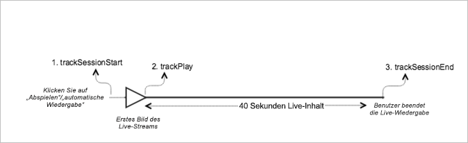

# Live-Hauptinhalt{#live-main-content}

## Szenario {#scenario}

In diesem Szenario gibt es ein einziges Live-Asset ohne Anzeigen, das 40 Sekunden nach Eintritt eines Benutzers in den Live-Stream wiedergegeben wird.

| Auslöser | Heartbeat-Methode | Netzwerkaufrufe | Hinweise   |
|---|---|---|---|
| Anwender klickt auf **[!UICONTROL Abspielen]** | `trackSessionStart` | Analytics Content Start, Heartbeat Content Start | Dies kann ein Anwender sein, der auf **[!UICONTROL Abspielen]** klickt, oder ein Ereignis bei automatischer Wiedergabe. |
| Das erste Medienbild wird wiedergegeben. | `trackPlay` | Heartbeat Content Play | Diese Methode löst den Timer aus. Heartbeats werden alle 10 Sekunden gesendet, solange die Wiedergabe läuft. |
| Der Inhalt wird wiedergegeben. |  | Content Heartbeats |  |
| Die Sitzung ist beendet. | `trackSessionEnd` |  | `SessionEnd` steht für das Ende einer Anzeigesitzung. Diese API muss auch dann aufgerufen werden, wenn der Benutzer die Medien nicht bis zum Ende konsumiert. |

## Parameter {#parameters}

Viele der Werte bei Adobe Analytics Content Start-Aufrufen sind auch bei Heartbeat Content Start-Aufrufen vorhanden. Außerdem verwendet Adobe noch viele weitere Parameter, um die verschiedenen Medienberichte in Adobe Analytics zu füllen. Davon werden im Folgenden nur die wichtigsten Parameter behandelt.

### Heartbeat Content Start

| Parameter | Wert | Hinweise |
|---|---|---|
| `s:sc:rsid` | &lt;Adobe-Report Suite-ID> |  |
| `s:sc:tracking_serve` | &lt;Analytics-Tracking-Server-URL> |  |
| `s:user:mid` | `s:user:mid` | Sollte mit dem mid-Wert beim Adobe Analytics Content Start-Aufruf übereinstimmen |
| `s:event:type` | &quot;start&quot; |  |
| `s:asset:type` | &quot;main&quot; |  |
| `s:asset:mediao_id` | &lt;Ihr Medienname> |  |
| `s:stream:type` | live |  |
| `s:meta:*` | optional | Im Medium festgelegte benutzerdefinierte Metadaten |

## Content Heartbeats {#content-heartbeats}

Während der Medienwiedergabe gibt es einen Timer, der alle 10 Sekunden einen oder mehrere Heartbeats (oder Pings) für Hauptinhalte und jede Sekunde für Anzeigen sendet. Diese Heartbeats enthalten Informationen über Wiedergabe, Anzeigen, Pufferung und eine Reihe anderer Dinge. Der genaue Inhalt eines jeden Heartbeat geht über den Rahmen dieses Dokuments hinaus. Wichtig ist, dass Heartbeats laufend während der Wiedergabe ausgelöst werden.

Suchen Sie in den Content Heartbeats nach einigen spezifischen Elementen:

| Parameter | Wert | Hinweise |
|---|---|---|
| `s:event:type` | &quot;play&quot; |  |
| `l:event:playhead` | &lt;Position der Abspielleiste>, z. B. 50, 60, 70 | Dies sollte die aktuelle Position der Abspielleiste widerspiegeln. |

## Heartbeat Content Complete {#heartbeat-content-complete}

In diesem Szenario wird kein Abschlussaufruf gesendet, da der Live-Stream nie abgeschlossen wurde.

## Einstellungen der Abspielleistenwerte

Bei LIVE-Streams müssen Sie den Wert des Abspielkopfs als die Anzahl der Sekunden seit Mitternacht UTC an diesem Tag festlegen, damit Analysten beim Reporting bestimmen können, an welchem Punkt Benutzer innerhalb einer 24-Stunden-Ansicht dem LIVE-Stream beitreten und ihn verlassen.

### Am Anfang

Bei LIVE-Medien müssen Sie, wenn ein Benutzer mit der Wiedergabe des Streams beginnt, `l:event:playhead` auf die Anzahl der Sekunden seit Mitternacht UTC an diesem Tag setzen. Dies ist im Gegensatz zu VOD, wo Sie die Abspielleiste auf „0“ festlegen würden.

Beispiel: Ein LIVE-Streaming-Ereignis beginnt um Mitternacht und dauert 24 Stunden (`a.media.length=86400`; `l:asset:length=86400`). Nehmen wir an, ein Benutzer beginnt um 12:00 Uhr mit der Wiedergabe des LIVE-Streams. In diesem Szenario sollten Sie `l:event:playhead` auf 43200 setzen (12 Stunden seit Mitternacht UTC an diesem Tag in Sekunden).

### Beim Anhalten

Dieselbe Live-Abspielleistenlogik, die zu Beginn der Wiedergabe angewendet wurde, muss angewendet werden, wenn ein Benutzer die Wiedergabe anhält. Wenn der Benutzer zum Abspielen des LIVE-Streams zurückkehrt, müssen Sie den Wert `l:event:playhead` auf die neue Anzahl der Sekunden seit Mitternacht UTC festlegen, _nicht_ auf den Punkt, an dem der Benutzer den LIVE-Stream angehalten hat.

## Beispielcode {#sample-code}



### Android

Die erwartete API-Aufrufreihenfolge lautet wie folgt:

```java
// Set up mediaObject 
MediaObject mediaInfo = MediaHeartbeat.createMediaObject( 
  Configuration.MEDIA_NAME,  
  Configuration.MEDIA_ID,  
  Configuration.MEDIA_LENGTH,  
  MediaHeartbeat.StreamType.LIVE 
); 

HashMap<String, String> mediaMetadata = new HashMap<String, String>(); 
mediaMetadata.put(CUSTOM_VAL_1, CUSTOM_KEY_1); 
mediaMetadata.put(CUSTOM_VAL_2, CUSTOM_KEY_2); 

// 1. Call trackSessionStart() when the user clicks Play or if autoplay is used,  
//    i.e., there is an intent to start playback.  
_mediaHeartbeat.trackSessionStart(mediaInfo, mediaMetadata); 

...... 
...... 

// 2. Call trackPlay() when the playback actually starts, i.e., when the first  
//    frame of main content is rendered on the screen. 
_mediaHeartbeat.trackPlay(); 

....... 
....... 

// 3. Call trackSessionEnd() when user ends the playback session.  
//    Since the user does not watch live media to completion, there  
//    is no need to call trackComplete().  
_mediaHeartbeat.trackSessionEnd(); 
....... 
....... 
```

### iOS

Die erwartete API-Aufrufreihenfolge lautet wie folgt:

```
// Set up mediaObject 
ADBMediaObject *mediaObject =  
[ADBMediaHeartbeat createMediaObjectWithName:MEDIA_NAME  
                   length:MEDIA_LENGTH  
                   streamType:ADBMediaHeartbeatStreamTypeLIVE]; 
 
NSMutableDictionary *mediaContextData = [[NSMutableDictionary alloc] init]; 
[mediaContextData setObject:CUSTOM_VAL_1 forKey:CUSTOM_KEY_1]; 
[mediaContextData setObject:CUSTOM_VAL_2 forKey:CUSTOM_KEY_2]; 
 
// 1. Call trackSessionStart when the user clicks Play or if autoplay is used,  
//    i.e., there is an intent to start playback. 
[_mediaHeartbeat trackSessionStart:mediaObject data:mediaContextData]; 
...... 
...... 
 
// 2. Call trackPlay when the playback actually starts, i.e., when the first  
//    frame of the main content is rendered on the screen. 
[_mediaHeartbeat trackPlay]; 
....... 
....... 
 
// 3. Call trackSessionEnd when user ends the playback session. Since the user  
//    does not watch live media to completion, there is no need to call  
//    trackComplete. 
[_mediaHeartbeat trackSessionEnd]; 
........ 
........ 
```

### JavaScript

Die erwartete API-Aufrufreihenfolge lautet wie folgt:

```js
// Set up mediaObject 
var mediaInfo =  
MediaHeartbeat.createMediaObject(Configuration.MEDIA_NAME,  
                                 Configuration.MEDIA_ID,  
                                 Configuration.MEDIA_LENGTH,  
                                 MediaHeartbeat.StreamType.VOD); 

var mediaMetadata = { 
  CUSTOM_KEY_1 : CUSTOM_VAL_1,  
  CUSTOM_KEY_2 : CUSTOM_VAL_2,  
  CUSTOM_KEY_3 : CUSTOM_VAL_3 
}; 

// 1. Call trackSessionStart() when Play is clicked or if autoplay  
//    is used, i.e., there's an intent to start playback. 
this._mediaHeartbeat.trackSessionStart(mediaInfo, mediaMetadata); 

...... 
...... 

// 2. Call trackPlay() when the playback actually starts, i.e., when the  
//    first frame of media is rendered on the screen. 
this._mediaHeartbeat.trackPlay(); 

....... 
....... 

// 3. Call trackSessionEnd() when user ends the playback session.  
//    Since user does not watch live media to completion, there is  
//    no need to call trackComplete(). 
this._mediaHeartbeat.trackSessionEnd(); 

........ 
........ 
```
