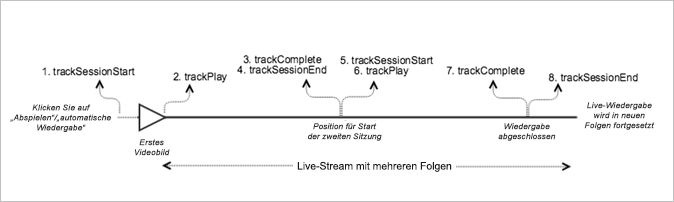

# Live-Hauptinhalt mit sequentieller Verfolgung{#live-main-content-with-sequential-tracking}

## Szenario {#section_E4B558253AD84ED59256EDB60CED02AE}

In diesem Szenario gibt es ein Live-Asset ohne Wiedergabe von Anzeigen für 40 Sekunden nach Beitritt zum Live-Stream.

Dieses Szenario ist mit dem Szenario [VOD-Wiedergabe ohne Anzeigen](../../sdk-implement/tracking-scenarios/vod-no-intrs-details.md) identisch, allerdings wird ein Teil des Inhalts vorgespult und es wird eine Suche von einem Punkt im Hauptinhalt zu einem anderen Punkt vorgenommen.

| Auslöser | Heartbeat-Methode | Netzwerkaufrufe   | Hinweise   |
| --- | --- | --- | --- |
| Anwender klickt auf [!UICONTROL Abspielen] | `trackSessionStart` | Analytics Content Start, Heartbeat Content Start | Der Measurement Library ist nicht bekannt, dass es eine Pre-Roll-Anzeige gibt. Daher sind diese Netzwerkaufrufe mit dem Szenario [VOD-Wiedergabe ohne Anzeigen](../../sdk-implement/tracking-scenarios/vod-no-intrs-details.md) identisch. |
| Das erste Bild des Inhalts wird wiedergegeben. | `trackPlay` | Heartbeat Content Play | Wenn Kapitelinhalt vor dem Hauptinhalt wiedergegeben wird, beginnen die Heartbeats mit dem Kapitelstart. |
| Inhalt wird wiedergegeben. |  | Content Heartbeats | Dieser Netzwerkaufruf ist mit dem Aufruf beim Szenario [VOD-Wiedergabe ohne Anzeigen](../../sdk-implement/tracking-scenarios/vod-no-intrs-details.md) identisch. |
| Sitzung 1 beendet (Folge 1 beendet) | `trackComplete` `trackSessionEnd` | Heartbeat Content Complete | „Complete“ bedeutet, dass Sitzung 1 für die erste Folge erreicht und vollständig angeschaut wurde. Bevor die Sitzung für die nächste Folge gestartet werden kann, muss diese Sitzung beendet werden. |
| Folge 2 gestartet (Start von Sitzung 2) | `trackSessionStart` | Analytics Content Start Heartbeat Content Start | Dies tritt auf, wenn der Anwender die erste Folge geschaut und direkt mit einer weiteren Folge begonnen hat. |
| Erstes Medienbild | `trackPlay` | Heartbeat Content Play | Durch diese Methode wird der Timer ausgelöst. Daraufhin werden während der Wiedergabedauer alle zehn Sekunden Heartbeats gesendet. |
| Inhalt wird wiedergegeben. |  | Content Heartbeats |  |
| Sitzung beendet (Folge 2 beendet) | `trackComplete` `trackSessionEnd` | Heartbeat Content Complete | „Complete“ bedeutet, dass Sitzung 2 für die zweite Folge erreicht und vollständig angeschaut wurde. Bevor die Sitzung für die nächste Folge gestartet werden kann, muss diese Sitzung beendet werden. |

## Parameter {#section_D52B325B99DA42108EF560873907E02C}

### Heartbeat Content Start

| Parameter | Wert | Hinweise |
|---|---|---|
| `s:sc:rsid` | &lt;Adobe-Report Suite-ID&gt; |  |
| `s:sc:tracking_serve` | &lt;Analytics-Tracking-Server-URL&gt; |  |
| `s:user:mid` | `s:user:mid` | Sollte mit dem mid-Wert beim Adobe Analytics Content Start-Aufruf übereinstimmen |
| `s:event:type` | `"start"` |  |
| `s:asset:type` | `"main"` |  |
| `s:asset:media_id` | &lt; Ihr Medienname &gt; |  |
| `s:stream:type` | `live` |  |
| `s:meta:*` | *optional* | Benutzerspezifischer Metadatensatz, der auf den Medien eingestellt ist |

## Heartbeat Content Play {#section_B6AD9225747943F881DCA8E6A1D5710E}

Dies sollte fast genauso wie der Heartbeat Content Start-Aufruf aussehen, aber den Hauptunterschied im Parameter „s:event:type“ aufweisen. Alle Parameter sollten hier weiterhin vorhanden sein.

| Parameter | Wert | Hinweise |
|---|---|---|
| `s:event:type` | `"play"` |  |
| `s:asset:type` | `"main"` |  |

## Content Heartbeats {#section_7B387303851A43E5993F937AE2B146FE}

Während der Medienwiedergabe gibt es einen Timer, der alle zehn Sekunden Heartbeats sendet. Diese Heartbeats enthalten Informationen zu Wiedergabe, Anzeigen, Pufferung und vielen weiteren Aspekten. Der genaue Inhalt jedes Heartbeats wird in diesem Dokument nicht behandelt. Wichtig ist vor allem, sicherzustellen, dass Heartbeats konsistent ausgelöst werden, während die Wiedergabe läuft.

Suchen Sie in den Inhalts-Heartbeats nach einigen speziellen Elementen:

| Parameter | Wert | Hinweise |
|---|---|---|
| `s:event:type` | `"play"` |  |
| `l:event:playhead` | &lt;Position der Abspielleiste&gt;, z. B. 50, 60, 70 | Dies sollte die aktuelle Position der Abspielleiste widerspiegeln. |

## Heartbeat Content Complete {#section_2CA970213AF2457195901A93FC9D4D0D}

Wenn die Wiedergabe einer Folge abgeschlossen ist (die Abspielleiste überschreitet die Grenze zwischen Folgen), wird ein Heartbeat Content Complete-Aufruf gesendet. Dieser Aufruf sieht wie andere Heartbeat-Aufrufe aus, enthält aber einige spezielle Elemente:

| Parameter | Wert | Hinweise |
|---|---|---|
| `s:event:type` | `"complete"` |  |
| `s:asset:type` | `"main"` |  |

## Beispielcode {#section_mpx_q2j_x2b}



### Android

Die erwartete API-Aufrufreihenfolge lautet wie folgt:

```java
// Set up mediaObject 
MediaObject mediaInfo = MediaHeartbeat.createMediaObject( 
  Configuration.MEDIA_NAME,  
  Configuration.MEDIA_ID,  
  Configuration.MEDIA_LENGTH,  
  MediaHeartbeat.StreamType.LIVE 
); 

HashMap<String, String> mediaMetadata = new HashMap<String, String>(); 
mediaMetadata.put(CUSTOM_VAL_1, CUSTOM_KEY_1); 
mediaMetadata.put(CUSTOM_VAL_2, CUSTOM_KEY_2); 

// 1. Call trackSessionStart() when the user clicks Play or if autoplay is used,  
//    i.e., when there is an intent to start playback.  
_mediaHeartbeat.trackSessionStart(mediaInfo, mediaMetadata); 

...... 
...... 

// 2. Call trackPlay() when the playback actually starts, i.e., when the first  
//    frame of main content is rendered on the screen.  
_mediaHeartbeat.trackPlay(); 

....... 
....... 

// 3. Call trackComplete() when the playback reaches the end of session,  
//    i.e., when the media completes and finishes playing 1st episode/session.  
_mediaHeartbeat.trackComplete(); 

........ 
........ 

// 4. Call trackSessionEnd() to end session 1 
_mediaHeartbeat.trackSessionEnd(); 

........ 
........ 

// Start tracking session 2 /episode 2 of the same live stream.  
// There is no need to reinstantiate a mediaHeartbeat instance for tracking sesison 2. 
// Set up mediaObject 
MediaObject mediaInfo = MediaHeartbeat.createMediaObject( 
  Configuration.MEDIA_NAME,  
  Configuration.MEDIA_ID,  
  Configuration.MEDIA_LENGTH,  
  MediaHeartbeat.StreamType.LIVE 
); 

HashMap<String, String> mediaMetadata = new HashMap<String, String>(); 
mediaMetadata.put(CUSTOM_VAL_1, CUSTOM_KEY_1); 
mediaMetadata.put(CUSTOM_VAL_2, CUSTOM_KEY_2); 

// 5. Call trackSessionStart() when the playhead reaches a point that denotes the 
//    start of session 2 
_mediaHeartbeat.trackSessionStart(mediaInfo, mediaMetadata); 

...... 
...... 

// 6. Call trackPlay() to start tracking session 2 playback  
_mediaHeartbeat.trackPlay(); 

....... 
....... 

// 7. Call trackComplete() when the playback reaches the end of session 2,  
//    i.e., the media completes and finishes playing.  
_mediaHeartbeat.trackComplete(); 

........ 
........ 

// 8. Call trackSessionEnd() to end session 2 
_mediaHeartbeat.trackSessionEnd(); 

........ 
........ 

// Continue similarly tracking further sessions in the live stream if required 
```

### iOS

Die erwartete API-Aufrufreihenfolge lautet wie folgt:

```
// Set up mediaObject 
ADBMediaObject *mediaObject =  
[ADBMediaHeartbeat createMediaObjectWithName:MEDIA_NAME  
                   length:MEDIA_LENGTH  
                   streamType:ADBMediaHeartbeatStreamTypeLIVE]; 
  
NSMutableDictionary *mediaContextData = [[NSMutableDictionary alloc] init]; 
[mediaContextData setObject:CUSTOM_VAL_1 forKey:CUSTOM_KEY_1]; 
[mediaContextData setObject:CUSTOM_VAL_2 forKey:CUSTOM_KEY_2]; 
  
// 1. Call trackSessionStart when the user clicks Play or if autoplay is used,  
//    i.e., there is an intent to start playback. 
[_mediaHeartbeat trackSessionStart:mediaObject data:mediaContextData]; 
...... 
...... 
  
// 2. Call trackPlay when the playback actually starts, i.e., when the first  
//    frame of main content is rendered on the screen. 
[_mediaHeartbeat trackPlay]; 
....... 
....... 

// 3. Call trackComplete when the playback reaches the end of session,  
//    i.e., when the media completes and finishes playing the first 
//    episode/session. 
[_mediaHeartbeat trackComplete]; 
....... 
....... 

// 4. Call trackSessionEnd to end session 1 
[_mediaHeartbeat trackSessionEnd]; 
........ 
........ 

// Start tracking session 2 / episode 2 of the same live stream, No need to  
// reinstantiate mediaHeartbeat instance for tracking sesison 2. 

// Set up mediaObject 
ADBMediaObject *mediaObject =  
[ADBMediaHeartbeat createMediaObjectWithName:MEDIA_NAME  
                   length:MEDIA_LENGTH  
                   streamType:ADBMediaHeartbeatStreamTypeLIVE]; 
 
NSMutableDictionary *mediaContextData = [[NSMutableDictionary alloc] init]; 
[mediaContextData setObject:CUSTOM_VAL_1 forKey:CUSTOM_KEY_1]; 
[mediaContextData setObject:CUSTOM_VAL_2 forKey:CUSTOM_KEY_2]; 
 
// 5. Call trackSessionStart when the playhead reaches a point that denotes  
//    start of session 2 
[_mediaHeartbeat trackSessionStart:mediaObject data:mediaContextData]; 
...... 
...... 
 
// 6. Call trackPlay to start tracking session 2 playback 
[_mediaHeartbeat trackPlay]; 
....... 
....... 
 
// 7. Call trackComplete when the playback reaches the end of session 2,  
//    i.e., when the media completes and finishes playing. 
[_mediaHeartbeat trackComplete]; 
........ 
........ 
 
// 8. Call trackSessionEnd to end the session 2 
[_mediaHeartbeat trackSessionEnd]; 
........ 
........ 

// Continue tracking further sessions in live stream similarly if required 
```

### JavaScript

Die erwartete API-Aufrufreihenfolge lautet wie folgt:

```js
// Set up mediaObject 

var mediaInfo = MediaHeartbeat.createMediaObject( 
  Configuration.MEDIA_NAME,  
  Configuration.MEDIA_ID,  
  Configuration.MEDIA_LENGTH,  
  MediaHeartbeat.StreamType.VOD 
); 

var mediaMetadata = { 
  CUSTOM_KEY_1 : CUSTOM_VAL_1,  
  CUSTOM_KEY_2 : CUSTOM_VAL_2,  
  CUSTOM_KEY_3 : CUSTOM_VAL_3 
}; 

// 1. Call trackSessionStart() when Play is clicked or if autoplay is used,  
//    i.e., there's an intent to start playback. 
this._mediaHeartbeat.trackSessionStart(mediaInfo, mediaMetadata); 

...... 
...... 

// 2. Call trackPlay() when the playback actually starts, i.e., when the  
//    first frame of media is rendered on the screen. 
this._mediaHeartbeat.trackPlay(); 

....... 
....... 

// 3. Call trackComplete() when the playback reaches the end of a session,  
//    i.e., whn playback completes and finishes playing the 1st episode/session. 
this._mediaHeartbeat.trackComplete(); 

........ 
........ 

// 4. Call trackSessionEnd() to end session 1 
this._mediaHeartbeat.trackSessionEnd(); 

........ 
........ 

// Start tracking session 2/episode 2 of the same live stream. There is no need  
// to reinstantiate a mediaHeartbeat instance for tracking sesison 2. 

// Set up mediaObject 
var mediaInfo2 = MediaHeartbeat.createMediaObject( 
  Configuration.MEDIA_NAME,  
  Configuration.MEDIA_ID,  
  Configuration.MEDIA_LENGTH,  
  MediaHeartbeat.StreamType.LIVE 
); 

var mediaMetadata2 = { 
  CUSTOM_KEY_1 : CUSTOM_VAL_1,  
  CUSTOM_KEY_2 : CUSTOM_VAL_2,  
  CUSTOM_KEY_3 : CUSTOM_VAL_3 
}; 

// 5. Call trackSessionStart() when the playhead reaches a point that denotes  
//    the start of session 2 
this._mediaHeartbeat.trackSessionStart(mediaInfo2, mediaMetadata2); 

...... 
...... 

// 6. Call trackPlay() to start tracking session 2 playback 
this._mediaHeartbeat.trackPlay(); 

....... 
....... 

// 7. Call trackComplete() when the playback reaches the end of session 2,  
//    i.e., playback completes and finishes playing. 
this._mediaHeartbeat.trackComplete(); 

........ 
........ 

// 8. Call trackSessionEnd() to end session 2 
this._mediaHeartbeat.trackSessionEnd(); 

........ 
........ 

// Continue tracking further sessions in live stream similarly if required 
```

