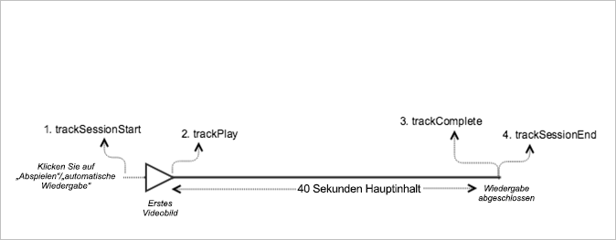

# VOD-Wiedergabe ohne Anzeigen{#vod-playback-with-no-ads}

## Szenario {#scenario}

Diese Szenario umfasst ein VOD-Asset ohne Anzeigen, das einmal von Anfang bis Ende wiedergegeben wird.

| Auslöser | Heartbeat-Methode | Netzwerkaufrufe | Hinweise   |
|---|---|---|---|
| User clicks **[!UICONTROL Play]** | `trackSessionStart` | Analytics Content Start, Heartbeat Content Start | Dies kann ein Benutzer sein, der auf „Abspielen“ klickt, oder ein Ereignis bei automatischer Wiedergabe. |
| Erstes Medienbild | `trackPlay` | Heartbeat Content Play | Durch diese Methode wird der Timer ausgelöst. Daraufhin werden während der Wiedergabe alle 10 Sekunden Heartbeats gesendet. |
| Inhalt wird wiedergegeben. |  | Content Heartbeats |  |
| Inhalt ist abgeschlossen. | `trackComplete` | Heartbeat Content Complete | *Complete* bedeutet, dass das Ende der Abspielleiste erreicht wurde. |

## Parameter {#parameters}

Viele der Werte bei Heartbeat Content Start-Aufrufen sind auch in Adobe Analytics `Content Start`-Aufrufen vorhanden. Es gibt viele Parameter, mit denen Adobe die verschiedenen Medienberichte füllt. In der folgenden Tabelle sind jedoch nur die wichtigsten Parameter aufgeführt:

### Heartbeat Content Start

| Parameter | Wert | Hinweise   |
|---|---|---|
| `s:sc:rsid` | &lt;Adobe-Report Suite-ID&gt; |  |
| `s:sc:tracking_server` | &lt;Analytics-Tracking-Server-URL&gt; |  |
| `s:user:mid` | muss festgelegt werden | Should match the mid value on the `Adobe Analytics Content Start` call. |
| `s:event:type` | `"start"` |  |
| `s:asset:type` | `"main"` |  |
| `s:asset:media_id` | &lt;Ihr Medienname&gt; |  |
| `s:meta:*` | optional | Benutzerdefinierte Metadaten, die auf den Medien festgelegt werden. |

## Heartbeat Content Play {#heartbeat-content-play}

These parameters should look nearly identical to the `Heartbeat Content Start` call, but the key difference is the `s:event:type` parameter. Alle anderen Parameter sollten weiterhin vorhanden sein.

| Parameter | Wert | Hinweise   |
|---|---|---|
| `s:event:type` | `"play"` |  |
| `s:asset:type` | `"main"` |  |

## Content Heartbeats {#content-heartbeats}

Während der Medienwiedergabe sendet ein Timer mindestens einen Heartbeat alle 10 Sekunden. Diese Heartbeats enthalten Informationen zur Wiedergabe, zu Anzeigen, zur Pufferung usw. Der genaue Inhalt jedes Heartbeats wird in diesem Dokument nicht behandelt. Wichtig ist vor allem, dass Heartbeats konsistent ausgelöst werden, während die Wiedergabe läuft.

Suchen Sie in den Inhalts-Heartbeats nach den folgenden Parametern:

| Parameter | Wert | Hinweise   |
|---|---|---|
| `s:event:type` | `"play"` |  |
| `l:event:playhead` | &lt;Position der Abspielleiste&gt;, z. B. 50,60,70 | Dieser Parameter spiegelt die aktuelle Position der Abspielleiste wider. |

## Heartbeat Content Complete {#heartbeat-content-complete}

Nach Abschluss der Wiedergabe (wenn also das Ende der Abspielleiste erreicht wird), wird ein `Heartbeat Content Complete`-Aufruf gesendet. Dieser Aufruf sieht wie andere Heartbeat-Aufrufe aus, enthält aber einige spezifische Parameter:

| Parameter | Wert | Hinweise   |
|---|---|---|
| `s:event:type` | `"complete"` |  |
| `s:asset:type` | `"main"` |  |

## Beispielcode {#sample-code}

In diesem Szenario ist der Inhalt 40 Sekunden lang. Er wird ohne Unterbrechungen bis zum Ende abgespielt.



### Android

```java
// Set up  mediaObject 
MediaObject mediaInfo = MediaHeartbeat.createMediaObject( 
  Configuration.MEDIA_NAME,  
  Configuration.MEDIA_ID,  
  Configuration.MEDIA_LENGTH,  
  MediaHeartbeat.StreamType.VOD 
); 

HashMap<String, String> mediaMetadata = new HashMap<String, String>(); 
mediaMetadata.put(CUSTOM_VAL_1, CUSTOM_KEY_1); 
mediaMetadata.put(CUSTOM_VAL_2, CUSTOM_KEY_2); 

// 1. Call trackSessionStart() when the user clicks Play or if autoplay  
//    is used, i.e., there's an intent to start playback.  
_mediaHeartbeat.trackSessionStart(mediaInfo, mediaMetadata); 

...... 
...... 

// 2. Call trackPlay() when the playback actually starts,  
//    i.e., the first frame of media is rendered on the screen.  
_mediaHeartbeat.trackPlay(); 

....... 
....... 

// 3. Call trackComplete() when the playback reaches the end,  
//    i.e., when the media completes and finishes playing.  
_mediaHeartbeat.trackComplete(); 

........ 
........ 

// 4. Call trackSessionEnd() when the playback session is over.  
//    This method must be called even if the user does not watch  
//    the media to completion.  
_mediaHeartbeat.trackSessionEnd(); 

........ 
........ 
```

### iOS

```
when the user clicks Play 
ADBMediaObject *mediaObject =  
[ADBMediaHeartbeat createMediaObjectWithName:MEDIA_NAME  
                   length:MEDIA_LENGTH  
                   streamType:ADBMediaHeartbeatStreamTypeVOD]; 

NSMutableDictionary *mediaContextData = [[NSMutableDictionary alloc] init]; 
[mediaContextData setObject:CUSTOM_VAL_1 forKey:CUSTOM_KEY_1]; 
[mediaContextData setObject:CUSTOM_VAL_2 forKey:CUSTOM_KEY_2]; 

// 1. Call trackSessionStart when the user clicks Play or if autoplay is used,  
//    i.e., there's an intent to start playback. 
[_mediaHeartbeat trackSessionStart:mediaObject data:mediaContextData]; 
...... 
...... 

// 2. Call trackPlay when the playback actually starts, i.e., when the  
//    first frame of main content is rendered on the screen. 
[_mediaHeartbeat trackPlay]; 
....... 
....... 

// 3. Call trackComplete when the playback reaches the end, i.e.,  
//    when the media completes and finishes playing. 
[_mediaHeartbeat trackComplete]; 
........ 
........ 

// 4. Call trackSessionEnd when the playback session is over. This method  
//    must be called even if the user does not watch the media to completion. 
[_mediaHeartbeat trackSessionEnd]; 
........ 
........ 
```

### JavaScript

```js
// Set up mediaObject 

var mediaInfo = MediaHeartbeat.createMediaObject(Configuration.MEDIA_NAME, Configuration.MEDIA_ID,  
Configuration.MEDIA_LENGTH,MediaHeartbeat.StreamType.VOD); 
var mediaMetadata = { 
  CUSTOM_KEY_1 : CUSTOM_VAL_1,  
  CUSTOM_KEY_2 : CUSTOM_VAL_2,  
  CUSTOM_KEY_3 : CUSTOM_VAL_3 

}; 

// 1. Call trackSessionStart() when the user clicks play, or when autoplay is used,  
//    i.e., there's an intent to start playback. 
this._mediaHeartbeat.trackSessionStart(mediaInfo, mediaMetadata); 

...... 
...... 

// 2. Call trackPlay() when the main content starts, i.e.,  
//    the first frame of the media content is rendered on the screen. 
this._mediaHeartbeat.trackPlay(); 

....... 
....... 

// 3. Call trackComplete() when the playback reaches the end,  
    i.e., the media completes and finishes playing. 
this._mediaHeartbeat.trackComplete(); 

........ 
........ 

// 4. Call trackSessionEnd() when the playback session is over.  
//    This method must be called even if the user does not  
//    watch the media to completion. 
this._mediaHeartbeat.trackSessionEnd(); 

........ 
........
```

