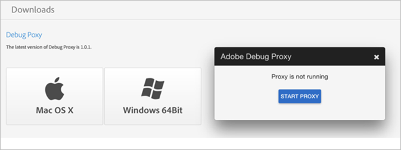

# Adobe Debug konfigurieren {#configure-adobe-debug}

## Zugriff auf Adobe Debug {#accessing-adobe-debug}

So greifen Sie auf Adobe Debug zu:

1. Gehen Sie zu [Experience Cloud](https://www.marketing.adobe.com) und erstellen Sie einen neuen Adobe Experience Cloud-Benutzer.

   >[!TIP]
   >
   >Diese Anmeldedaten nicht mit dem Benutzernamen/Passwort überein, mit dem Sie sich bei Adobe Analytics anmelden.

1. Nachdem Sie ein Experience Cloud-Konto eingerichtet haben, wenden Sie sich an Ihren Adobe-Support-Mitarbeiter, um Zugriff auf Adobe Debug anzufordern.
1. Nachdem der Zugriff gewährt wurde, gehen Sie zu [https://debug.adobe.com](https://debug.adobe.com) und melden Sie sich mit den Anmeldedaten für Experience Cloud an.

   

   Folgende Browser werden für dieses Tool unterstützt:
   * Google Chrome
   * Mozilla Firefox
   * Apple Safari
   * Microsoft Internet Explorer Versionen 9-11

Die empfohlenen Browser sind die neuesten Versionen von Chrome und Firefox.

## Debug-Proxy {#debug-proxy}

Herunterladen und Konfigurieren des Debug-Proxy:

1. Laden Sie die Debug-Proxy-App unter [App-Downloads](https://debug.adobe.com/#/downloads) herunter.

   Folgende Betriebssysteme werden unterstützt:
   * OS X 10.7 64 Bit oder höher
   * Windows 7.1 64 Bit oder höher

   

1. Der Debug-Proxy-Server wird auf Ihrem lokalen Computer an Port 33284 ausgeführt und als Systemproxy festgelegt.

   Möglicherweise müssen Sie Ihre Browsereinstellung je nach Betriebssystem und Browser anpassen.

## SSL-Zertifikat für Desktops oder Apps herunterladen und installieren {#download-and-install-sSL-desktop}

Beim ersten Ausführen von Adobe Debug wird ein eindeutiges SSL-Zertifikat generiert. Wenn Sie HTTPS-Traffic auf dem Desktop und/oder in Apps unterstützen, müssen Sie unser SSL-Zertifikat herunterladen und installieren.

Laden Sie das SSL-Zertifikat herunter und installieren Sie es:

1. Nachdem Adobe Debug installiert und gestartet wurde, gehen Sie zu [https://proxy.debug.adobe.com/ssl](https://proxy.debug.adobe.com/ssl) und laden Sie das Zertifikat herunter.
1. Importieren Sie das Zertifikat

   **Mac OS**
   1. Doppelklicken Sie auf das CA-Stammzertifikat, um es in Keychain Access zu öffnen.
   1. Das CA-Stammzertifikat wird bei der Anmeldung angezeigt.
   1. Ziehen Sie das CA-Stammzertifikat in System.
   1. Sie müssen das Zertifikat nach System kopieren, um sicherzustellen, dass es von allen Benutzern und lokalen Systemprozessen als vertrauenswürdig eingestuft wird.
   1. Öffnen Sie das CA-Stammzertifikat, erweitern Sie „Trust“ (Vertrauen), wählen Sie „Always Trust“(Immer vertrauen) und speichern Sie Ihre Änderungen.

   **Windows**
   1. Führen Sie einen der folgenden Schritte aus:

      * [Hinzufügen von Zertifikaten zum Speicher der vertrauenswürdigen Stammzertifizierungsstellen für einen lokalen Computer](https://technet.microsoft.com/de-de/library/cc754841.aspx#BKMK_addlocal)
   1. Führen Sie bei Verwendung von Firefox den Prozess zur [Installation des Stammzertifikats in Mozilla Firefox](https://wiki.wmtransfer.com/projects/webmoney/wiki/Installing_root_certificate_in_Mozilla_Firefox) aus.

      Sie müssen Firefox möglicherweise erneut öffnen, damit die Änderung übernommen wird.
   **iOS-Geräte**
   1. Legen Sie auf Ihrem iOS-Gerät Adobe Debug als HTTP-Proxy fest, indem Sie auf **[!UICONTROL Einstellungen]** **>** **[!UICONTROL WLAN-Einstellungen]** klicken.

   1. Gehen Sie in Safari zu [Debuggen](https://proxy.debug.adobe.com/ssl).

      Safari fordert Sie zur Installation des SSL-Zertifikats auf.

## SSL-Zertifikat auf Ihrem Mobilgerät installieren {#install-sSL-for-mobile-device}

Wenn die HTTPS-Aufrufe in Adobe Debug fehlen, müssen Sie das SSL-Zertifikat für Adobe Debug auf dem Mobilgerät installieren.

### iOS

So installieren Sie das SSL-Zertifikat auf einem iOS-Gerät:

1. Deaktivieren Sie auf Ihrem Laptop den Debug-Proxy und öffnen Sie [Adobe Debug](https://debug.adobe.com).
1. Führen Sie die folgenden Schritte auf Ihrem iOS-Gerät aus:
   1. Aktivieren Sie auf Ihrem Gerät in den Flugmodus.
   1. Wählen Sie dasselbe WLAN-Signal aus, das auch von Ihrem Laptop verwendet wird.
   1. Geben Sie auf Ihrem Laptop manuell die IP-Adresse und den Port ein, die in der Debug-Proxy-App angezeigt werden.
   1. Öffnen Sie ein Apple Safari-Browserfenster.
   1. Gehen Sie zu [https://proxy.debug.adobe.com/ssl](https://proxy.debug.adobe.com/ssl).
   1. Laden Sie das SSL-Zertifikat herunter und installieren Sie es.

1. Starten Sie auf Ihrem Laptop Ihre Adobe Debug-Sitzung.
1. Beginnen Sie Tests auf Ihrem iOS-Gerät.

### Android

So installieren Sie das SSL-Zertifikat auf einem Android-Gerät:

1. Deaktivieren Sie auf Ihrem Laptop den Debug-Proxy und öffnen Sie [Adobe Debug](https://debug.adobe.com).
1. Führen Sie die folgenden Schritte auf Ihrem Android-Gerät aus:
   1. Wählen Sie auf Ihrem Gerät den Flugmodus aus.
   1. Wählen Sie dasselbe WLAN-Signal aus, das auch von Ihrem Laptop verwendet wird.
   1. Geben Sie auf Ihrem Laptop manuell die IP-Adresse und den Port ein, die in der Debug-Proxy-App angezeigt werden.
   1. Öffnen Sie ein Browserfenster.
   1. Gehen Sie zu [https://proxy.debug.adobe.com/ssl](https://proxy.debug.adobe.com/ssl).
   1. Laden Sie das SSL-Zertifikat herunter und installieren Sie es.

1. Starten Sie auf Ihrem Laptop Ihre Adobe Debug-Sitzung.
1. Starten Sie Tests auf Ihrem Android-Gerät.
