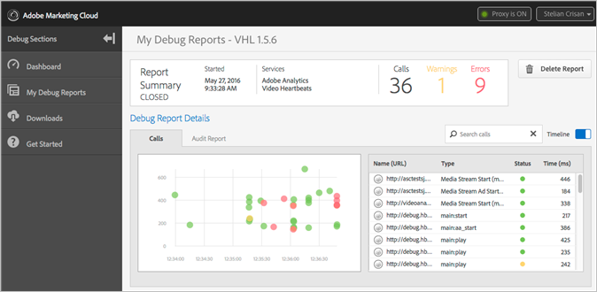

# Debug-Dashboard und -Berichte{#debug-dashboards-and-reports}

Adobe Debug bietet Reporting in Echtzeit, damit Sie Hits und Metadaten anzeigen können, die während der Videowiedergabe gesendet werden. Jeder dieser Berichte kann innerhalb von Debug gespeichert werden.

Für die Zertifizierung können Sie diese Berichte weitergeben, indem Sie einfach die URL kopieren und den Link beispielsweise in einem ZenDesk-Ticket senden.

>[!NOTE]
>
>Es kann immer nur eine Sitzung aktiv sein. Die aktive Sitzung kann über das Dashboard geöffnet werden.

