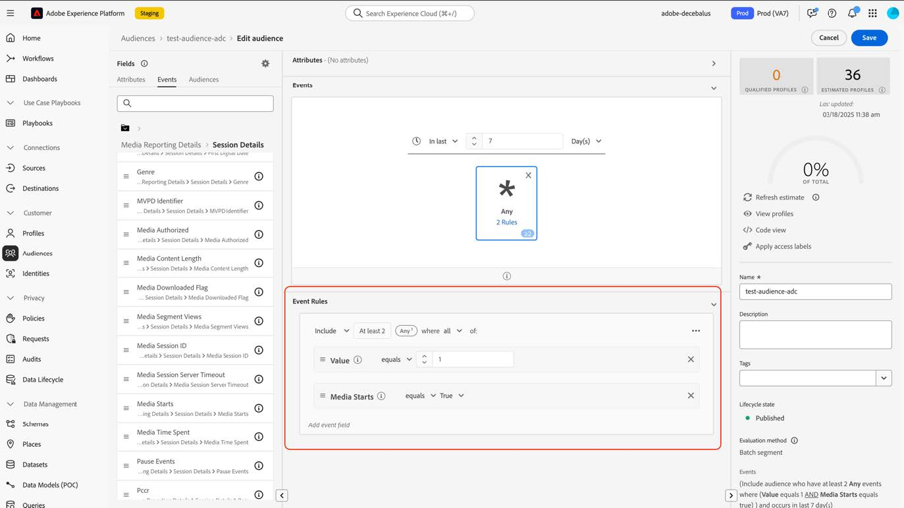

# Migrieren von Zielgruppen zu den neuen Feldern für Streaming-Medien

In diesem Dokument wird beschrieben, wie eine Zielgruppe, die Felder aus dem Datentyp „Medien“ der Streaming-Mediensammlung von Adobe verwendet, migriert werden sollte, um den neuen entsprechenden Datentyp namens &quot;[Media Reporting Details“ ](https://experienceleague.adobe.com/de/docs/experience-platform/xdm/data-types/media-reporting-details) verwenden.

## Migrieren einer Zielgruppe

Um eine Zielgruppe vom alten Datentyp „Media“ in den neuen Datentyp &quot;[Media Reporting Details](https://experienceleague.adobe.com/de/docs/experience-platform/xdm/data-types/media-reporting-details)&quot; zu migrieren, müssen Sie die Zielgruppe bearbeiten und in jeder Regel das alte Feld vom veralteten Datentyp durch das neue entsprechende Feld vom neuen Datentyp ersetzen:

1. Suchen Sie Regeln, die Felder aus dem veralteten Datentyp „Medien“ enthalten. Dies sind alle Felder, die `media.mediaTimed` mit dem Pfad beginnen.

1. Duplizieren Sie diese Regeln mithilfe der Felder aus dem neuen Datentyp [Media Reporting Details](https://experienceleague.adobe.com/de/docs/experience-platform/xdm/data-types/media-reporting-details).

1. Behalten Sie beide Regeln bei, bis Sie überprüfen, ob die Zielgruppen erwartungsgemäß funktionieren.

1. Entfernen Sie die Regeln, die Felder enthalten, aus dem veralteten Datentyp „Medien“.

1. Überprüfen Sie, ob die Zielgruppen weiterhin erwartungsgemäß funktionieren.

Siehe den [Content-ID](https://experienceleague.adobe.com/de/docs/media-analytics/using/implementation/variables/audio-video-parameters#content-id) auf der Seite [Audio- und Videoparameter](https://experienceleague.adobe.com/de/docs/media-analytics/using/implementation/variables/audio-video-parameters), um die Zuordnung zwischen den alten und den neuen Feldern vorzunehmen. Der alte Feldpfad befindet sich unter der Eigenschaft „XDM-Feldpfad“, während der neue Feldpfad unter der Eigenschaft „XDM-Feldpfad für Berichterstellung“ zu finden ist.

## Beispiel

Um die Befolgung der Migrationsrichtlinien zu vereinfachen, sehen Sie sich das folgende Beispiel an, das eine Zielgruppe mit einer einzigen Regel enthält. Da die Zielgruppe über eine einzige Regel verfügt, müssen Sie die Migrationsrichtlinien nur einmal anwenden.

1. Klicken Sie auf [!UICONTROL **Schaltfläche**] Zielgruppe bearbeiten“ in der oberen rechten Ecke.

1. Suchen Sie die für die Zielgruppe konfigurierten Regeln.

   

   

1. Wählen Sie die Regel aus, um ihre Konfiguration zu öffnen.

   

1. (Optional) Um den Pfad des in der Regel verwendeten Felds anzuzeigen, klicken Sie auf die Informationsschaltfläche neben dem Feldnamen.

   

1. Identifizieren Sie den Feldnamen (in diesem Fall „Medienstarts„).

   

1. Auf der Seite [Audio- und Videoparameter](https://experienceleague.adobe.com/de/docs/media-analytics/using/implementation/variables/audio-video-parameters) können Sie die alten Felder zuordnen. Der alte Feldpfad befindet sich unter der Eigenschaft „XDM-Feldpfad“, der neue Feldpfad unter der Eigenschaft „XDM-Feldpfad für Berichterstellung“. Beispielsweise wird für den Parameter [Medienstarts](https://experienceleague.adobe.com/de/docs/media-analytics/using/implementation/variables/audio-video-parameters#media-starts) der Korrespondent für `media.mediaTimed.impressions.value` `mediaReporting.sessionDetails.isViewed`.

   

1. Fügen Sie dieselbe Regel wie bei der vorhandenen hinzu, indem Sie das neue Feld verwenden.

   

   

   

1. Klicken Sie [!UICONTROL **Speichern**], um die Zielgruppe zu speichern. Sie können diese Einrichtung so lange beibehalten, wie Sie überprüfen müssen, ob die Zielgruppe weiterhin wie erwartet funktioniert.

1. Entfernen Sie nach Abschluss der Validierung das alte Feld und klicken Sie auf [!UICONTROL **Speichern**] um die Audience zu speichern.

   

1. Validieren Sie die Zielgruppe erneut.

   Der Prozess zur Migration der Zielgruppe ist abgeschlossen.
