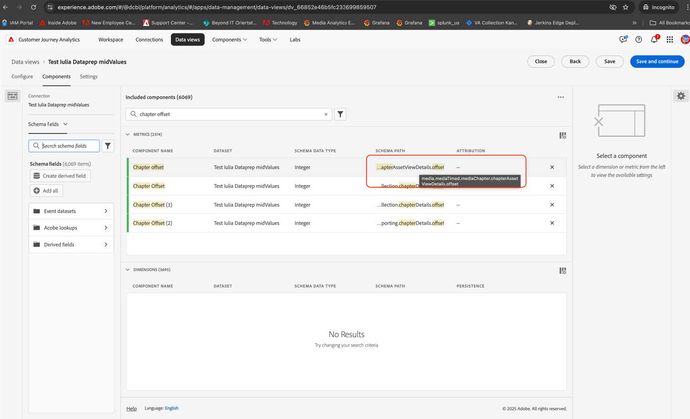

# Migrieren von Customer Journey Analytics zur Verwendung der neuen Streaming-Medienfelder

In diesem Dokument wird beschrieben, wie ein Customer Journey Analytics-Setup, das den Datentyp Adobe Streaming Media Services namens „Media“ verwendet, so aktualisiert werden sollte, dass er den neuen entsprechenden Datentyp namens &quot;[ Media Reporting Details“ ](https://experienceleague.adobe.com/en/docs/experience-platform/xdm/data-types/media-reporting-details).

## Migrieren von Customer Journey Analytics

Um ein Customer Journey Analytics-Setup aus dem alten Datentyp „Media“ in den neuen Datentyp &quot;[Media Reporting Details](https://experienceleague.adobe.com/en/docs/experience-platform/xdm/data-types/media-reporting-details)&quot; zu migrieren, müssen Sie die folgenden Setups aktualisieren, die den alten Datentyp verwenden:

* Datenansichten

* Abgeleitete Felder

### Datenansichten migrieren

So migrieren Sie die Datenansichten in den neuen Datentyp:

1. Suchen Sie alle Datenansichten mithilfe des veralteten Datentyps „Medien“. Dies sind alle Felder, bei denen der Pfad mit `media.mediaTimed` beginnt.

1. Führen Sie einen der folgenden Schritte aus:

   * Fügen Sie in diese Datenansichten die Felder aus dem neuen Datentyp „Media Reporting Details“ ein.

   * Erstellen Sie ein abgeleitetes Feld, das den neuen Datentyp „Media Reporting Details“ verwendet, wenn er festgelegt ist, oder das auf den alten Datentyp „Media“ zurückgreift, wenn der Datentyp „Media Reporting Details“ nicht festgelegt ist.

### Migrieren abgeleiteter Felder

So migrieren Sie abgeleitete Felder in den neuen Datentyp:

1. Suchen Sie alle abgeleiteten Felder mit dem veralteten Datentyp „Medien“. Dies sind alle abgeleiteten Felder, die Felder enthalten, bei denen der Pfad mit `media.mediaTimed` beginnt.

1. Ersetzen Sie alle alten Felder im abgeleiteten Feld durch das neue entsprechende Feld aus „Details zur Medienberichterstattung“.

Siehe den [Content-ID](https://experienceleague.adobe.com/de/docs/media-analytics/using/implementation/variables/audio-video-parameters#content-id) auf der Seite [Audio- und Videoparameter](https://experienceleague.adobe.com/de/docs/media-analytics/using/implementation/variables/audio-video-parameters), um die Zuordnung zwischen den alten und den neuen Feldern vorzunehmen. Der alte Feldpfad befindet sich unter der Eigenschaft „XDM-Feldpfad“, während der neue Feldpfad unter der Eigenschaft „XDM-Feldpfad für Berichterstellung“ zu finden ist.

## Beispiel

Um die Befolgung der Migrationsrichtlinien zu vereinfachen, sehen Sie sich das folgende Beispiel an, das eine Datenansicht mit Feldern aus dem alten, veralteten Datentyp „Medien“ enthält. In dieser Datenansicht müssen Sie die neuen entsprechenden Felder hinzufügen.

### Datenansicht aktualisieren

Sie können eine der folgenden Optionen verwenden, um die Datenansicht zu aktualisieren:

#### Option 1

1. Suchen Sie eine Metrik oder Dimension, die das alte Feld aus dem veralteten Datentyp verwendet.

   

1. Aktivieren Sie das entsprechende neue Feld im Abschnitt [Kapitelversatz](https://experienceleague.adobe.com/en/docs/media-analytics/using/implementation/variables/chapter-parameters#chapter-offset) im Artikel [Kapitelparameter](https://experienceleague.adobe.com/de/docs/media-analytics/using/implementation/variables/chapter-parameters).

1. Suchen Sie das neue entsprechende Feld in der Datenansicht.

   

1. Ziehen Sie das neue Feld auf die Metrik oder Dimension.

1. Wiederholen Sie diesen Vorgang für alle Metriken und Dimensionen, die Felder aus dem veralteten Datentyp „Medien“ verwenden.

#### Option 2

Mit dieser Option wird ein abgeleitetes Feld erstellt, das den Wert aus dem alten Feld oder den Wert aus dem neuen Feld auswählt, je nachdem, welches Feld für ein bestimmtes Ereignis vorhanden ist. Dieses abgeleitete Feld ersetzt in allen Projekten, in denen es verwendet wird, den alten Datentyp „Medien“.

Wenn Sie ein abgeleitetes Feld für den „Kapitelnamen“ erstellen möchten, das den neuen Datentyp „Details zur Medienberichterstattung“ verwendet, wenn er festgelegt ist, oder das auf den alten Datentyp „Medien“ zurückgreift, wenn der Datentyp „Details zur Medienberichterstattung“ nicht festgelegt ist:

1. Ziehen Sie eine „Wenn-Fall“-Klausel in die abgeleiteten Felder.

   

1. Füllen Sie die [!UICONTROL **If**]-Klausel mit dem Wert des **XDM-** für Berichterstellung, wie im Parameter [Kapitelname](https://experienceleague.adobe.com/en/docs/media-analytics/using/implementation/variables/chapter-parameters#chapter-name) auf der Seite [Kapitelparameter](https://experienceleague.adobe.com/de/docs/media-analytics/using/implementation/variables/chapter-parameters) gezeigt.

   

   

   

   

1. Füllen Sie den Fallback-Wert mit dem alten Feld aus dem veralteten Datentyp „Media“.

   

   

   Dies ist die endgültige Definition des abgeleiteten Feldes.

   

1. Um die abgeleiteten Felder zu aktualisieren, suchen Sie ein abgeleitetes Feld, das die alten verworfenen Felder verwendet (Pfad, der mit `media.mediaTimed` beginnt).

   

1. Bewegen Sie den Mauszeiger über das abgeleitete Feld, das Sie aktualisieren möchten, und wählen Sie dann das Symbol [!UICONTROL **Bearbeiten**] aus.

1. Suchen Sie alle Felder aus dem alten Datentyp (Pfad, der mit `media.mediaTimed` beginnt) und ersetzen Sie sie durch das neue entsprechende Feld.

   

1. Aktivieren Sie das entsprechende neue Feld im Abschnitt [Inhaltsname (Variable)](https://experienceleague.adobe.com/en/docs/media-analytics/using/implementation/variables/audio-video-parameters#content-name-variable) im Artikel [Streaming-Medienparameter](https://experienceleague.adobe.com/en/docs/media-analytics/using/implementation/variables/audio-video-parameters#content-name-variable) .

1. Ersetzen Sie das alte Feld durch das neue Feld.

   

1. Wiederholen Sie diesen Vorgang für alle abgeleiteten Felder, die Felder aus dem alten, veralteten Datentyp „Medien“ verwenden.

   Die Migration der CJA-Einrichtung ist abgeschlossen.
