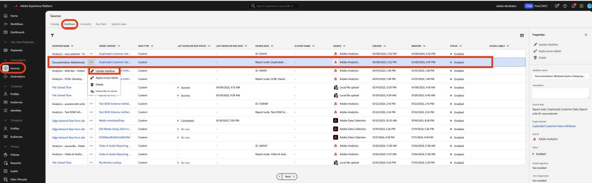
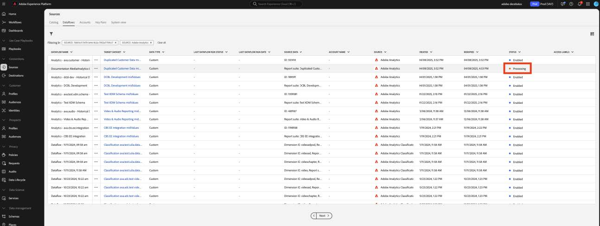
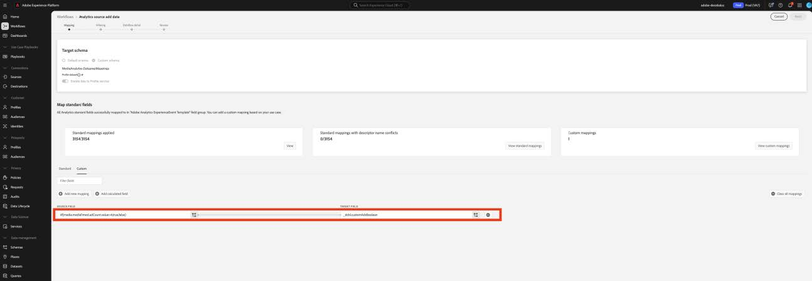

# Migrieren der Datenvorbereitung für benutzerdefinierte Felder in die neuen Felder für Streaming-Medien

In diesem Dokument wird der Prozess der Migration des Datenvorbereitungs-Service beschrieben, der zusätzlich zu den Adobe-Datenerfassungsflüssen vorhanden ist, die für Adobe Streaming Media Collection-Daten aktiviert sind. Bei der Migration wird eine Datenvorbereitung-Zuordnung aus dem Datentyp „Medien“ der Streaming-Mediensammlung von Adobe in den neuen entsprechenden Datentyp &quot;[&#x200B; Media Reporting Details“ &#x200B;](https://experienceleague.adobe.com/en/docs/experience-platform/xdm/data-types/media-reporting-details).

## Migrieren der Datenvorbereitung für benutzerdefinierte Felder

Um die Datenvorbereitungs-Zuordnungen vom alten Datentyp namens „Media“ zum neuen Datentyp namens &quot;[Media Reporting Details](https://experienceleague.adobe.com/en/docs/experience-platform/xdm/data-types/media-reporting-details) zu migrieren, müssen Sie die Datenvorbereitungs-Zuordnungen bearbeiten:

>[!IMPORTANT]
>
>Um Datenverluste zu vermeiden, stellen Sie sicher, dass der Analytics-Quell-Connector mithilfe der neuen `mediaReporting` bereitgestellt wurde, bevor Sie die Schritte in diesem Abschnitt ausführen.

1. Wechseln Sie in Adobe Experience Platform [!UICONTROL **Abschnitt**] Quellen“ zur Registerkarte [!UICONTROL **Datenflüsse**].

1. Suchen Sie den Datenfluss, der für den Import von Streaming-Mediendaten von Adobe Analytics nach Adobe Experience Platform über die Adobe-Datenerfassung verantwortlich ist.

1. Wählen Sie [!UICONTROL **Datenfluss aktualisieren**], um die Datenvorbereitungs-Einrichtung zu ändern, indem jede benutzerdefinierte Quellzuordnung, die ein veraltetes Feld enthält, durch das neue entsprechende Feld aus dem neuen XDM-Objekt ersetzt wird.

1. Suchen Sie die Zuordnungen, die Quellfelder aus dem veralteten Objekt „Media“ enthalten.

1. Ersetzen Sie diese Quellen mithilfe von Feldern aus dem neuen Objekt „Details zur Medienberichterstattung“.

1. Überprüfen Sie, ob die Zuordnungen weiterhin erwartungsgemäß funktionieren.

Siehe den [Content-ID](https://experienceleague.adobe.com/en/docs/media-analytics/using/implementation/variables/audio-video-parameters#content-id) auf der Seite [Audio- und Videoparameter](https://experienceleague.adobe.com/de/docs/media-analytics/using/implementation/variables/audio-video-parameters), um die Zuordnung zwischen den alten und den neuen Feldern vorzunehmen. Der alte Feldpfad befindet sich unter der Eigenschaft „XDM-Feldpfad“, während der neue Feldpfad unter der Eigenschaft „XDM-Feldpfad für Berichterstellung“ zu finden ist.

## Beispiel

Um die Befolgung der Migrationsrichtlinien zu vereinfachen, sehen Sie sich den folgenden Beispiel-Datenfluss an, der eine einzelne Zuordnung enthält. In diesem Fall müssen Sie die Migrationsrichtlinien nur einmal anwenden.

1. Wechseln Sie in Adobe Experience Platform [!UICONTROL **Abschnitt**] Quellen“ zur Registerkarte [!UICONTROL **Datenflüsse**].

1. Suchen Sie den Datenfluss, der für den Import von Streaming-Mediendaten von Adobe Analytics nach Adobe Experience Platform über die Adobe-Datenerfassung verantwortlich ist.

1. Wählen **[!UICONTROL Datenfluss aktualisieren]**, um in die Bearbeitungsbenutzeroberfläche zu gelangen, wie in der folgenden Abbildung dargestellt.

   

1. Wählen Sie auf der **[!UICONTROL Zuordnung]** die Option **[!UICONTROL Benutzerdefiniert]** aus.

1. Identifizieren Sie die benutzerdefinierten Zuordnungen, die auf `media.mediaTimed` Feldern als Quellen basieren.

   

   Da Sie in diesem Beispiel eine benutzerdefinierte Feldergruppe für das Schema in Ihrer Entwicklungsorganisation erstellt haben, befindet sich das Zielfeld unter `_dcbl`. Der Pfad der benutzerdefinierten Feldergruppe unterscheidet sich je nach Organisationsname.

1. Suchen Sie für jede Zuordnung, die das `media.mediaTimed`-Objekt verwendet, mithilfe dieser Dokumentation im `mediaReporting`-Objekt nach der entsprechenden Person.

   Beispiel: Für „Network“ wird der Korrespondent für &quot;`media.mediaTimed.primaryAssetViewDetails`.broadcastNetwork“ `mediaReporting.sessionDetails.network`.

   

1. Ersetzen Sie im **&#x200B;**&#x200B;Source den `media.mediaTimed` durch den `mediaReporting`. Das Zielfeld bleibt unverändert.

   

1. Klicken Sie **[!UICONTROL Weiter]**, um Ihre Änderungen zu speichern.

   Der Status wird als &quot;**[!UICONTROL &quot;]**. Nachdem die Änderungen angewendet wurden, wird der Status als &quot;**[!UICONTROL &quot;]**.

   

## Beispiel mit verschiedenen Datentypen

Im obigen Beispiel waren alle beteiligten Datentypen „String“, sodass die Zuordnungsersetzung direkt erfolgte.

Wenn der Quellfelddatentyp nicht mit dem Zielfelddatentyp übereinstimmt, müssen Sie die Richtlinien im [Handbuch zur Fehlerbehebung bei der Datenvorbereitung](https://experienceleague.adobe.com/en/docs/experience-platform/data-prep/troubleshooting-guide), [Umgang mit Datenformaten mit der &#x200B;](https://experienceleague.adobe.com/en/docs/experience-platform/data-prep/data-handling) und [Funktionen zur Datenvorbereitung](https://experienceleague.adobe.com/en/docs/experience-platform/data-prep/data-handling).

Wenn beispielsweise der Quelltyp eine Zeichenfolge und der Zieltyp ein boolescher Wert ist, kann die Datenvorbereitung den Wert automatisch analysieren und den Quellwert in einen booleschen Wert konvertieren.

Wenn der Quelltyp eine Zahl und der Zieltyp ein boolescher Wert ist, müssen Sie Datenmanipulationsfunktionen verwenden:

Zuordnung mit `media.mediaTimed` zu einem benutzerdefinierten Feld.

Zuordnung mit `mediaReporting` zum selben benutzerdefinierten Feld:

