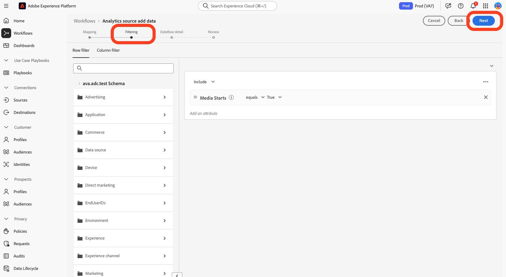
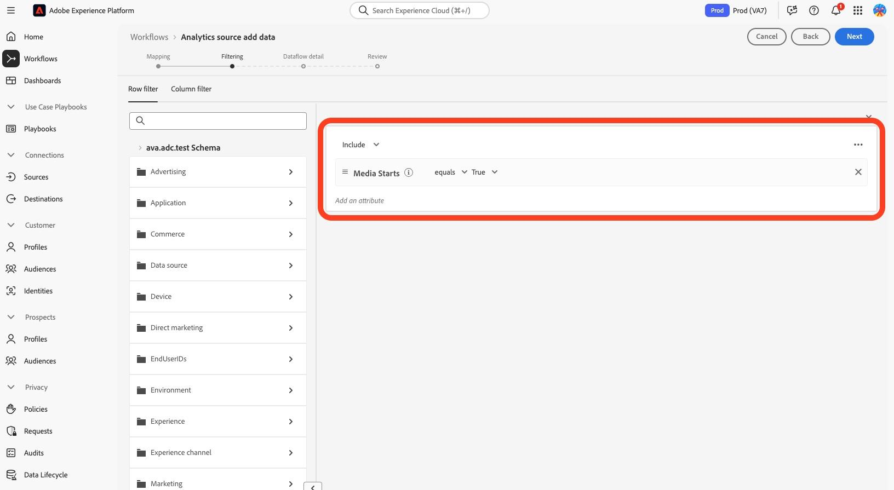

# Migrieren von Profilen in die neuen Streaming-Medienfelder

In diesem Dokument wird der Prozess der Migration des Profilfilterdienstes beschrieben, der zusätzlich zu den Adobe-Datenerfassungsflüssen vorhanden ist, die für Adobe Analytics für Streaming-Mediendaten aktiviert sind. Bei der Migration wird der Profilfilterdienst von mithilfe des Datentyps „Media“ für Adobe-Streaming-Mediendienste in den neuen Datentyp &quot;[ Media Reporting Details“ ](https://experienceleague.adobe.com/en/docs/experience-platform/xdm/data-types/media-reporting-details).

## Profile migrieren

Um die Profilfilterung vom alten Datentyp namens „Media“ zum neuen Datentyp namens &quot;[Media Reporting Details“ ](https://experienceleague.adobe.com/en/docs/experience-platform/xdm/data-types/media-reporting-details), müssen Sie die vorhandenen Profilfilterregeln bearbeiten:

1. Wechseln Sie in Adobe Experience Platform [!UICONTROL **Abschnitt**] Quellen“ zur Registerkarte [!UICONTROL **Datenflüsse**].

1. Suchen Sie den Datenfluss, der für den Import von Streaming-Mediendaten von Adobe Analytics nach Adobe Experience Platform über die Adobe-Datenerfassung verantwortlich ist.

1. Wählen Sie [!UICONTROL **Datenfluss aktualisieren**], um die Einrichtung der Profilfilterung zu ändern, indem Sie jede benutzerdefinierte Regel, die ein verworfenes Feld enthält, durch das neue entsprechende Feld aus dem neuen XDM-Objekt ersetzen.

1. Suchen Sie die Filter, die Felder aus dem veralteten Objekt „Medien“ enthalten.

1. Hängen Sie diese Filter an, indem Sie Felder aus dem neuen Objekt „Details zur Medienberichterstattung“ hinzufügen.

1. Verwenden Sie einen OR-Operator zwischen den beiden Feldern.

1. Überprüfen Sie, ob die Profile weiterhin erwartungsgemäß funktionieren.

Siehe den [Content-ID](https://experienceleague.adobe.com/de/docs/media-analytics/using/implementation/variables/audio-video-parameters#content-id) auf der Seite [Audio- und Videoparameter](https://experienceleague.adobe.com/de/docs/media-analytics/using/implementation/variables/audio-video-parameters), um die Zuordnung zwischen den alten und den neuen Feldern vorzunehmen. Der alte Feldpfad befindet sich unter der Eigenschaft „XDM-Feldpfad“, der neue Feldpfad unter der Eigenschaft „XDM-Feldpfad für Berichterstellung“.

## Beispiel

Um die Befolgung der Migrationsrichtlinien zu vereinfachen, sehen Sie sich den folgenden Beispiel-Datenfluss an, der eine einzelne Profilfilterregel enthält. Da es in diesem Fall nur eine einzige Regel gibt, müssen Sie die Migrationsrichtlinien nur einmal anwenden.

1. Wechseln Sie in Adobe Experience Platform [!UICONTROL **Abschnitt**] Quellen“ zur Registerkarte [!UICONTROL **Datenflüsse**].

&#x200B;1. Suchen Sie den Datenfluss, der für den Import von Streaming-Mediendaten von Adobe Analytics nach Adobe Experience Platform über Adobe Analytics verantwortlich ist.

1. Wählen **[!UICONTROL Datenfluss aktualisieren]**, um in die Bearbeitungsbenutzeroberfläche zu gelangen, wie in der folgenden Abbildung dargestellt.

   

1. Wählen Sie **[!UICONTROL Weiter]**, um zur Registerkarte Filterung zu wechseln.

   

1. Identifizieren Sie auf **[!UICONTROL Registerkarte]** die Filterregeln, die auf `media.mediaTimed` Feldern basieren.

   

   Suchen Sie für jeden Filter, der das media.mediaTimed-Objekt verwendet, mithilfe der Seite „Audio- und Videoparameter`mediaReporting` nach dem entsprechenden [-Objekt](https://experienceleague.adobe.com/de/docs/media-analytics/using/implementation/variables/audio-video-parameters) um eine Zuordnung zwischen den alten und den neuen Feldern herzustellen. Der alte Feldpfad befindet sich unter der Eigenschaft „XDM-Feldpfad“, während der neue Feldpfad unter der Eigenschaft „XDM-Feldpfad für Berichterstellung“ zu finden ist. Beispielsweise wird für [Medienstarts](https://experienceleague.adobe.com/de/docs/media-analytics/using/implementation/variables/audio-video-parameters#media-starts) der Korrespondent für `media.mediaTimed.impressions.value` `mediaReporting.sessionDetails.isViewed`.

   

1. Ziehen Sie das entsprechende `mediaReporting` in die Filterregel und verwenden Sie zwischen den beiden Regeln den OR-Operator. Fügen Sie bei Verwendung des neuen Felds dieselbe Regel wie die vorhandene hinzu.

   

1. Klicken Sie **[!UICONTROL Weiter]**, um Ihre Änderungen zu speichern.
